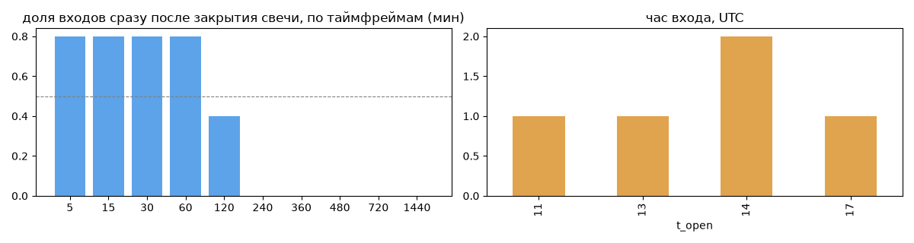
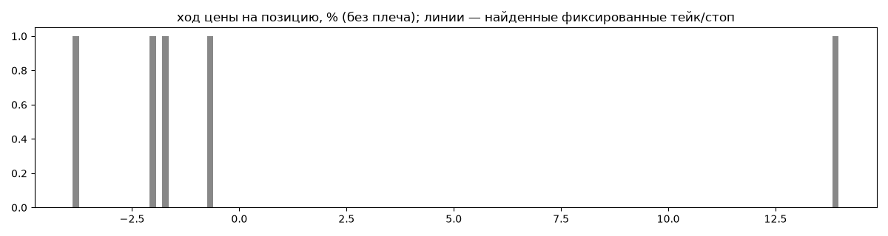
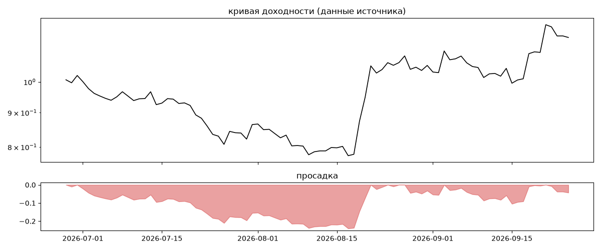
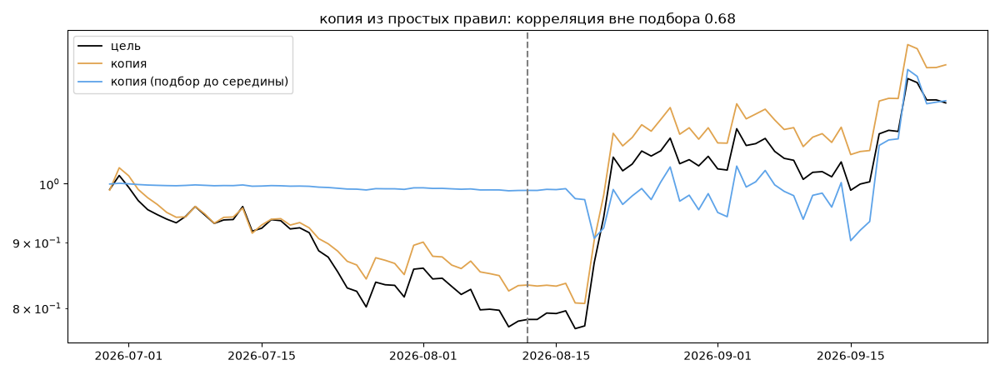

# Algo-Executor — обратный инжиниринг

*Источник: bybit · https://www.bybit.com/copyTrade/trade-center/detail?leaderMark=/wQF7+GkKrFNJGsT/+8rhw== · разбор 26.09.2026*

> Algorithmic BTC trend-following bot focused on asymmetric risk: frequent small losses and occasional large gains. Performance data and methodology explained at alperenlcr.github.io/trade_bot_results/

## Коротко

- **Тип:** тренд · покупает страховку · **бот**
  - в плюс 20% сделок, средний плюс в 6.92 раза больше минуса
  - сверка с самоописанием: заявлено «тренд» → ✅ совпало
- **Когда входит:** на закрытии свечи 60 мин (≈0.9 мин после закрытия, 80% входов)
- **Правило входа:** не искали — мало позиций (5 < 60)
- **Как выходит:** 80% выходов сразу сменяются новым входом — переворот или перезапуск бота
- **Результат:** ×1.16, +81% в год, макс. просадка -24%, сейчас -4% (4 дн.). По годам: 2026: +16%
- **Хвосты:** месяцев в плюс 67%, худший месяц = None средних хороших, просадка/волатильность -0.39 → не ясно
- **Природа по кривой:** тренд 57%, возврат к среднему 28%, докупка (продажа страховки) 13% · совпадение копии вне подбора 0.68 (на подборе 1.0) — ⚠️ кривая короткая, вывод слабый
- **Форма доходности:** участие в росте рынка 1.03, в падении -0.14 → в обычные дни в росте участвует сильнее, чем в падениях (редкие обвалы тут не видны — см. «хвосты»)
- **Оговорки:** только последние 90 дней — выводы о правилах ограничены; p_open = средняя позиции, order_price = цена ордера; кривая = cumResetRoi за 90 дней (ROI витрины, с плечом)

## Почерк

| | |
|---|---|
| период | 2026-05-16 → 2026-08-10 (86 дн.) |
| позиций | 5 (0.41 в неделю), открыто сейчас 0 |
| монет | 1: BTC 5 |
| доля BTC/ETH/SOL/XRP/BNB/золото | 100% |
| шорты | 60% |
| в плюс | 20% |
| средний плюс / минус | 14.58% / -2.11% (отношение 6.92) |
| худшая / лучшая | -3.96% / 14.58% |
| удержание 10/50/90% | {'p10': 73.6, 'p50': 169.0, 'p90': 1085.8} ч |
| одновременно открыто макс. | 1 |
| доливки | {'multi_order_share': 0.0, 'size_ratio': None, 'add_dir': None, 'max_orders': 1} |
| уровни цен | {'round_price_share': 0.0, 'repeat_price_share': 0.0, 'grid': None} |







## Копия по кривой

Подбор на 89 днях, разрез 2026-08-12. Корреляция дневной доходности: подбор 1.0, **проверка 0.68**, вся история 0.99 (R² 0.97).

| компонента копии | вес |
|---|---|
| BTC [день] EMA10/50 | 0.21 |
| BTC [4ч] докупка шаг 3% тейк 3% | 0.095 |
| BTC [день] возврат 2 | 0.045 |
| BTC [4ч] возврат 1 | 0.039 |
| BTC [день] возврат 3 | 0.033 |
| BTC [4ч] возврат 5 | 0.032 |
| ETH [4ч] ход 2 | 0.032 |
| BTC [день] возврат 1 | 0.029 |
| ETH [день] ход 60 | 0.028 |
| BTC [4ч] возврат 2 | 0.027 |

Сильнее всего совпадает по одиночке: BTC [день] ход 60 (0.89), BTC [день] ход 40 (0.82), SOL [день] EMA10/50 (0.73), SOL [день] ход 60 (0.72), ETH [день] ход 60 (0.68), SOL [день] EMA5/20 (0.66)

Сильнее всего противоположна: BTC [день] возврат 2 (-0.58), SOL [день] возврат 1 (-0.52), ETH [день] возврат 2 (-0.51), ETH [день] возврат 1 (-0.47)




## Выходы

```
{
 "fixed_tp": null,
 "fixed_sl": null,
 "reentry": 0.8,
 "exit_on_candle_close": {
  "15": 1.0,
  "60": 1.0,
  "240": 0.0,
  "1440": 0.0
 },
 "hold_mode_h": 72.0,
 "hold_mode_share": 0.2,
 "verdict": [
  "80% выходов сразу сменяются новым входом — переворот или перезапуск бота"
 ]
}
```