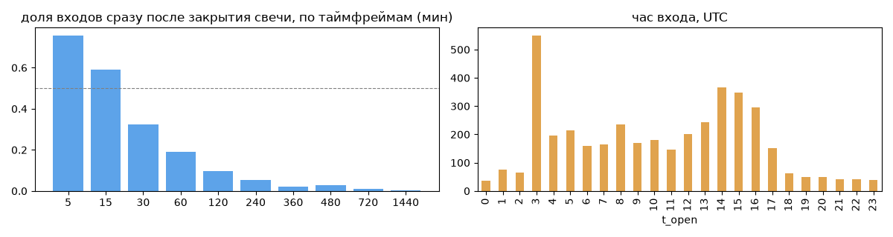
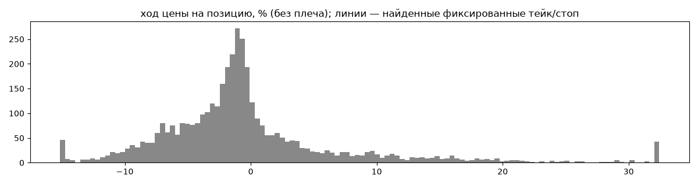
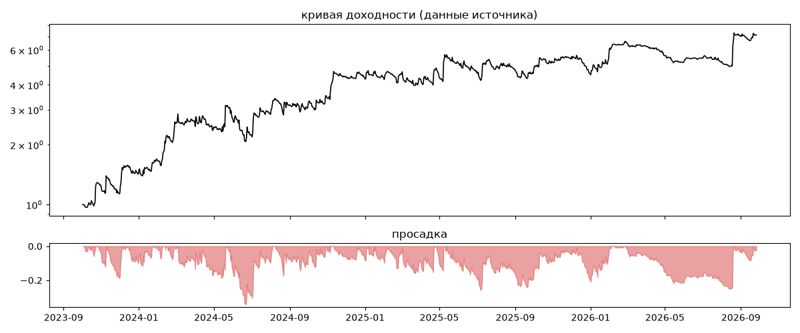
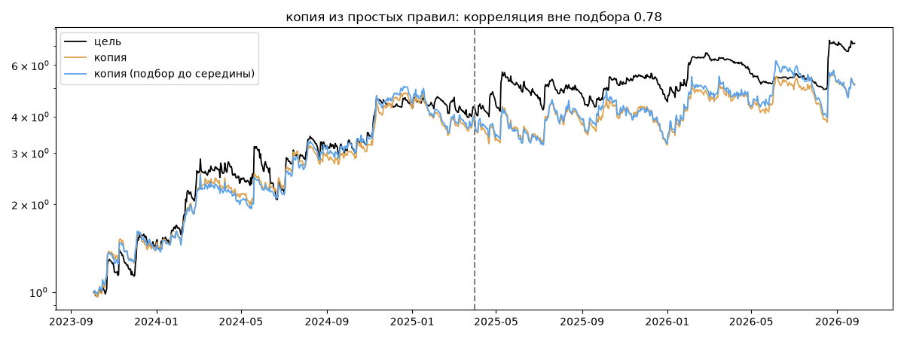

# Algotoria — обратный инжиниринг

*Источник: invvo · https://invvo.com/strategy/16 · разбор 26.09.2026*

> Algotoria runs 14 uncorrelated long-short strategies on Bitcoin-USDT and Ethereum-USDT Perpetual Futures in Binance USDS-M. This portfolio uses MIXED collateral including USDT, USDC, BTC, ETH and BNB. The expected revenue is 50-100% per year at 50% risk. Algotoria runs 10+ uncorrelated long-short strategies on Bitcoin-USDT, Ethereum-USDT, and other Perpetual Futures in Binance USDS-M. Algotoria is bi-drectional, i.e. the trading strategies are balanced to bull and bear conditions. The expected revenue is 30-60% per year at 30% risk. Learn more at algotoria.com

## Коротко

- **Тип:** тренд · покупает страховку · **бот**
  - в плюс 31% сделок, средний плюс в 2.02 раза больше минуса
  - контекст входа: вход ПО ХОДУ движения (тренд/пробой) (75% входов по ходу 4–24 ч движения)
  - ⚠️ по описанию несколько стратегий в одном счёте — позиции неттируются, сделки = изменения суммарной позиции
  - сверка с самоописанием: заявлено «тренд» → ✅ совпало
- **Контекст входа:** вход ПО ХОДУ движения (тренд/пробой): за 4ч 78% по ходу (медиана 0.58%), за 24ч 72% по ходу (медиана 0.87%), за 72ч 53% по ходу (медиана 0.21%)
- **Когда входит:** на закрытии свечи 15 мин (≈0.0 мин после закрытия, 59% входов); 30% входов пачками по разным монетам
- **Правило входа:** не искали — позиции неттированы (несколько стратегий в одном счёте) — по сделкам правило не восстановить, смотрите стадию «копия по кривой»
- **Как выходит:** 78% выходов сразу сменяются новым входом — переворот или перезапуск бота
- **Результат:** ×7.13, +93% в год, макс. просадка -34%, сейчас -2% (36 дн.). По годам: 2023: +42%, 2024: +205%, 2025: +5%, 2026: +57%
- **Хвосты:** месяцев в плюс 63%, худший месяц = -1.2 средних хороших, просадка/волатильность -0.59 → хвост умеренный: худший месяц сопоставим с обычным хорошим
- **Природа по кривой:** тренд 75%, возврат к среднему 15%, держание (бета рынка) 7%, докупка (продажа страховки) 3% · совпадение копии вне подбора 0.78 (на подборе 0.86)
- **Форма доходности:** участие в росте рынка 0.96, в падении -0.56 → в обычные дни в росте участвует сильнее, чем в падениях (редкие обвалы тут не видны — см. «хвосты»)
- **Оговорки:** полная история с запуска; p_open = средняя позиции (cost/lots): доливки внутри, при нескольких стратегиях — неттинг

## Почерк

| | |
|---|---|
| период | 2023-10-04 → 2026-09-24 (1086 дн.) |
| позиций | 4082 (26.31 в неделю), открыто сейчас 10 |
| монет | 36: ETH 821, BTC 534, SOL 221, BCH 106, BNB 96, LTC 96 |
| доля BTC/ETH/SOL/XRP/BNB/золото | 43% |
| шорты | 50% |
| в плюс | 31% |
| средний плюс / минус | 7.94% / -3.93% (отношение 2.02) |
| худшая / лучшая | -36.89% / 127.68% |
| удержание 10/50/90% | {'p10': 8.3, 'p50': 60.0, 'p90': 204.9} ч |
| одновременно открыто макс. | 32 |
| доливки | {'multi_order_share': 0.0, 'size_ratio': None, 'add_dir': None, 'max_orders': 1, 'cost_mult_max': 669.2, 'cost_cv': 2.74} |
| уровни цен | {'round_price_share': 0.0, 'repeat_price_share': 0.0, 'grid': None} |







## Копия по кривой

Подбор на 1090 днях, разрез 2025-03-31. Корреляция дневной доходности: подбор 0.86, **проверка 0.78**, вся история 0.83 (R² 0.69).

| компонента копии | вес |
|---|---|
| BTC [4ч] ход 10 | 0.072 |
| ETH [4ч] ход 5 | 0.07 |
| ETH [день] держать | 0.057 |
| BTC [4ч] ход 20 | 0.052 |
| BTC [день] ход 3 | 0.047 |
| ETH [4ч] EMA5/20 | 0.047 |
| ETH [день] возврат 2 | 0.039 |
| ETH [день] ход 10 | 0.038 |
| BTC [4ч] EMA5/20 | 0.037 |
| ETH [4ч] ход 10 | 0.034 |

Сильнее всего совпадает по одиночке: ETH [4ч] EMA5/20 (0.62), BTC [4ч] EMA5/20 (0.61), BTC [4ч] ход 10 (0.58), ETH [4ч] ход 20 (0.58), BTC [4ч] ход 20 (0.58), ETH [4ч] ход 10 (0.54)

Сильнее всего противоположна: ETH [4ч] возврат 5 (-0.52), BTC [день] возврат 3 (-0.51), BTC [день] возврат 2 (-0.46), ETH [день] возврат 3 (-0.45)




## Выходы

```
{
 "fixed_tp": null,
 "fixed_sl": null,
 "reentry": 0.78,
 "exit_on_candle_close": {
  "15": 0.69,
  "60": 0.16,
  "240": 0.04,
  "1440": 0.0
 },
 "hold_mode_h": 36.75,
 "hold_mode_share": 0.0,
 "atr": {
  "interval": "15",
  "win_pct_cv": 1.2,
  "win_atr_cv": 1.29,
  "loss_pct_cv": 0.7,
  "loss_atr_cv": 0.79,
  "win_k_median": 3.17,
  "loss_k_median": -3.89
 },
 "verdict": [
  "78% выходов сразу сменяются новым входом — переворот или перезапуск бота"
 ]
}
```