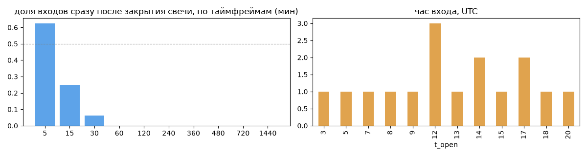
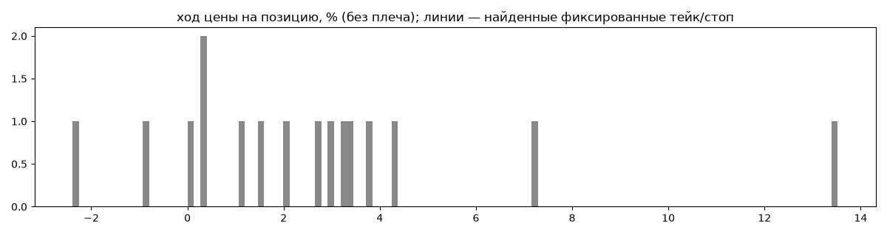
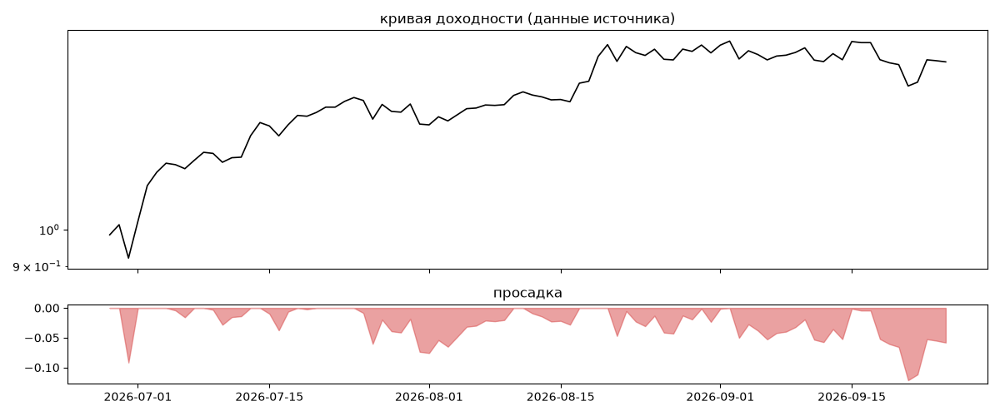
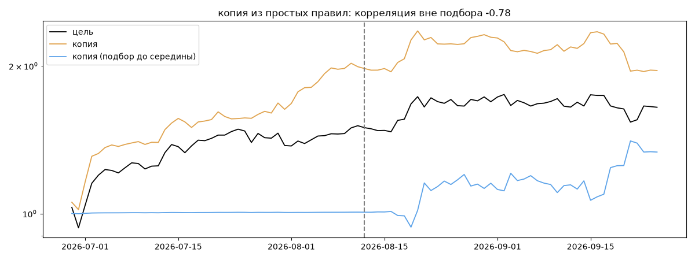

# BadBoy15xa — обратный инжиниринг

*Источник: bybit · https://www.bybit.com/copyTrade/trade-center/detail?leaderMark=QwTSmi88uOpFo+hHiC+Cbg== · разбор 26.09.2026*

## Коротко

- **Тип:** контртренд (вход против движения) · нейтрально · **человек**
  - контекст входа: вход ПРОТИВ движения (контртренд/докупка на проливе) (28% входов по ходу 4–24 ч движения)
- **Контекст входа:** вход ПРОТИВ движения (контртренд/докупка на проливе): за 4ч 31% по ходу (медиана -0.34%), за 24ч 25% по ходу (медиана -1.13%), за 72ч 12% по ходу (медиана -1.78%)
- **Когда входит:** без привязки к свечам
- **Правило входа:** не искали — у входов нет сетки свечей — входы лимитками/вручную или по тикам; укажите таймфрейм вручную (--tf)
- **Как выходит:** выход плавающий: по сигналу или скользящему стопу
- **Результат:** ×1.65, +674% в год, макс. просадка -12%, сейчас -6% (23 дн.). По годам: 2026: +65%
- **Хвосты:** месяцев в плюс 67%, худший месяц = None средних хороших, просадка/волатильность -0.2 → не ясно
- **Природа по кривой:** тренд 44%, возврат к среднему 44%, докупка (продажа страховки) 12% · совпадение копии вне подбора -0.78 (на подборе 0.96) — ⚠️ кривая короткая, вывод слабый
- **Форма доходности:** участие в росте рынка 0.15, в падении -0.72 → в обычные дни в росте участвует сильнее, чем в падениях (редкие обвалы тут не видны — см. «хвосты»)
- **Оговорки:** только последние 90 дней — выводы о правилах ограничены; p_open = средняя позиции, order_price = цена ордера; кривая = cumResetRoi за 90 дней (ROI витрины, с плечом)

## Почерк

| | |
|---|---|
| период | 2026-06-24 → 2026-08-21 (59 дн.) |
| позиций | 16 (1.91 в неделю), открыто сейчас 0 |
| монет | 2: BTC 10, ETH 6 |
| доля BTC/ETH/SOL/XRP/BNB/золото | 100% |
| шорты | 38% |
| в плюс | 87% |
| средний плюс / минус | 3.39% / -1.77% (отношение 1.92) |
| худшая / лучшая | -2.65% / 14.64% |
| удержание 10/50/90% | {'p10': 47.5, 'p50': 123.1, 'p90': 435.1} ч |
| одновременно открыто макс. | 3 |
| доливки | {'multi_order_share': 0.06, 'size_ratio': 1.01, 'add_dir': 'усреднение вниз', 'max_orders': 2, 'cost_mult_max': 2.3, 'cost_cv': 0.4} |
| уровни цен | {'round_price_share': 0.82, 'repeat_price_share': 0.12, 'grid': None} |







## Копия по кривой

Подбор на 89 днях, разрез 2026-08-12. Корреляция дневной доходности: подбор 0.96, **проверка -0.78**, вся история 0.77 (R² 0.59).

| компонента копии | вес |
|---|---|
| BTC [4ч] докупка шаг 2% тейк 2% | 0.123 |
| BTC [4ч] ход 2 | 0.083 |
| SOL [день] возврат 1 | 0.067 |
| ETH [4ч] возврат 3 | 0.065 |
| SOL [4ч] ход 3 | 0.06 |
| BTC [день] возврат 5 | 0.051 |
| BTC [4ч] пробой 20 | 0.044 |
| ETH [день] ход 3 | 0.044 |
| BTC [день] ход 1 | 0.042 |
| SOL [4ч] возврат 2 | 0.041 |

Сильнее всего совпадает по одиночке: BTC [4ч] докупка шаг 2% тейк 2% (0.31), ETH [4ч] докупка шаг 3% тейк 3% (0.31), ETH [4ч] докупка шаг 2% тейк 2% (0.3), BTC [4ч] докупка шаг 3% тейк 3% (0.28), ETH [4ч] докупка шаг 1% тейк 1% (0.27), SOL [4ч] докупка шаг 3% тейк 3% (0.26)

Сильнее всего противоположна: BTC [4ч] пробой 55 (-0.63), BTC [4ч] EMA50/200 (-0.58), BTC [день] пробой 55 (-0.56), BTC [день] EMA10/50 (-0.56)




## Выходы

```
{
 "fixed_tp": null,
 "fixed_sl": null,
 "reentry": 0.0,
 "exit_on_candle_close": {
  "15": 0.12,
  "60": 0.0,
  "240": 0.0,
  "1440": 0.0
 },
 "hold_mode_h": 42.54,
 "hold_mode_share": 0.06,
 "verdict": [
  "выход плавающий: по сигналу или скользящему стопу"
 ]
}
```