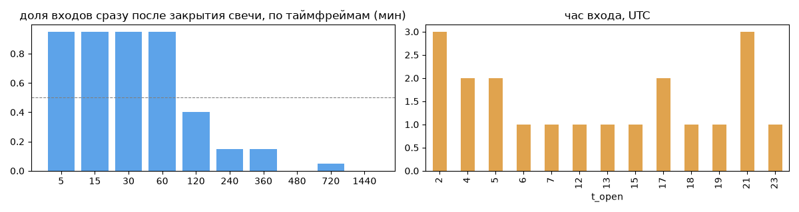
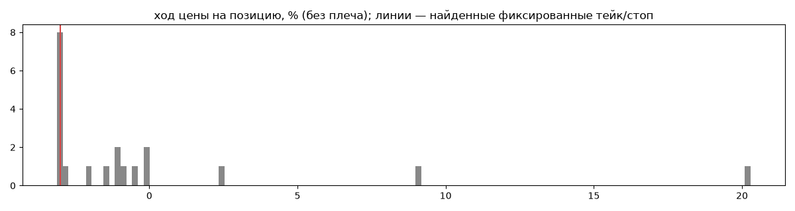
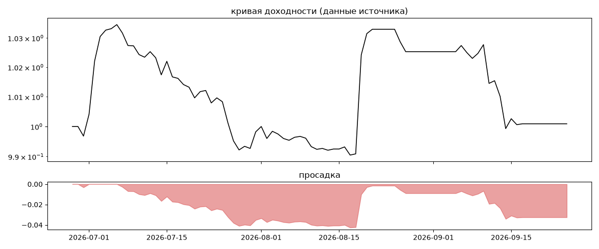
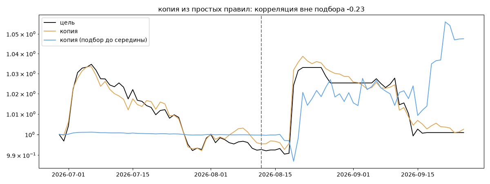

# CAB_Trader — обратный инжиниринг

*Источник: bybit · https://www.bybit.com/copyTrade/trade-center/detail?leaderMark=c2oAXxd3NVU1tNr+CT7eQA== · разбор 26.09.2026*

> CAB_Trader operações em mercado perpetuo modo automático para Long e Short, utilizando AI com BOT operando 24H. Acompanhe os BOT em andamento para BTC / ETH / SOL / DOGE. Trades conservadores sem alavancagem.

## Коротко

- **Тип:** тренд · покупает страховку · **бот**
  - в плюс 15% сделок, средний плюс в 5.71 раза больше минуса
  - контекст входа: вход ПО ХОДУ движения (тренд/пробой) (75% входов по ходу 4–24 ч движения)
- **Контекст входа:** вход ПО ХОДУ движения (тренд/пробой): за 4ч 50% по ходу (медиана 0.12%), за 24ч 100% по ходу (медиана 1.97%), за 72ч 60% по ходу (медиана 0.56%)
- **Когда входит:** на закрытии свечи 60 мин (≈0.1 мин после закрытия, 95% входов)
- **Правило входа:** не искали — мало позиций (20 < 60)
- **Как выходит:** стоп фиксированный ≈ -3.0%; 50% выходов сразу сменяются новым входом — переворот или перезапуск бота
- **Результат:** ×1.0, +0% в год, макс. просадка -4%, сейчас -3% (81 дн.). По годам: 2026: +0%
- **Хвосты:** месяцев в плюс 67%, худший месяц = None средних хороших, просадка/волатильность -0.43 → не ясно
- **Природа по кривой:** тренд 55%, возврат к среднему 35%, докупка (продажа страховки) 10% · совпадение копии вне подбора -0.23 (на подборе 1.0) — ⚠️ кривая короткая, вывод слабый
- **Форма доходности:** участие в росте рынка 0.14, в падении -0.05 → в обычные дни в росте участвует сильнее, чем в падениях (редкие обвалы тут не видны — см. «хвосты»)
- **Оговорки:** только последние 90 дней — выводы о правилах ограничены; p_open = средняя позиции, order_price = цена ордера; кривая = cumResetRoi за 90 дней (ROI витрины, с плечом)

## Почерк

| | |
|---|---|
| период | 2026-06-30 → 2026-09-15 (77 дн.) |
| позиций | 20 (1.81 в неделю), открыто сейчас 0 |
| монет | 1: ETH 20 |
| доля BTC/ETH/SOL/XRP/BNB/золото | 100% |
| шорты | 50% |
| в плюс | 15% |
| средний плюс / минус | 11.51% / -2.02% (отношение 5.71) |
| худшая / лучшая | -3.13% / 22.9% |
| удержание 10/50/90% | {'p10': 21.0, 'p50': 56.5, 'p90': 158.2} ч |
| одновременно открыто макс. | 2 |
| доливки | {'multi_order_share': 0.0, 'size_ratio': None, 'add_dir': None, 'max_orders': 1, 'cost_mult_max': 1.7, 'cost_cv': 0.18} |
| уровни цен | {'round_price_share': 0.0, 'repeat_price_share': 0.0, 'grid': None} |







## Копия по кривой

Подбор на 89 днях, разрез 2026-08-12. Корреляция дневной доходности: подбор 1.0, **проверка -0.23**, вся история 0.95 (R² 0.9).

| компонента копии | вес |
|---|---|
| BTC [день] возврат 5 | 0.088 |
| BTC [4ч] докупка шаг 2% тейк 2% | 0.082 |
| BTC [день] возврат 2 | 0.075 |
| ETH [4ч] возврат 3 | 0.075 |
| BTC [4ч] EMA10/50 | 0.074 |
| ETH [день] ход 5 | 0.064 |
| ETH [4ч] ход 10 | 0.056 |
| BTC [4ч] ход 5 | 0.047 |
| BTC [день] ход 1 | 0.037 |
| SOL [4ч] ход 3 | 0.034 |

Сильнее всего совпадает по одиночке: ETH [день] ход 3 (0.77), ETH [день] ход 5 (0.76), ETH [день] ход 1 (0.73), ETH [4ч] EMA5/20 (0.72), ETH [день] ход 2 (0.7), ETH [4ч] ход 10 (0.67)

Сильнее всего противоположна: ETH [день] возврат 3 (-0.77), ETH [день] возврат 5 (-0.76), ETH [день] возврат 1 (-0.73), ETH [день] пробой 10 (-0.72)




## Выходы

```
{
 "fixed_tp": null,
 "fixed_sl": {
  "level": -3.0,
  "share": 0.47
 },
 "reentry": 0.5,
 "exit_on_candle_close": {
  "15": 0.7,
  "60": 0.55,
  "240": 0.1,
  "1440": 0.0
 },
 "hold_mode_h": 50.0,
 "hold_mode_share": 0.1,
 "atr": {
  "interval": "60",
  "win_pct_cv": NaN,
  "win_atr_cv": NaN,
  "loss_pct_cv": 0.57,
  "loss_atr_cv": 0.63,
  "win_k_median": 9.94,
  "loss_k_median": -3.31
 },
 "verdict": [
  "стоп фиксированный ≈ -3.0%",
  "50% выходов сразу сменяются новым входом — переворот или перезапуск бота"
 ]
}
```