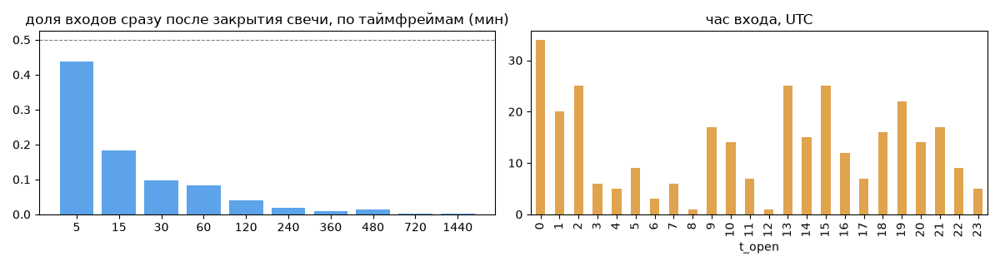
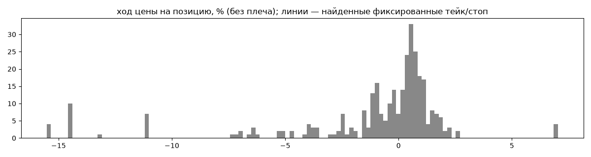
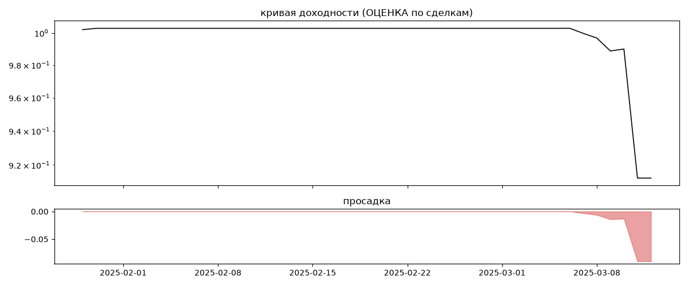

# Anjuta (мои копии) — обратный инжиниринг

*Источник: bybit-copy-export ·  · разбор 26.09.2026*

## Коротко

- **Тип:** контртренд (вход против движения) · нейтрально · **не ясно, бот или человек**
  - контекст входа: вход ПРОТИВ движения (контртренд/докупка на проливе) (35% входов по ходу 4–24 ч движения)
- **Контекст входа:** вход ПРОТИВ движения (контртренд/докупка на проливе): за 4ч 45% по ходу (медиана -0.28%), за 24ч 26% по ходу (медиана -3.4%), за 72ч 43% по ходу (медиана -2.81%)
- **Когда входит:** без привязки к свечам
- **Правило входа:** не искали — у входов нет сетки свечей — входы лимитками/вручную или по тикам; укажите таймфрейм вручную (--tf)
- **Как выходит:** тейк похож на ≈0.34×ATR
- **Результат (оценка по сделкам):** ×0.91, -56% в год, макс. просадка -9%, сейчас -9% (6 дн.). По годам: 2025: -9%
- **Хвосты:** месяцев в плюс 0%, худший месяц = None средних хороших, просадка/волатильность -0.39 → не ясно
- **Оговорки:** только период подписки Вадима; цены входа/выхода из истории копирования (средние позиции)

## Почерк

| | |
|---|---|
| период | 2025-01-29 → 2025-03-11 (41 дн.) |
| позиций | 315 (54.15 в неделю), открыто сейчас 0 |
| монет | 2: XRP 191, DOGE 124 |
| доля BTC/ETH/SOL/XRP/BNB/золото | 61% |
| шорты | 0% |
| в плюс | 54% |
| средний плюс / минус | 1.02% / -3.72% (отношение 0.27) |
| худшая / лучшая | -18.62% / 8.63% |
| удержание 10/50/90% | {'p10': 0.1, 'p50': 1.3, 'p90': 13.7} ч |
| одновременно открыто макс. | 37 |
| доливки | {'multi_order_share': 0.0, 'size_ratio': None, 'add_dir': None, 'max_orders': 1, 'cost_mult_max': 48.1, 'cost_cv': 2.43} |
| уровни цен | {'round_price_share': 0.01, 'repeat_price_share': 0.12, 'grid': None} |








## Выходы

```
{
 "fixed_tp": null,
 "fixed_sl": null,
 "reentry": 0.15,
 "exit_on_candle_close": {
  "15": 0.09,
  "60": 0.01,
  "240": 0.0,
  "1440": 0.0
 },
 "hold_mode_h": 44.98,
 "hold_mode_share": 0.03,
 "atr": {
  "interval": "60",
  "win_pct_cv": 1.23,
  "win_atr_cv": 0.9,
  "loss_pct_cv": 1.26,
  "loss_atr_cv": 1.48,
  "win_k_median": 0.34,
  "loss_k_median": -0.8
 },
 "verdict": [
  "тейк похож на ≈0.34×ATR"
 ]
}
```