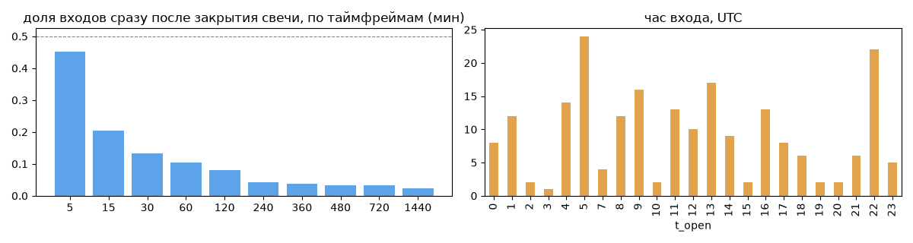
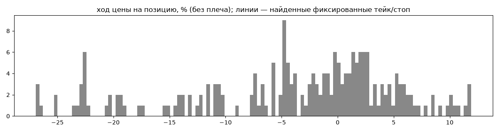
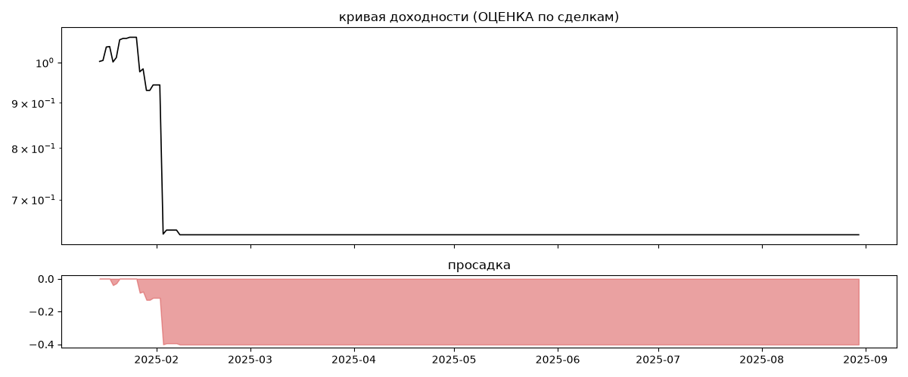

# CryptosMX (мои копии) — обратный инжиниринг

*Источник: bybit-copy-export ·  · разбор 26.09.2026*

## Коротко

- **Тип:** контртренд (вход против движения) · нейтрально · **не ясно, бот или человек**
  - контекст входа: вход ПРОТИВ движения (контртренд/докупка на проливе) (28% входов по ходу 4–24 ч движения)
- **Контекст входа:** вход ПРОТИВ движения (контртренд/докупка на проливе): за 4ч 22% по ходу (медиана -1.79%), за 24ч 37% по ходу (медиана -4.89%), за 72ч 32% по ходу (медиана -4.59%)
- **Когда входит:** без привязки к свечам
- **Правило входа:** не искали — у входов нет сетки свечей — входы лимитками/вручную или по тикам; укажите таймфрейм вручную (--tf)
- **Как выходит:** выход плавающий: по сигналу или скользящему стопу
- **Результат (оценка по сделкам):** ×0.64, -52% в год, макс. просадка -40%, сейчас -40% (216 дн.). По годам: 2025: -36%
- **Хвосты:** месяцев в плюс 14%, худший месяц = -6000.9 средних хороших, просадка/волатильность -0.92 → продаёт страховку: один плохой месяц съедает много хороших
- **Оговорки:** только период подписки Вадима; цены входа/выхода из истории копирования (средние позиции)

## Почерк

| | |
|---|---|
| период | 2025-01-15 → 2025-08-29 (226 дн.) |
| позиций | 210 (6.51 в неделю), открыто сейчас 0 |
| монет | 3: DOGE 178, 1000PEPE 31, SUI 1 |
| доля BTC/ETH/SOL/XRP/BNB/золото | 0% |
| шорты | 0% |
| в плюс | 41% |
| средний плюс / минус | 4.07% / -9.68% (отношение 0.42) |
| худшая / лучшая | -31.34% / 15.74% |
| удержание 10/50/90% | {'p10': 6.4, 'p50': 30.0, 'p90': 117.8} ч |
| одновременно открыто макс. | 52 |
| доливки | {'multi_order_share': 0.0, 'size_ratio': None, 'add_dir': None, 'max_orders': 1, 'cost_mult_max': 51.0, 'cost_cv': 1.95} |
| уровни цен | {'round_price_share': 0.02, 'repeat_price_share': 0.02, 'grid': None} |








## Выходы

```
{
 "fixed_tp": null,
 "fixed_sl": null,
 "reentry": 0.0,
 "exit_on_candle_close": {
  "15": 0.32,
  "60": 0.23,
  "240": 0.01,
  "1440": 0.0
 },
 "hold_mode_h": 17.27,
 "hold_mode_share": 0.04,
 "atr": {
  "interval": "60",
  "win_pct_cv": 0.85,
  "win_atr_cv": 1.0,
  "loss_pct_cv": 0.85,
  "loss_atr_cv": 1.14,
  "win_k_median": 1.48,
  "loss_k_median": -2.97
 },
 "verdict": [
  "выход плавающий: по сигналу или скользящему стопу"
 ]
}
```