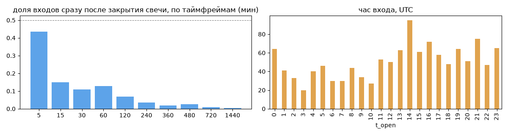
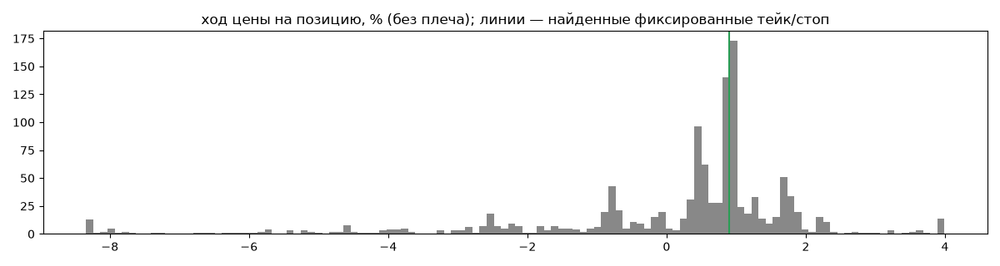
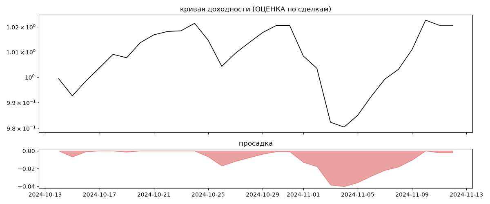

# dogge trader (мои копии) — обратный инжиниринг

*Источник: bybit-copy-export ·  · разбор 26.09.2026*

## Коротко

- **Тип:** скальпер · нейтрально · **бот**
  - сделка держится ~0.8 ч, 302.0 сделок в неделю
  - контекст входа: вход без выраженной стороны (56% входов по ходу 4–24 ч движения)
- **Контекст входа:** вход без выраженной стороны: за 4ч 48% по ходу (медиана -0.25%), за 24ч 65% по ходу (медиана 4.21%), за 72ч 74% по ходу (медиана 10.54%)
- **Когда входит:** без привязки к свечам; 28% входов пачками по разным монетам
- **Правило входа:** не искали — у входов нет сетки свечей — входы лимитками/вручную или по тикам; укажите таймфрейм вручную (--tf)
- **Как выходит:** тейк фиксированный ≈ +0.9%; 38% выходов сразу сменяются новым входом — переворот или перезапуск бота
- **Результат (оценка по сделкам):** ×1.02, +30% в год, макс. просадка -4%, сейчас -0% (2 дн.). По годам: 2024: +2%
- **Хвосты:** месяцев в плюс 100%, худший месяц = None средних хороших, просадка/волатильность -0.3 → не ясно
- **Оговорки:** только период подписки Вадима; цены входа/выхода из истории копирования (средние позиции)

## Почерк

| | |
|---|---|
| период | 2024-10-14 → 2024-11-11 (28 дн.) |
| позиций | 1211 (302.0 в неделю), открыто сейчас 0 |
| монет | 10: POPCAT 313, WIF 202, SHIB1000 156, BOME 131, 1000FLOKI 124, 1000BONK 114 |
| доля BTC/ETH/SOL/XRP/BNB/золото | 0% |
| шорты | 0% |
| в плюс | 71% |
| средний плюс / минус | 1.11% / -2.49% (отношение 0.45) |
| худшая / лучшая | -18.32% / 9.07% |
| удержание 10/50/90% | {'p10': 0.1, 'p50': 0.8, 'p90': 10.6} ч |
| одновременно открыто макс. | 35 |
| доливки | {'multi_order_share': 0.0, 'size_ratio': None, 'add_dir': None, 'max_orders': 1, 'cost_mult_max': 118.9, 'cost_cv': 2.79} |
| уровни цен | {'round_price_share': 0.03, 'repeat_price_share': 0.09, 'grid': {'sym': 'SILLY', 'step': 1e-05, 'step_pct': np.float64(0.04), 'levels': 9, 'on_grid': 1.0}} |








## Выходы

```
{
 "fixed_tp": {
  "level": 0.9,
  "share": 0.4
 },
 "fixed_sl": null,
 "reentry": 0.38,
 "exit_on_candle_close": {
  "15": 0.16,
  "60": 0.03,
  "240": 0.01,
  "1440": 0.0
 },
 "hold_mode_h": 0.02,
 "hold_mode_share": 0.02,
 "atr": {
  "interval": "60",
  "win_pct_cv": 0.6,
  "win_atr_cv": 0.72,
  "loss_pct_cv": 0.95,
  "loss_atr_cv": 0.82,
  "win_k_median": 0.25,
  "loss_k_median": -0.39
 },
 "verdict": [
  "тейк фиксированный ≈ +0.9%",
  "38% выходов сразу сменяются новым входом — переворот или перезапуск бота"
 ]
}
```