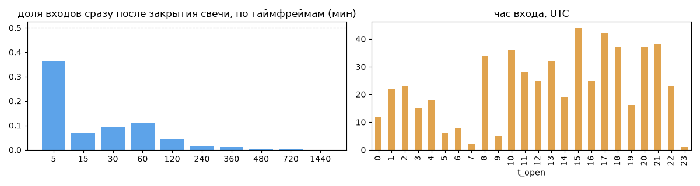
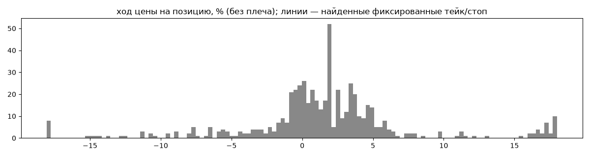
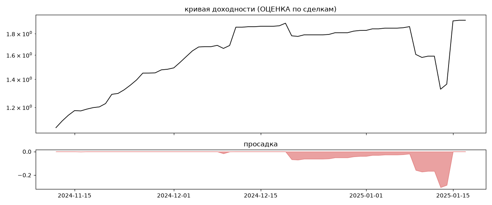

# ITEKCrypto Kamaz (мои копии) — обратный инжиниринг

*Источник: bybit-copy-export ·  · разбор 26.09.2026*

## Коротко

- **Тип:** контртренд (вход против движения) · нейтрально · **бот**
  - контекст входа: вход ПРОТИВ движения (контртренд/докупка на проливе) (30% входов по ходу 4–24 ч движения)
- **Контекст входа:** вход ПРОТИВ движения (контртренд/докупка на проливе): за 4ч 22% по ходу (медиана -2.01%), за 24ч 38% по ходу (медиана -2.95%), за 72ч 44% по ходу (медиана -3.15%)
- **Когда входит:** без привязки к свечам; 51% входов пачками по разным монетам
- **Правило входа:** не искали — у входов нет сетки свечей — входы лимитками/вручную или по тикам; укажите таймфрейм вручную (--tf)
- **Как выходит:** выход плавающий: по сигналу или скользящему стопу
- **Результат (оценка по сделкам):** ×1.81, +2536% в год, макс. просадка -30%, сейчас +0% (0 дн.). По годам: 2024: +71%, 2025: +6%
- **Хвосты:** месяцев в плюс 100%, худший месяц = None средних хороших, просадка/волатильность -0.26 → не ясно
- **Оговорки:** только период подписки Вадима; цены входа/выхода из истории копирования (средние позиции)

## Почерк

| | |
|---|---|
| период | 2024-11-12 → 2025-01-16 (65 дн.) |
| позиций | 548 (58.83 в неделю), открыто сейчас 0 |
| монет | 18: 1000PEPE 191, DOGE 126, OP 26, WLD 24, SHIB1000 22, 1000BONK 21 |
| доля BTC/ETH/SOL/XRP/BNB/золото | 3% |
| шорты | 0% |
| в плюс | 68% |
| средний плюс / минус | 4.1% / -3.92% (отношение 1.05) |
| худшая / лучшая | -23.37% / 19.05% |
| удержание 10/50/90% | {'p10': 0.2, 'p50': 4.4, 'p90': 50.8} ч |
| одновременно открыто макс. | 55 |
| доливки | {'multi_order_share': 0.0, 'size_ratio': None, 'add_dir': None, 'max_orders': 1, 'cost_mult_max': 53.2, 'cost_cv': 1.33} |
| уровни цен | {'round_price_share': 0.02, 'repeat_price_share': 0.08, 'grid': {'sym': 'OP', 'step': 0.0001, 'step_pct': np.float64(0.01), 'levels': 4, 'on_grid': 1.0}} |








## Выходы

```
{
 "fixed_tp": null,
 "fixed_sl": null,
 "reentry": 0.01,
 "exit_on_candle_close": {
  "15": 0.17,
  "60": 0.05,
  "240": 0.0,
  "1440": 0.0
 },
 "hold_mode_h": 11.96,
 "hold_mode_share": 0.01,
 "atr": {
  "interval": "60",
  "win_pct_cv": 1.23,
  "win_atr_cv": 1.25,
  "loss_pct_cv": 1.07,
  "loss_atr_cv": 1.26,
  "win_k_median": 0.97,
  "loss_k_median": -0.88
 },
 "verdict": [
  "выход плавающий: по сигналу или скользящему стопу"
 ]
}
```