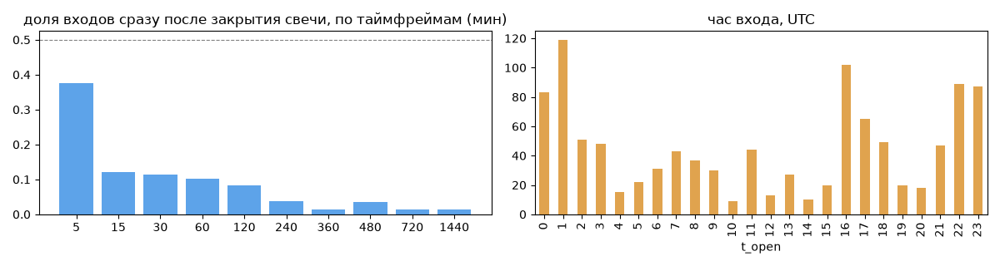
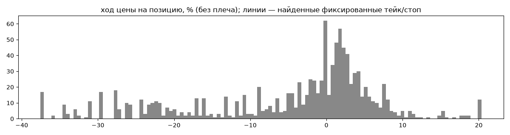
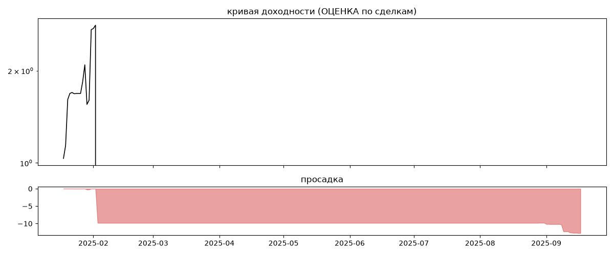

# ITEKCrypto REINVEST (мои копии) — обратный инжиниринг

*Источник: bybit-copy-export ·  · разбор 26.09.2026*

## Коротко

- **Тип:** сетка · продаёт страховку · **бот**
  - заявки на повторяющихся уровнях 1000PEPE с шагом 1e-06 (~0.01%)
  - контекст входа: вход ПРОТИВ движения (контртренд/докупка на проливе) (16% входов по ходу 4–24 ч движения)
- **Контекст входа:** вход ПРОТИВ движения (контртренд/докупка на проливе): за 4ч 17% по ходу (медиана -2.36%), за 24ч 15% по ходу (медиана -9.23%), за 72ч 24% по ходу (медиана -10.76%)
- **Когда входит:** без привязки к свечам; 68% входов пачками по разным монетам
- **Правило входа:** не искали — у входов нет сетки свечей — входы лимитками/вручную или по тикам; укажите таймфрейм вручную (--tf)
- **Как выходит:** выход плавающий: по сигналу или скользящему стопу
- **Результат (оценка по сделкам):** ×2.72, +3899369699010% в год, макс. просадка -26%, сейчас +0% (0 дн.). По годам: 2025: +172%
- **Хвосты:** месяцев в плюс 100%, худший месяц = None средних хороших, просадка/волатильность -0.06 → не ясно
- **Оговорки:** только период подписки Вадима; цены входа/выхода из истории копирования (средние позиции)

## Почерк

| | |
|---|---|
| период | 2025-01-18 → 2025-09-15 (241 дн.) |
| позиций | 1079 (31.39 в неделю), открыто сейчас 0 |
| монет | 15: 1000PEPE 198, 1000FLOKI 147, DOGE 128, 1000BONK 113, SOL 102, AVAX 88 |
| доля BTC/ETH/SOL/XRP/BNB/золото | 17% |
| шорты | 1% |
| в плюс | 46% |
| средний плюс / минус | 4.44% / -13.05% (отношение 0.34) |
| худшая / лучшая | -39.24% / 26.99% |
| удержание 10/50/90% | {'p10': 0.5, 'p50': 7.5, 'p90': 44.1} ч |
| одновременно открыто макс. | 377 |
| доливки | {'multi_order_share': 0.0, 'size_ratio': None, 'add_dir': None, 'max_orders': 1, 'cost_mult_max': 25.6, 'cost_cv': 1.06} |
| уровни цен | {'round_price_share': 0.03, 'repeat_price_share': 0.32, 'grid': {'sym': '1000PEPE', 'step': 1e-06, 'step_pct': np.float64(0.01), 'levels': 36, 'on_grid': 1.0}} |








## Выходы

```
{
 "fixed_tp": null,
 "fixed_sl": null,
 "reentry": 0.0,
 "exit_on_candle_close": {
  "15": 0.33,
  "60": 0.02,
  "240": 0.0,
  "1440": 0.0
 },
 "hold_mode_h": 9.25,
 "hold_mode_share": 0.01,
 "atr": {
  "interval": "60",
  "win_pct_cv": 0.88,
  "win_atr_cv": 1.13,
  "loss_pct_cv": 0.64,
  "loss_atr_cv": 0.82,
  "win_k_median": 1.48,
  "loss_k_median": -5.07
 },
 "verdict": [
  "выход плавающий: по сигналу или скользящему стопу"
 ]
}
```