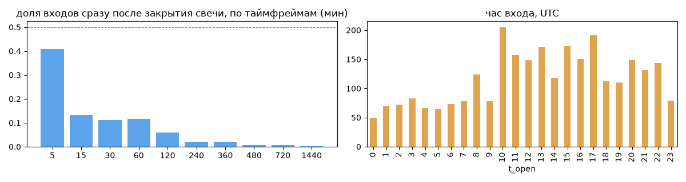
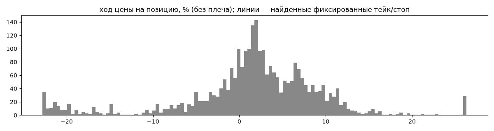
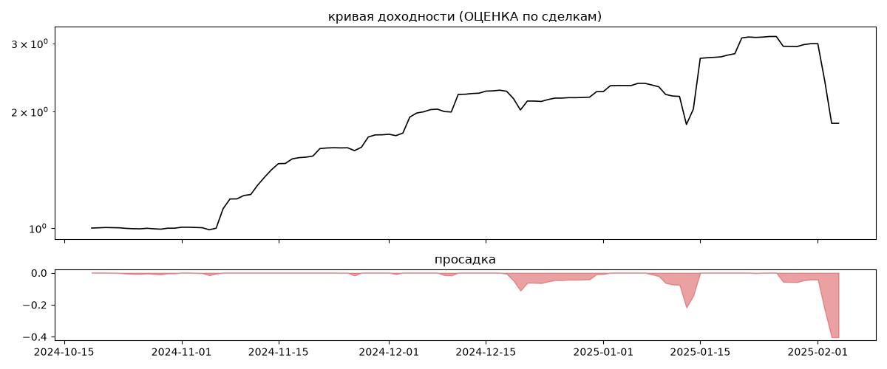

# ITEKCrypto (мои копии) — обратный инжиниринг

*Источник: bybit-copy-export ·  · разбор 26.09.2026*

## Коротко

- **Тип:** контртренд (вход против движения) · нейтрально · **бот**
  - часто в плюс (69%), но плюс меньше минуса
  - контекст входа: вход ПРОТИВ движения (контртренд/докупка на проливе) (33% входов по ходу 4–24 ч движения)
- **Контекст входа:** вход ПРОТИВ движения (контртренд/докупка на проливе): за 4ч 34% по ходу (медиана -1.08%), за 24ч 32% по ходу (медиана -2.45%), за 72ч 24% по ходу (медиана -5.32%)
- **Когда входит:** без привязки к свечам; 35% входов пачками по разным монетам
- **Правило входа:** не искали — у входов нет сетки свечей — входы лимитками/вручную или по тикам; укажите таймфрейм вручную (--tf)
- **Как выходит:** выход плавающий: по сигналу или скользящему стопу
- **Результат (оценка по сделкам):** ×1.86, +721% в год, макс. просадка -40%, сейчас -40% (9 дн.). По годам: 2024: +125%, 2025: -17%
- **Хвосты:** месяцев в плюс 75%, худший месяц = None средних хороших, просадка/волатильность -0.38 → не ясно
- **Оговорки:** только период подписки Вадима; цены входа/выхода из истории копирования (средние позиции)

## Почерк

| | |
|---|---|
| период | 2024-10-19 → 2025-02-03 (107 дн.) |
| позиций | 2797 (183.7 в неделю), открыто сейчас 0 |
| монет | 13: 1000PEPE 1101, SOL 777, DOGE 669, SHIB1000 76, XRP 50, 10000SATS 40 |
| доля BTC/ETH/SOL/XRP/BNB/золото | 30% |
| шорты | 0% |
| в плюс | 69% |
| средний плюс / минус | 5.48% / -7.11% (отношение 0.77) |
| худшая / лучшая | -30.76% / 38.57% |
| удержание 10/50/90% | {'p10': 0.7, 'p50': 23.0, 'p90': 132.9} ч |
| одновременно открыто макс. | 345 |
| доливки | {'multi_order_share': 0.0, 'size_ratio': None, 'add_dir': None, 'max_orders': 1, 'cost_mult_max': 100.4, 'cost_cv': 1.41} |
| уровни цен | {'round_price_share': 0.01, 'repeat_price_share': 0.13, 'grid': {'sym': 'SOL', 'step': 0.01, 'step_pct': np.float64(0.0), 'levels': 76, 'on_grid': 1.0}} |








## Выходы

```
{
 "fixed_tp": null,
 "fixed_sl": null,
 "reentry": 0.02,
 "exit_on_candle_close": {
  "15": 0.16,
  "60": 0.04,
  "240": 0.02,
  "1440": 0.01
 },
 "hold_mode_h": 0.23,
 "hold_mode_share": 0.01,
 "atr": {
  "interval": "60",
  "win_pct_cv": 0.58,
  "win_atr_cv": 0.58,
  "loss_pct_cv": 0.42,
  "loss_atr_cv": 0.61,
  "win_k_median": 2.32,
  "loss_k_median": -9.99
 },
 "verdict": [
  "выход плавающий: по сигналу или скользящему стопу"
 ]
}
```