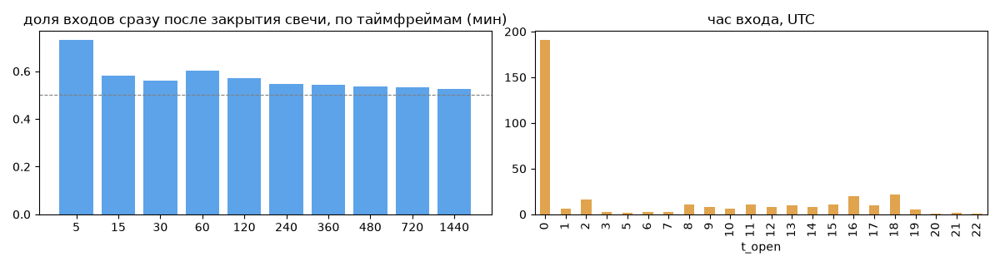
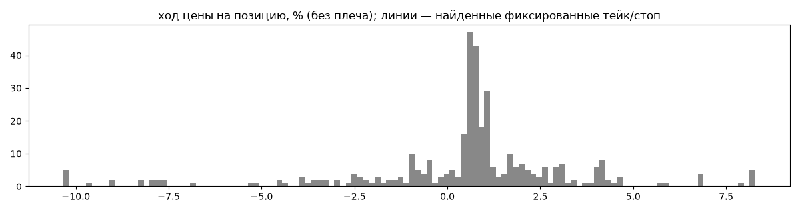
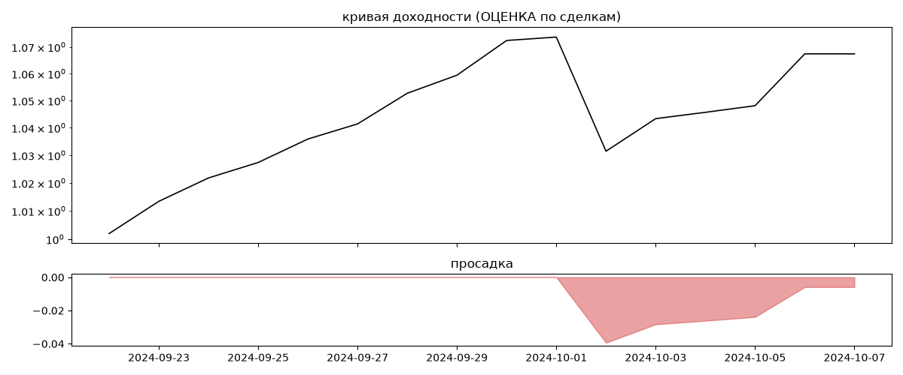

# livemore low risk (мои копии) — обратный инжиниринг

*Источник: bybit-copy-export ·  · разбор 26.09.2026*

## Коротко

- **Тип:** возврат к среднему · нейтрально · **бот**
  - часто в плюс (74%), но плюс меньше минуса
  - контекст входа: вход без выраженной стороны (42% входов по ходу 4–24 ч движения)
- **Контекст входа:** вход без выраженной стороны: за 4ч 43% по ходу (медиана -0.59%), за 24ч 41% по ходу (медиана -1.41%), за 72ч 55% по ходу (медиана 2.43%)
- **Когда входит:** на закрытии свечи 1440 мин (≈0.0 мин после закрытия, 52% входов); 68% входов пачками по разным монетам
- **Правило входа:** правило найдено частично — лучшее: «импульс тело≥1.2% объём≥1.2× у края канала | BTC>EMA200», на проверке F1 0.444 (охват 0.56, точность 0.48 на всей истории)
- **Как выходит:** 57% выходов сразу сменяются новым входом — переворот или перезапуск бота; выход по времени ≈ через 23.98 ч
- **Результат (оценка по сделкам):** ×1.07, +366% в год, макс. просадка -4%, сейчас -1% (6 дн.). По годам: 2024: +6%
- **Хвосты:** месяцев в плюс 0%, худший месяц = None средних хороших, просадка/волатильность -0.16 → не ясно
- **Оговорки:** только период подписки Вадима; цены входа/выхода из истории копирования (средние позиции)

## Почерк

| | |
|---|---|
| период | 2024-09-22 → 2024-10-06 (14 дн.) |
| позиций | 358 (177.0 в неделю), открыто сейчас 0 |
| монет | 11: SHIB1000 110, SUI 52, RENDER 44, 1000PEPE 40, 1000BONK 34, 1000FLOKI 30 |
| доля BTC/ETH/SOL/XRP/BNB/золото | 0% |
| шорты | 0% |
| в плюс | 74% |
| средний плюс / минус | 1.7% / -3.3% (отношение 0.51) |
| худшая / лучшая | -21.01% / 8.92% |
| удержание 10/50/90% | {'p10': 0.5, 'p50': 24.0, 'p90': 48.0} ч |
| одновременно открыто макс. | 42 |
| доливки | {'multi_order_share': 0.0, 'size_ratio': None, 'add_dir': None, 'max_orders': 1, 'cost_mult_max': 78.7, 'cost_cv': 2.0} |
| уровни цен | {'round_price_share': 0.04, 'repeat_price_share': 0.09, 'grid': {'sym': 'SHIB1000', 'step': 1e-06, 'step_pct': np.float64(0.01), 'levels': 6, 'on_grid': 1.0}} |







## Правило входа

Таймфрейм D, монет 10, входов в окне 25. Точность считается только по свечам, где цель вне позиции по монете.

| правило                                                              |   совпало |   сработало |   охват |   точность |    F1 |   F1_подбор |   F1_проверка |
|:---------------------------------------------------------------------|----------:|------------:|--------:|-----------:|------:|------------:|--------------:|
| импульс тело≥1.2% объём≥1.2× у края канала | BTC>EMA200              |        14 |          29 |    0.56 |       0.48 | 0.519 |       0.533 |         0.444 |
| импульс тело≥0.8% объём≥1.2× у края канала | BTC>EMA200              |        14 |          29 |    0.56 |       0.48 | 0.519 |       0.533 |         0.444 |
| импульс тело≥2.0% объём≥1.2× у края канала | BTC>EMA200              |        14 |          29 |    0.56 |       0.48 | 0.519 |       0.533 |         0.444 |
| импульс тело≥0.8% объём≥1.2× у края канала | —                       |        14 |          30 |    0.56 |       0.47 | 0.509 |       0.533 |         0.4   |
| импульс тело≥1.2% объём≥1.2× у края канала | —                       |        14 |          30 |    0.56 |       0.47 | 0.509 |       0.533 |         0.4   |
| импульс тело≥2.0% объём≥1.2× у края канала | —                       |        14 |          30 |    0.56 |       0.47 | 0.509 |       0.533 |         0.4   |
| импульс тело≥2.0% объём≥1.2× у края канала | BTC>EMA50               |        13 |          29 |    0.52 |       0.45 | 0.481 |       0.533 |         0.222 |
| импульс тело≥1.2% объём≥1.2× у края канала | BTC>EMA50               |        13 |          29 |    0.52 |       0.45 | 0.481 |       0.533 |         0.222 |
| импульс тело≥0.8% объём≥1.2× у края канала | BTC>EMA50               |        13 |          29 |    0.52 |       0.45 | 0.481 |       0.533 |         0.222 |
| импульс тело≥0.8% объём≥1.2× у края канала | BTC свеча того же цвета |        11 |          23 |    0.44 |       0.48 | 0.458 |       0.513 |         0.222 |
| импульс тело≥1.2% объём≥1.2× у края канала | BTC свеча того же цвета |        11 |          23 |    0.44 |       0.48 | 0.458 |       0.513 |         0.222 |
| импульс тело≥2.0% объём≥1.2× у края канала | BTC свеча того же цвета |        11 |          23 |    0.44 |       0.48 | 0.458 |       0.513 |         0.222 |

**Подпись свечи входа** (эффект = сдвиг медианы входов от обычных свечей в межквартильных размахах):

| признак           | сторона   |   медиана_входов |    p10 |   p90 |   медиана_обычных |   эффект |
|:------------------|:----------|-----------------:|-------:|------:|------------------:|---------:|
| ход 4 св %        | лонг      |            14.92 | -10.74 | 31.52 |              4.35 |     1.44 |
| от EMA20 %        | лонг      |            20.2  |  -0.12 | 33.8  |              7.83 |     1.3  |
| объём/ср50        | лонг      |             1.78 |   0.83 |  3.33 |              0.96 |     1.17 |
| от EMA200 %       | лонг      |            12.5  |  -8.84 | 64.27 |             -0.75 |     1.08 |
| RSI14             | лонг      |            70.45 |  50.82 | 82.44 |             59.8  |     0.98 |
| от EMA50 %        | лонг      |            21.52 |   0.18 | 51.42 |              9.56 |     0.92 |
| наклон EMA20 %    | лонг      |             5.92 |   0.92 | 13.93 |              2.9  |     0.88 |
| ход 12 св %       | лонг      |            26.22 |   3.09 | 60.49 |             12.92 |     0.84 |
| RSI7              | лонг      |            79.77 |  46.08 | 90.07 |             63.62 |     0.8  |
| место в канале 55 | лонг      |             0.87 |   0.51 |  0.96 |              0.66 |     0.71 |
| ход 1 св %        | лонг      |             5.52 |   0.51 | 12.16 |              1.65 |     0.66 |
| тело %            | лонг      |             5.52 |   0.51 | 12.16 |              1.65 |     0.66 |
| тело/ATR          | лонг      |             0.68 |   0.07 |  1.56 |              0.24 |     0.59 |
| объём/ср20        | лонг      |             1.47 |   0.73 |  3.45 |              1.03 |     0.52 |

**Дерево решений** (подбор на первых 2/3; на проверке {'охват': 0.17, 'точность': 1.0, 'F1': 0.286}):
```
|--- от EMA20 % <= 18.40
|   |--- место в канале 20 <= 0.93
|   |   |--- class: 0
|   |--- место в канале 20 >  0.93
|   |   |--- class: 1
|--- от EMA20 % >  18.40
|   |--- class: 1
```

## Выходы

```
{
 "fixed_tp": null,
 "fixed_sl": null,
 "reentry": 0.58,
 "exit_on_candle_close": {
  "15": 0.06,
  "60": 0.02,
  "240": 0.0,
  "1440": 0.0
 },
 "hold_mode_h": 23.98,
 "hold_mode_share": 0.38,
 "atr": {
  "interval": "D",
  "win_pct_cv": 1.02,
  "win_atr_cv": 0.91,
  "loss_pct_cv": 1.13,
  "loss_atr_cv": 1.11,
  "win_k_median": 0.13,
  "loss_k_median": -0.27
 },
 "verdict": [
  "57% выходов сразу сменяются новым входом — переворот или перезапуск бота",
  "выход по времени ≈ через 23.98 ч"
 ]
}
```