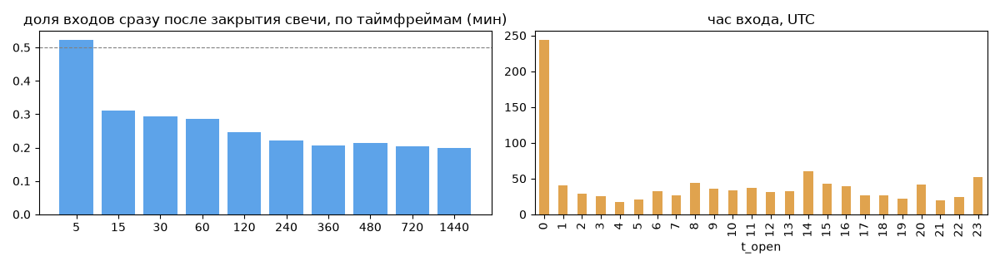
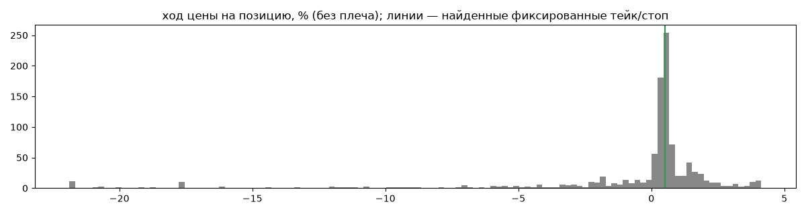
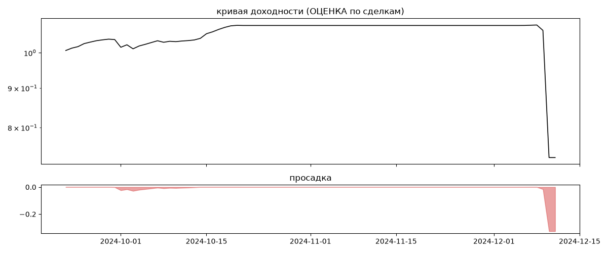

# Livingstone low risk (мои копии) — обратный инжиниринг

*Источник: bybit-copy-export ·  · разбор 26.09.2026*

## Коротко

- **Тип:** возврат к среднему · продаёт страховку · **бот**
  - часто в плюс (76%), но плюс меньше минуса
  - контекст входа: вход без выраженной стороны (48% входов по ходу 4–24 ч движения)
- **Контекст входа:** вход без выраженной стороны: за 4ч 47% по ходу (медиана -0.15%), за 24ч 50% по ходу (медиана -0.01%), за 72ч 69% по ходу (медиана 5.43%)
- **Когда входит:** без привязки к свечам; 36% входов пачками по разным монетам
- **Правило входа:** не искали — у входов нет сетки свечей — входы лимитками/вручную или по тикам; укажите таймфрейм вручную (--tf)
- **Как выходит:** тейк фиксированный ≈ +0.5%; 40% выходов сразу сменяются новым входом — переворот или перезапуск бота
- **Результат (оценка по сделкам):** ×0.73, -77% в год, макс. просадка -33%, сейчас -33% (3 дн.). По годам: 2024: -27%
- **Хвосты:** месяцев в плюс 33%, худший месяц = None средних хороших, просадка/волатильность -0.48 → не ясно
- **Оговорки:** только период подписки Вадима; цены входа/выхода из истории копирования (средние позиции)

## Почерк

| | |
|---|---|
| период | 2024-09-22 → 2024-12-10 (80 дн.) |
| позиций | 1003 (88.13 в неделю), открыто сейчас 0 |
| монет | 12: ARKM 179, FTM 169, DOGE 164, RUNE 119, ONDO 90, LDO 89 |
| доля BTC/ETH/SOL/XRP/BNB/золото | 0% |
| шорты | 0% |
| в плюс | 76% |
| средний плюс / минус | 0.89% / -5.78% (отношение 0.15) |
| худшая / лучшая | -31.65% / 8.71% |
| удержание 10/50/90% | {'p10': 0.0, 'p50': 2.8, 'p90': 25.5} ч |
| одновременно открыто макс. | 61 |
| доливки | {'multi_order_share': 0.0, 'size_ratio': None, 'add_dir': None, 'max_orders': 1, 'cost_mult_max': 264.0, 'cost_cv': 3.0} |
| уровни цен | {'round_price_share': 0.05, 'repeat_price_share': 0.2, 'grid': {'sym': 'RUNE', 'step': 0.001, 'step_pct': np.float64(0.02), 'levels': 18, 'on_grid': 1.0}} |








## Выходы

```
{
 "fixed_tp": {
  "level": 0.5,
  "share": 0.37
 },
 "fixed_sl": null,
 "reentry": 0.4,
 "exit_on_candle_close": {
  "15": 0.11,
  "60": 0.04,
  "240": 0.0,
  "1440": 0.0
 },
 "hold_mode_h": 23.98,
 "hold_mode_share": 0.15,
 "atr": {
  "interval": "60",
  "win_pct_cv": 1.42,
  "win_atr_cv": 1.15,
  "loss_pct_cv": 0.9,
  "loss_atr_cv": 1.04,
  "win_k_median": 0.15,
  "loss_k_median": -1.91
 },
 "verdict": [
  "тейк фиксированный ≈ +0.5%",
  "40% выходов сразу сменяются новым входом — переворот или перезапуск бота"
 ]
}
```