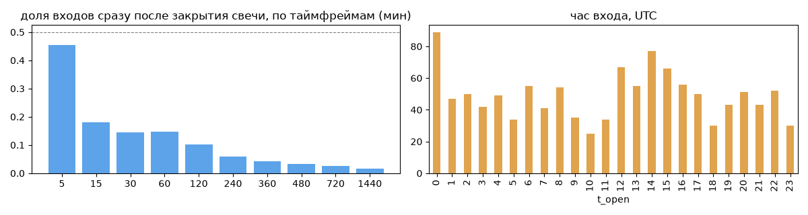
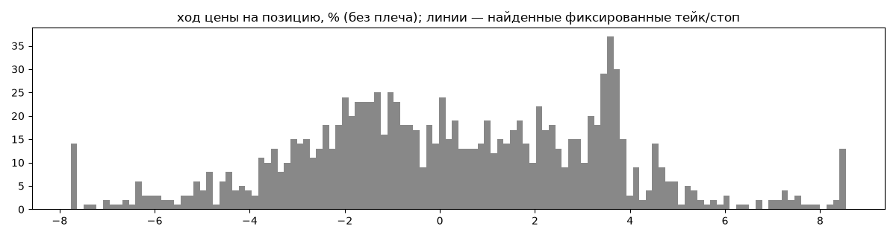
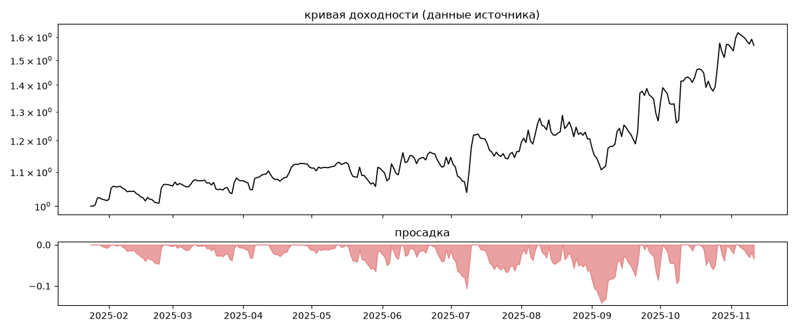
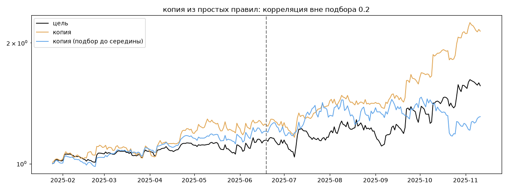

# Donatello Bybit — обратный инжиниринг

*Источник: invvo · https://invvo.com/strategy/18 · разбор 26.09.2026*

> Donatello — трендовая алгоритмическая стратегия, работающая как в лонг, так и в шорт. 

Она сочетает скорость скальпинга со способностью удерживать позиции при сильном тренде, извлекая максимум из движения. Торгует по 18 топ-парам из ТОП-100 Coinmarketcap, с использованием stop-loss и take-profit и гибкую настройку рисков. 

Такой подход ограничивает убытки и повышает стабильность результатов, делая стратегию хорошим дополнением в портфель стратегий других типов. Paracels — команда профессиональных трейдеров и разработчиков, специализирующихся на автоматизированной торговле криптовалютой. 

## Коротко

- **Тип:** тренд (вход по ходу движения) · нейтрально · **бот**
  - контекст входа: вход ПО ХОДУ движения (тренд/пробой) (85% входов по ходу 4–24 ч движения)
  - сверка с самоописанием: заявлено «тренд, скальпинг» → ✅ совпало
- **Контекст входа:** вход ПО ХОДУ движения (тренд/пробой): за 4ч 86% по ходу (медиана 1.24%), за 24ч 85% по ходу (медиана 2.42%), за 72ч 74% по ходу (медиана 2.36%)
- **Когда входит:** без привязки к свечам
- **Правило входа:** не искали — у входов нет сетки свечей — входы лимитками/вручную или по тикам; укажите таймфрейм вручную (--tf)
- **Как выходит:** выход плавающий: по сигналу или скользящему стопу
- **Результат:** ×1.56, +75% в год, макс. просадка -14%, сейчас -4% (7 дн.). По годам: 2025: +56%
- **Хвосты:** месяцев в плюс 80%, худший месяц = -0.1 средних хороших, просадка/волатильность -0.37 → хвост умеренный: худший месяц сопоставим с обычным хорошим
- **Природа по кривой:** тренд 56%, возврат к среднему 31%, докупка (продажа страховки) 9%, держание (бета рынка) 3% · совпадение копии вне подбора 0.2 (на подборе 0.97)
- **Форма доходности:** участие в росте рынка 0.22, в падении -0.37 → в обычные дни в росте участвует сильнее, чем в падениях (редкие обвалы тут не видны — см. «хвосты»)
- **Оговорки:** полная история с запуска; p_open = средняя позиции (cost/lots): доливки внутри, при нескольких стратегиях — неттинг

## Почерк

| | |
|---|---|
| период | 2025-01-26 → 2025-11-11 (289 дн.) |
| позиций | 1175 (28.43 в неделю), открыто сейчас 5 |
| монет | 22: RUNE 340, KAS 140, ALT 84, TAO 81, TRUMP 76, FIL 70 |
| доля BTC/ETH/SOL/XRP/BNB/золото | 9% |
| шорты | 52% |
| в плюс | 51% |
| средний плюс / минус | 2.81% / -2.46% (отношение 1.14) |
| худшая / лучшая | -11.68% / 18.1% |
| удержание 10/50/90% | {'p10': 2.0, 'p50': 16.3, 'p90': 63.7} ч |
| одновременно открыто макс. | 17 |
| доливки | {'multi_order_share': 0.0, 'size_ratio': None, 'add_dir': None, 'max_orders': 1, 'cost_mult_max': 13.0, 'cost_cv': 0.78} |
| уровни цен | {'round_price_share': 0.0, 'repeat_price_share': 0.06, 'grid': None} |







## Копия по кривой

Подбор на 291 днях, разрез 2025-06-19. Корреляция дневной доходности: подбор 0.97, **проверка 0.2**, вся история 0.85 (R² 0.73).

| компонента копии | вес |
|---|---|
| BTC [4ч] докупка шаг 3% тейк 3% | 0.075 |
| BTC [4ч] ход 3 | 0.061 |
| BTC [день] ход 5 | 0.042 |
| BTC [4ч] возврат 2 | 0.031 |
| SOL [4ч] ход 5 | 0.025 |
| BTC [день] ход 2 | 0.024 |
| BTC [день] возврат 1 | 0.023 |
| BTC [день] возврат 3 | 0.022 |
| TAO [4ч] ход 20 | 0.021 |
| RUNE [день] возврат 1 | 0.02 |

Сильнее всего совпадает по одиночке: TRUMP [4ч] EMA5/20 (0.59), TRUMP [4ч] ход 10 (0.58), TRUMP [4ч] ход 20 (0.56), TRUMP [4ч] пробой 10 (0.54), SOL [4ч] EMA5/20 (0.52), TRUMP [день] ход 1 (0.51)

Сильнее всего противоположна: TRUMP [день] возврат 1 (-0.51), TRUMP [4ч] возврат 5 (-0.47), TRUMP [день] возврат 3 (-0.46), ALT [день] возврат 3 (-0.46)




## Выходы

```
{
 "fixed_tp": null,
 "fixed_sl": null,
 "reentry": 0.0,
 "exit_on_candle_close": {
  "15": 0.23,
  "60": 0.12,
  "240": 0.06,
  "1440": 0.04
 },
 "hold_mode_h": 0.67,
 "hold_mode_share": 0.0,
 "atr": {
  "interval": "60",
  "win_pct_cv": 0.92,
  "win_atr_cv": 1.33,
  "loss_pct_cv": 0.66,
  "loss_atr_cv": 0.63,
  "win_k_median": 1.58,
  "loss_k_median": -1.77
 },
 "verdict": [
  "выход плавающий: по сигналу или скользящему стопу"
 ]
}
```