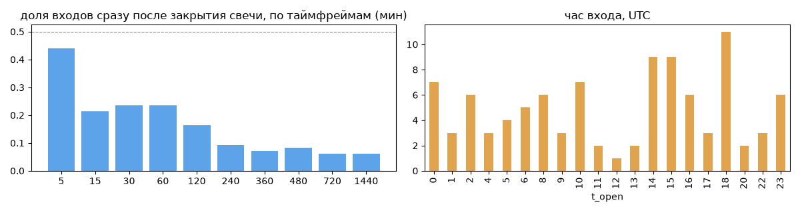
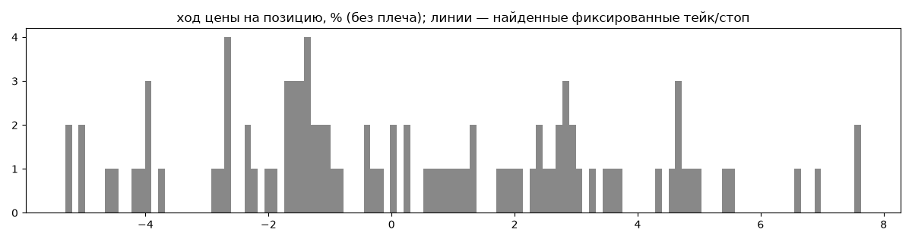
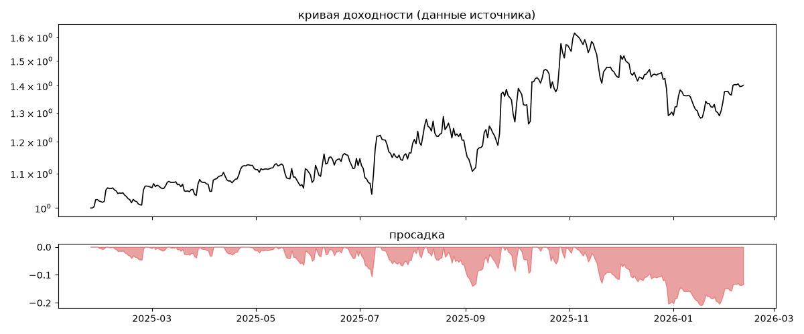
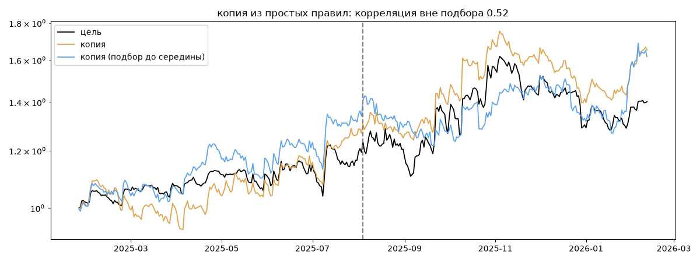

# Donatello — обратный инжиниринг

*Источник: invvo · https://invvo.com/strategy/26 · разбор 26.09.2026*

> Cтратегия Donatello разработана для автоматической торговли. 
Поддерживает большинство торгуемых пар на рынке. 
Мы используем собственно разработанные метрики для определения параметров стратегии, для соблюдения выбранного нами риска. 
Стратегия работает в лонг и в шорт, каждая сделка сопровождается стоп лоссом и тейк профитом. В данном портфолио используется набор из 16 пар в соотношении риск/прибыль - 10%/120% Paracels — команда профессиональных трейдеров и разработчиков, специализирующихся на автоматизированной торговле криптовалютой. Наша ключевая компетенция — создание и внедрение торг

## Коротко

- **Тип:** тренд (вход по ходу движения) · нейтрально · **бот**
  - контекст входа: вход ПО ХОДУ движения (тренд/пробой) (94% входов по ходу 4–24 ч движения)
  - сверка с самоописанием: заявлено «тренд» → ✅ совпало
- **Контекст входа:** вход ПО ХОДУ движения (тренд/пробой): за 4ч 92% по ходу (медиана 1.19%), за 24ч 95% по ходу (медиана 2.98%), за 72ч 76% по ходу (медиана 1.95%)
- **Когда входит:** без привязки к свечам
- **Правило входа:** не искали — у входов нет сетки свечей — входы лимитками/вручную или по тикам; укажите таймфрейм вручную (--tf)
- **Как выходит:** выход плавающий: по сигналу или скользящему стопу
- **Результат:** ×1.4, +38% в год, макс. просадка -21%, сейчас -13% (99 дн.). По годам: 2025: +30%, 2026: +8%
- **Хвосты:** месяцев в плюс 77%, худший месяц = -1.7 средних хороших, просадка/волатильность -0.58 → хвост умеренный: худший месяц сопоставим с обычным хорошим
- **Природа по кривой:** тренд 57%, возврат к среднему 28%, докупка (продажа страховки) 11%, держание (бета рынка) 3% · совпадение копии вне подбора 0.52 (на подборе 0.89)
- **Форма доходности:** участие в росте рынка 0.18, в падении -0.35 → в обычные дни в росте участвует сильнее, чем в падениях (редкие обвалы тут не видны — см. «хвосты»)
- **Оговорки:** полная история с запуска; p_open = средняя позиции (cost/lots): доливки внутри, при нескольких стратегиях — неттинг

## Почерк

| | |
|---|---|
| период | 2026-01-03 → 2026-02-11 (39 дн.) |
| позиций | 98 (17.41 в неделю), открыто сейчас 2 |
| монет | 12: KAS 33, TRUMP 13, ARB 11, ALT 9, MNT 8, DOT 6 |
| доля BTC/ETH/SOL/XRP/BNB/золото | 8% |
| шорты | 72% |
| в плюс | 50% |
| средний плюс / минус | 2.99% / -2.3% (отношение 1.3) |
| худшая / лучшая | -5.45% / 8.09% |
| удержание 10/50/90% | {'p10': 2.5, 'p50': 20.0, 'p90': 53.0} ч |
| одновременно открыто макс. | 8 |
| доливки | {'multi_order_share': 0.0, 'size_ratio': None, 'add_dir': None, 'max_orders': 1, 'cost_mult_max': 4.4, 'cost_cv': 0.52} |
| уровни цен | {'round_price_share': 0.0, 'repeat_price_share': 0.0, 'grid': None} |







## Копия по кривой

Подбор на 383 днях, разрез 2025-08-04. Корреляция дневной доходности: подбор 0.89, **проверка 0.52**, вся история 0.82 (R² 0.67).

| компонента копии | вес |
|---|---|
| BTC [4ч] докупка шаг 3% тейк 3% | 0.112 |
| BTC [4ч] ход 3 | 0.089 |
| BTC [4ч] ход 20 | 0.054 |
| BTC [4ч] возврат 2 | 0.046 |
| BTC [день] ход 5 | 0.033 |
| BTC [день] возврат 3 | 0.025 |
| TRUMP [день] EMA50/200 | 0.022 |
| ETH [день] ход 2 | 0.021 |
| ARB [4ч] ход 5 | 0.02 |
| BTC [день] ход 40 | 0.019 |

Сильнее всего совпадает по одиночке: TRUMP [4ч] EMA5/20 (0.59), ARB [4ч] EMA5/20 (0.59), ARB [4ч] ход 10 (0.58), TRUMP [4ч] ход 20 (0.58), TRUMP [4ч] ход 10 (0.57), ARB [4ч] пробой 10 (0.55)

Сильнее всего противоположна: TRUMP [день] возврат 1 (-0.49), ARB [4ч] возврат 5 (-0.47), TRUMP [4ч] возврат 5 (-0.47), ARB [день] возврат 2 (-0.42)




## Выходы

```
{
 "fixed_tp": null,
 "fixed_sl": null,
 "reentry": 0.0,
 "exit_on_candle_close": {
  "15": 0.29,
  "60": 0.17,
  "240": 0.15,
  "1440": 0.11
 },
 "hold_mode_h": 0.02,
 "hold_mode_share": 0.03,
 "atr": {
  "interval": "60",
  "win_pct_cv": 0.64,
  "win_atr_cv": 0.94,
  "loss_pct_cv": 0.63,
  "loss_atr_cv": 0.74,
  "win_k_median": 2.1,
  "loss_k_median": -1.83
 },
 "verdict": [
  "выход плавающий: по сигналу или скользящему стопу"
 ]
}
```