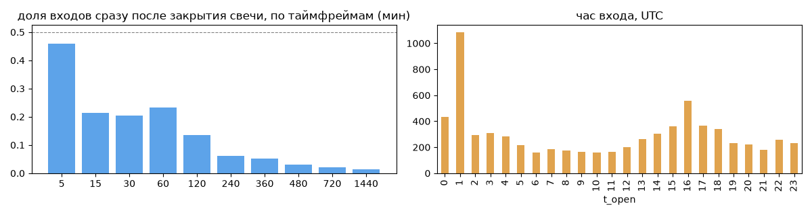
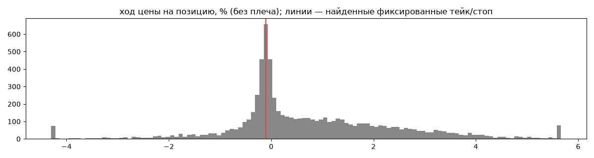
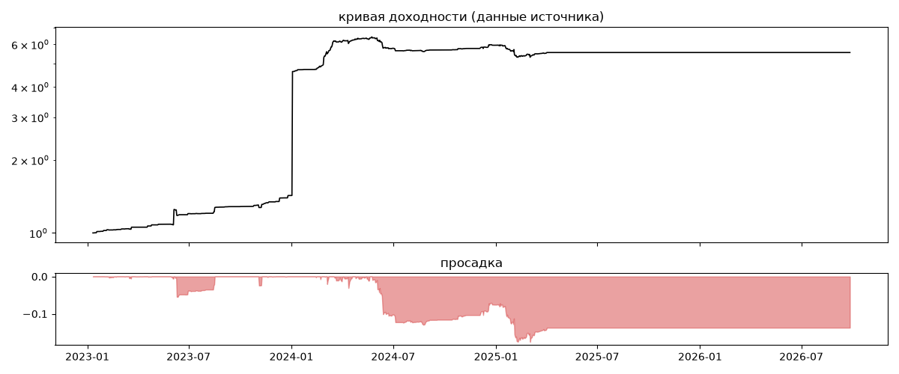
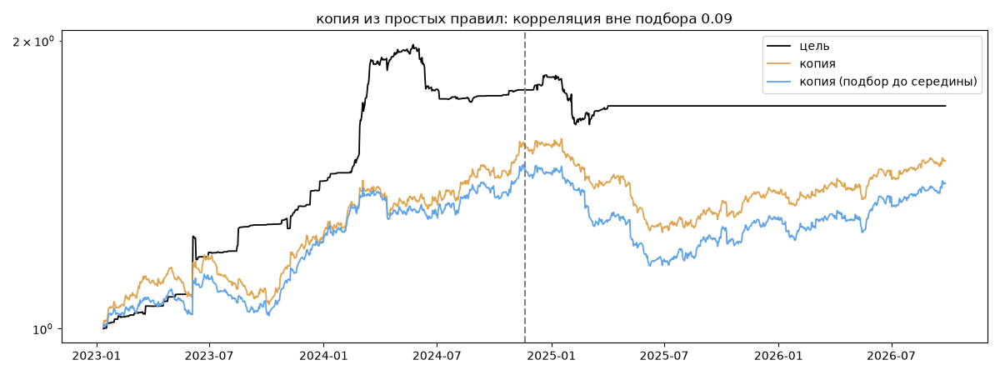

# FlowAI — обратный инжиниринг

*Источник: invvo · https://invvo.com/strategy/14 · разбор 26.09.2026*

> Автоматизированная торговая система FlowAI от Meritocracy!

FlowAI является полностью автоматизированной торговой стратегией, которая гибко адаптируется к изменяющимся рыночным условиям, применяя передовые фильтры для принятия решений. Стратегия реализована в виде автономной торговой системы, работающей на надежной облачной платформе, что гарантирует высокую доступность и непрерывность работы.

Безопасность и Стабильность:

Стратегия FlowAI основывается на высокоэффективном статистическом анализе больших данных и теории вероятности. Широкая диверсификация по торговым парам, как в операци

## Коротко

- **Тип:** скальпер · покупает страховку · **бот**
  - сделка держится ~0.7 ч, 61.77 сделок в неделю
  - контекст входа: вход без выраженной стороны (40% входов по ходу 4–24 ч движения)
  - сверка с самоописанием: заявлено «контртренд» → ✅ совпало
- **Контекст входа:** вход без выраженной стороны: за 4ч 35% по ходу (медиана -1.24%), за 24ч 45% по ходу (медиана -1.4%), за 72ч 44% по ходу (медиана -2.43%)
- **Когда входит:** без привязки к свечам; 59% входов пачками по разным монетам
- **Правило входа:** не искали — у входов нет сетки свечей — входы лимитками/вручную или по тикам; укажите таймфрейм вручную (--tf)
- **Как выходит:** стоп фиксированный ≈ -0.1%
- **Результат:** ×5.55, +59% в год, макс. просадка -18%, сейчас -14% (855 дн.). По годам: 2023: +43%, 2024: +317%, 2025: -7%, 2026: +0%
- **Хвосты:** месяцев в плюс 50%, худший месяц = -0.6 средних хороших, просадка/волатильность -0.15 → хвост умеренный: худший месяц сопоставим с обычным хорошим
- **Природа по кривой:** тренд 56%, возврат к среднему 40%, докупка (продажа страховки) 3% · совпадение копии вне подбора 0.09 (на подборе 0.51)
- **Форма доходности:** участие в росте рынка 0.03, в падении -0.03 → в обычные дни симметрично
- **Оговорки:** полная история с запуска; p_open = средняя позиции (cost/lots): доливки внутри, при нескольких стратегиях — неттинг

## Почерк

| | |
|---|---|
| период | 2023-01-14 → 2025-04-02 (809 дн.) |
| позиций | 7142 (61.77 в неделю), открыто сейчас 0 |
| монет | 231: FARTCOIN 239, WIF 145, 1000PEPE 131, BEL 125, 1000BONK 123, ALPHA 119 |
| доля BTC/ETH/SOL/XRP/BNB/золото | 0% |
| шорты | 0% |
| в плюс | 59% |
| средний плюс / минус | 1.7% / -0.69% (отношение 2.46) |
| худшая / лучшая | -22.43% / 29.56% |
| удержание 10/50/90% | {'p10': 0.0, 'p50': 0.7, 'p90': 2.4} ч |
| одновременно открыто макс. | 25 |
| доливки | {'multi_order_share': 0.0, 'size_ratio': None, 'add_dir': None, 'max_orders': 1, 'cost_mult_max': 1098.1, 'cost_cv': 4.48} |
| уровни цен | {'round_price_share': 0.0, 'repeat_price_share': 0.12, 'grid': {'sym': 'ALPHA', 'step': 5e-08, 'step_pct': np.float64(0.0), 'levels': 19, 'on_grid': 0.94}} |







## Копия по кривой

Подбор на 1353 днях, разрез 2024-11-19. Корреляция дневной доходности: подбор 0.51, **проверка 0.09**, вся история 0.4 (R² 0.16).

| компонента копии | вес |
|---|---|
| SOL [4ч] возврат 2 | 0.084 |
| BTC [день] ход 2 | 0.078 |
| BTC [день] возврат 3 | 0.07 |
| ETH [день] возврат 3 | 0.069 |
| BTC [4ч] ход 2 | 0.054 |
| BTC [день] ход 5 | 0.054 |
| BTC [4ч] ход 10 | 0.05 |
| ETH [день] ход 5 | 0.048 |
| ETH [4ч] возврат 2 | 0.047 |
| SOL [4ч] ход 3 | 0.045 |

Сильнее всего совпадает по одиночке: BTC [4ч] ход 10 (0.16), BTC [день] ход 2 (0.16), BTC [4ч] пробой 20 (0.15), BTC [4ч] пробой 10 (0.14), BTC [день] ход 5 (0.14), SOL [4ч] возврат 2 (0.12)

Сильнее всего противоположна: BTC [день] возврат 2 (-0.16), BTC [день] возврат 5 (-0.14), SOL [4ч] ход 60 (-0.12), SOL [4ч] ход 2 (-0.12)




## Выходы

```
{
 "fixed_tp": null,
 "fixed_sl": {
  "level": -0.1,
  "share": 0.54
 },
 "reentry": 0.24,
 "exit_on_candle_close": {
  "15": 0.28,
  "60": 0.17,
  "240": 0.05,
  "1440": 0.01
 },
 "hold_mode_h": 0.0,
 "hold_mode_share": 0.18,
 "atr": {
  "interval": "60",
  "win_pct_cv": 0.52,
  "win_atr_cv": 0.6,
  "loss_pct_cv": 1.26,
  "loss_atr_cv": 1.13,
  "win_k_median": 0.53,
  "loss_k_median": -0.27
 },
 "verdict": [
  "стоп фиксированный ≈ -0.1%"
 ]
}
```