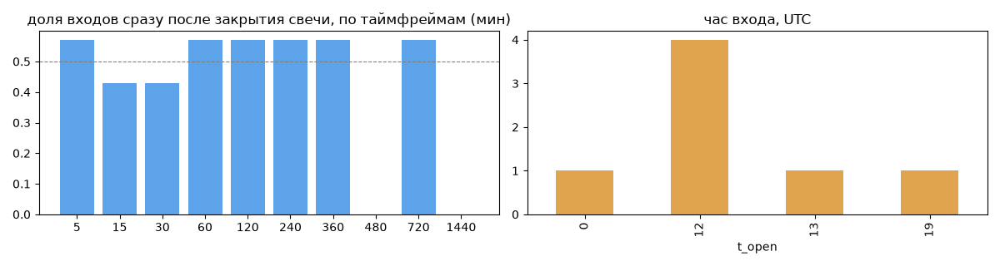
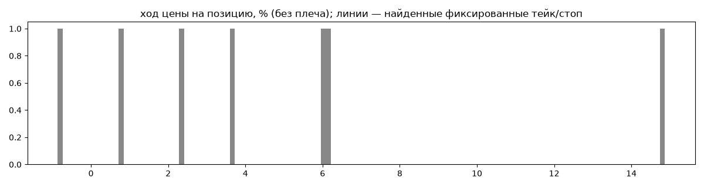
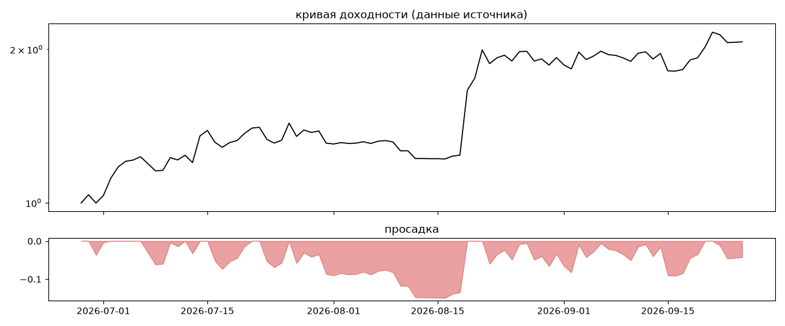
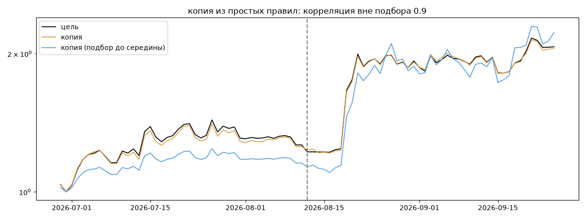

# H_trendHunter — обратный инжиниринг

*Источник: bybit · https://www.bybit.com/copyTrade/trade-center/detail?leaderMark=BO2WE5lm2vnXvGLuLpxEUg== · разбор 26.09.2026*

> - Low Leverage(1.5~2)
- Low Risk
- Complete backtest since 2012
- Guarantee never liquidation
- Please maintain your investment for at least six months
your assets will steadily grow over time.

## Коротко

- **Тип:** долгосрочный держатель · нейтрально · **бот**
  - держит в среднем 29 дней
  - сверка с самоописанием: заявлено «тренд» → ✅ совпало
- **Когда входит:** на закрытии свечи 720 мин (≈0.1 мин после закрытия, 57% входов)
- **Правило входа:** не искали — мало позиций (7 < 60)
- **Как выходит:** выход плавающий: по сигналу или скользящему стопу
- **Результат:** ×2.07, +1883% в год, макс. просадка -15%, сейчас -4% (4 дн.). По годам: 2026: +107%
- **Хвосты:** месяцев в плюс 100%, худший месяц = None средних хороших, просадка/волатильность -0.15 → не ясно
- **Природа по кривой:** тренд 39%, докупка (продажа страховки) 27%, возврат к среднему 18%, держание (бета рынка) 16% · совпадение копии вне подбора 0.9 (на подборе 1.0) — ⚠️ кривая короткая, вывод слабый
- **Форма доходности:** участие в росте рынка 2.08, в падении 1.67 → в обычные дни в росте участвует сильнее, чем в падениях (редкие обвалы тут не видны — см. «хвосты»)
- **Оговорки:** только последние 90 дней — выводы о правилах ограничены; p_open = средняя позиции, order_price = цена ордера; кривая = cumResetRoi за 90 дней (ROI витрины, с плечом)

## Почерк

| | |
|---|---|
| период | 2026-06-16 → 2026-09-20 (96 дн.) |
| позиций | 7 (0.51 в неделю), открыто сейчас 0 |
| монет | 2: ETH 6, HBAR 1 |
| доля BTC/ETH/SOL/XRP/BNB/золото | 86% |
| шорты | 0% |
| в плюс | 85% |
| средний плюс / минус | 5.73% / -0.96% (отношение 5.96) |
| худшая / лучшая | -0.96% / 15.42% |
| удержание 10/50/90% | {'p10': 75.2, 'p50': 696.0, 'p90': 991.2} ч |
| одновременно открыто макс. | 2 |
| доливки | {'multi_order_share': 0.43, 'size_ratio': 0.99, 'add_dir': 'усреднение вниз', 'max_orders': 3} |
| уровни цен | {'round_price_share': 0.0, 'repeat_price_share': 0.0, 'grid': None} |







## Копия по кривой

Подбор на 89 днях, разрез 2026-08-12. Корреляция дневной доходности: подбор 1.0, **проверка 0.9**, вся история 1.0 (R² 0.99).

| компонента копии | вес |
|---|---|
| ETH [4ч] держать | 0.157 |
| ETH [4ч] докупка шаг 2% тейк 2% | 0.115 |
| HBAR [4ч] докупка шаг 3% тейк 3% | 0.081 |
| BTC [день] возврат 2 | 0.052 |
| BTC [4ч] докупка шаг 1% тейк 1% | 0.051 |
| ETH [день] пробой 10 | 0.047 |
| BTC [4ч] ход 2 | 0.036 |
| BTC [4ч] ход 10 | 0.033 |
| BTC [4ч] возврат 3 | 0.029 |
| HBAR [день] EMA50/200 | 0.027 |

Сильнее всего совпадает по одиночке: ETH [день] держать (0.97), ETH [4ч] держать (0.97), ETH [4ч] докупка шаг 2% тейк 2% (0.87), ETH [4ч] докупка шаг 1% тейк 1% (0.86), ETH [4ч] докупка шаг 3% тейк 3% (0.86), ETH [4ч] EMA20/100 (0.85)

Сильнее всего противоположна: ETH [день] возврат 5 (-0.75), ETH [день] EMA50/200 (-0.74), ETH [день] возврат 1 (-0.72), HBAR [день] EMA50/200 (-0.66)




## Выходы

```
{
 "fixed_tp": null,
 "fixed_sl": null,
 "reentry": 0.0,
 "exit_on_candle_close": {
  "15": 0.86,
  "60": 0.86,
  "240": 0.86,
  "1440": 0.71
 },
 "hold_mode_h": 1.51,
 "hold_mode_share": 0.14,
 "verdict": [
  "выход плавающий: по сигналу или скользящему стопу"
 ]
}
```