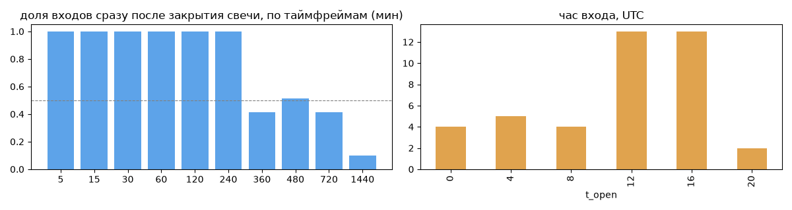
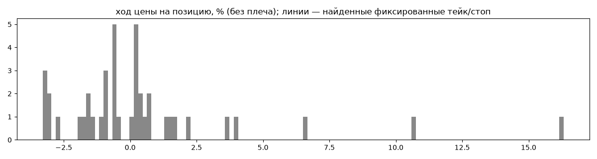
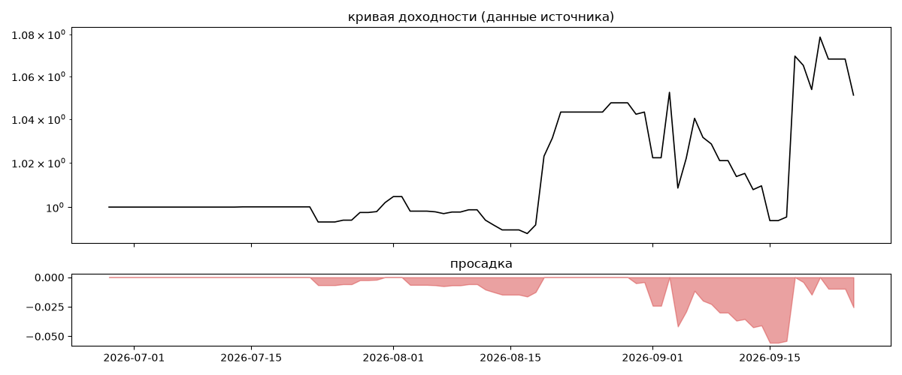
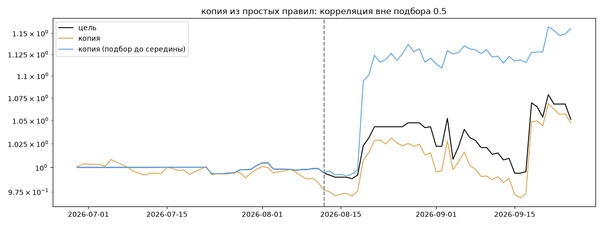

# Honest Algo Trader 2 — обратный инжиниринг

*Источник: bybit · https://www.bybit.com/copyTrade/trade-center/detail?leaderMark=9ack0MY4IcKWNNnWJ6gWRA== · разбор 26.09.2026*

> This is the second strategy of the Honest Algo Trader project.


## Коротко

- **Тип:** тренд (вход по ходу движения) · нейтрально · **бот**
  - контекст входа: вход ПО ХОДУ движения (тренд/пробой) (94% входов по ходу 4–24 ч движения)
- **Контекст входа:** вход ПО ХОДУ движения (тренд/пробой): за 4ч 100% по ходу (медиана 0.73%), за 24ч 88% по ходу (медиана 1.25%), за 72ч 61% по ходу (медиана 0.35%)
- **Когда входит:** на закрытии свечи 480 мин (≈0.1 мин после закрытия, 51% входов)
- **Правило входа:** не искали — мало позиций (41 < 60)
- **Как выходит:** выход плавающий: по сигналу или скользящему стопу
- **Результат:** ×1.05, +23% в год, макс. просадка -6%, сейчас -2% (4 дн.). По годам: 2026: +5%
- **Хвосты:** месяцев в плюс 100%, худший месяц = None средних хороших, просадка/волатильность -0.25 → не ясно
- **Природа по кривой:** тренд 53%, возврат к среднему 32%, докупка (продажа страховки) 14% · совпадение копии вне подбора 0.5 (на подборе 1.0) — ⚠️ кривая короткая, вывод слабый
- **Форма доходности:** участие в росте рынка 0.34, в падении 0.1 → в обычные дни в росте участвует сильнее, чем в падениях (редкие обвалы тут не видны — см. «хвосты»)
- **Оговорки:** только последние 90 дней — выводы о правилах ограничены; p_open = средняя позиции, order_price = цена ордера; кривая = cumResetRoi за 90 дней (ROI витрины, с плечом)

## Почерк

| | |
|---|---|
| период | 2026-07-14 → 2026-09-25 (73 дн.) |
| позиций | 41 (3.94 в неделю), открыто сейчас 0 |
| монет | 5: ETH 15, SOL 15, BTC 6, XRP 3, AVAX 2 |
| доля BTC/ETH/SOL/XRP/BNB/золото | 95% |
| шорты | 20% |
| в плюс | 48% |
| средний плюс / минус | 2.79% / -1.6% (отношение 1.74) |
| худшая / лучшая | -3.36% / 20.02% |
| удержание 10/50/90% | {'p10': 4.0, 'p50': 7.5, 'p90': 44.0} ч |
| одновременно открыто макс. | 4 |
| доливки | {'multi_order_share': 0.0, 'size_ratio': None, 'add_dir': None, 'max_orders': 1, 'cost_mult_max': 1.6, 'cost_cv': 0.23} |
| уровни цен | {'round_price_share': 0.02, 'repeat_price_share': 0.05, 'grid': None} |







## Копия по кривой

Подбор на 89 днях, разрез 2026-08-12. Корреляция дневной доходности: подбор 1.0, **проверка 0.5**, вся история 0.96 (R² 0.92).

| компонента копии | вес |
|---|---|
| BTC [4ч] ход 20 | 0.082 |
| SOL [4ч] докупка шаг 2% тейк 2% | 0.065 |
| BTC [день] ход 1 | 0.055 |
| BTC [4ч] докупка шаг 3% тейк 3% | 0.052 |
| BTC [день] возврат 2 | 0.051 |
| BTC [день] ход 100 | 0.047 |
| SOL [4ч] ход 3 | 0.035 |
| XRP [4ч] возврат 5 | 0.033 |
| SOL [день] EMA50/200 | 0.031 |
| BTC [день] возврат 5 | 0.03 |

Сильнее всего совпадает по одиночке: BTC [день] держать (0.6), BTC [4ч] ход 200 (0.6), BTC [4ч] держать (0.6), SOL [день] держать (0.59), SOL [4ч] держать (0.58), BTC [4ч] ход 10 (0.58)

Сильнее всего противоположна: SOL [день] возврат 1 (-0.53), SOL [4ч] возврат 2 (-0.53), SOL [4ч] возврат 3 (-0.51), XRP [день] EMA50/200 (-0.48)




## Выходы

```
{
 "fixed_tp": null,
 "fixed_sl": null,
 "reentry": 0.0,
 "exit_on_candle_close": {
  "15": 0.49,
  "60": 0.39,
  "240": 0.39,
  "1440": 0.02
 },
 "hold_mode_h": 4.0,
 "hold_mode_share": 0.24,
 "atr": {
  "interval": "360",
  "win_pct_cv": 1.74,
  "win_atr_cv": 2.2,
  "loss_pct_cv": 0.65,
  "loss_atr_cv": 0.56,
  "win_k_median": 0.46,
  "loss_k_median": -1.05
 },
 "verdict": [
  "выход плавающий: по сигналу или скользящему стопу"
 ]
}
```