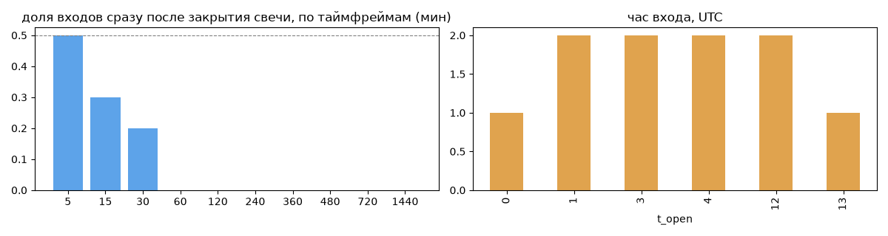
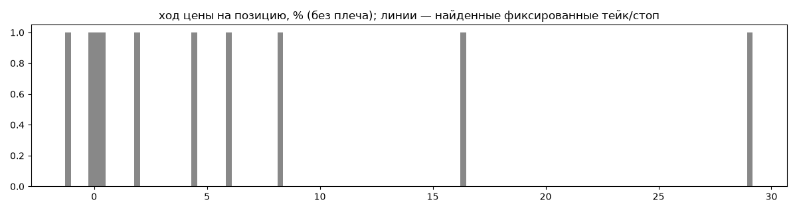
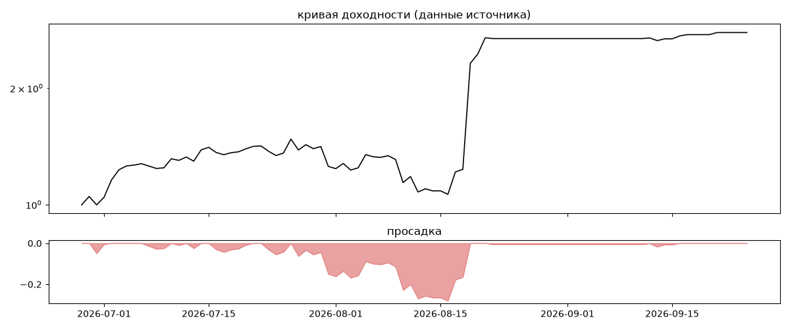
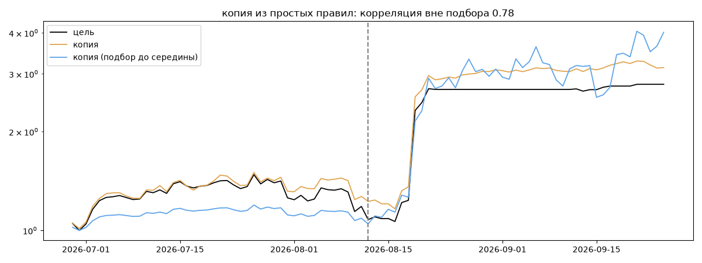

# honeywave — обратный инжиниринг

*Источник: bybit · https://www.bybit.com/copyTrade/trade-center/detail?leaderMark=1cpXZFMrNidXorw/E2uPjw== · разбор 26.09.2026*

> 진입은 보통 1차(10~25%) 진입합니다. 스마트 카피 모드로 설정해서 저의 분할법을 따라와주어야 2차 매수로 추가 수익을 만들거나 리스크 관리가 가능합니다. 저의 시나리오와 매매법을 믿고 따라와주신다면 한 달 기준 수익으로 마감시켜드리겠습니다.

## Коротко

- **Тип:** смешанный · нейтрально · **не ясно, бот или человек**
- **Когда входит:** без привязки к свечам
- **Правило входа:** не искали — у входов нет сетки свечей — входы лимитками/вручную или по тикам; укажите таймфрейм вручную (--tf)
- **Как выходит:** выход плавающий: по сигналу или скользящему стопу
- **Результат:** ×2.79, +6623% в год, макс. просадка -28%, сейчас +0% (0 дн.). По годам: 2026: +179%
- **Хвосты:** месяцев в плюс 100%, худший месяц = None средних хороших, просадка/волатильность -0.15 → не ясно
- **Природа по кривой:** тренд 40%, возврат к среднему 35%, докупка (продажа страховки) 25% · совпадение копии вне подбора 0.78 (на подборе 1.0) — ⚠️ кривая короткая, вывод слабый
- **Форма доходности:** участие в росте рынка 3.78, в падении -0.13 → в обычные дни в росте участвует сильнее, чем в падениях (редкие обвалы тут не видны — см. «хвосты»)
- **Оговорки:** только последние 90 дней — выводы о правилах ограничены; p_open = средняя позиции, order_price = цена ордера; кривая = cumResetRoi за 90 дней (ROI витрины, с плечом)

## Почерк

| | |
|---|---|
| период | 2026-06-26 → 2026-09-22 (88 дн.) |
| позиций | 10 (0.8 в неделю), открыто сейчас 0 |
| монет | 2: ETH 9, LINK 1 |
| доля BTC/ETH/SOL/XRP/BNB/золото | 90% |
| шорты | 0% |
| в плюс | 80% |
| средний плюс / минус | 8.48% / -0.74% (отношение 11.45) |
| худшая / лучшая | -1.39% / 30.42% |
| удержание 10/50/90% | {'p10': 12.5, 'p50': 166.8, 'p90': 429.5} ч |
| одновременно открыто макс. | 3 |
| доливки | {'multi_order_share': 0.2, 'size_ratio': 0.99, 'add_dir': 'в обе стороны', 'max_orders': 4, 'cost_mult_max': 4.0, 'cost_cv': 0.66} |
| уровни цен | {'round_price_share': 0.12, 'repeat_price_share': 0.0, 'grid': None} |







## Копия по кривой

Подбор на 89 днях, разрез 2026-08-12. Корреляция дневной доходности: подбор 1.0, **проверка 0.78**, вся история 0.99 (R² 0.99).

| компонента копии | вес |
|---|---|
| ETH [4ч] докупка шаг 2% тейк 2% | 0.168 |
| BTC [4ч] докупка шаг 1% тейк 1% | 0.082 |
| BTC [4ч] ход 2 | 0.062 |
| BTC [день] возврат 2 | 0.052 |
| ETH [день] ход 60 | 0.051 |
| BTC [4ч] возврат 1 | 0.041 |
| BTC [день] ход 1 | 0.033 |
| ETH [день] ход 1 | 0.032 |
| SOL [4ч] возврат 2 | 0.032 |
| BTC [4ч] возврат 3 | 0.03 |

Сильнее всего совпадает по одиночке: ETH [4ч] докупка шаг 2% тейк 2% (0.91), ETH [4ч] докупка шаг 3% тейк 3% (0.89), ETH [4ч] докупка шаг 1% тейк 1% (0.89), ETH [день] ход 5 (0.83), ETH [день] EMA5/20 (0.83), ETH [день] ход 1 (0.83)

Сильнее всего противоположна: ETH [день] EMA50/200 (-0.92), ETH [день] ход 200 (-0.89), ETH [день] ход 100 (-0.89), ETH [день] EMA20/100 (-0.89)




## Выходы

```
{
 "fixed_tp": null,
 "fixed_sl": null,
 "reentry": 0.0,
 "exit_on_candle_close": {
  "15": 0.3,
  "60": 0.1,
  "240": 0.0,
  "1440": 0.0
 },
 "hold_mode_h": 9.87,
 "hold_mode_share": 0.1,
 "verdict": [
  "выход плавающий: по сигналу или скользящему стопу"
 ]
}
```