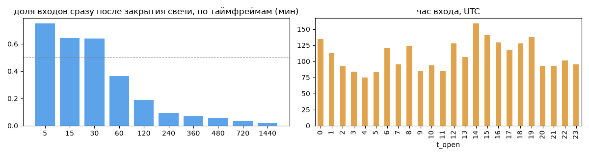
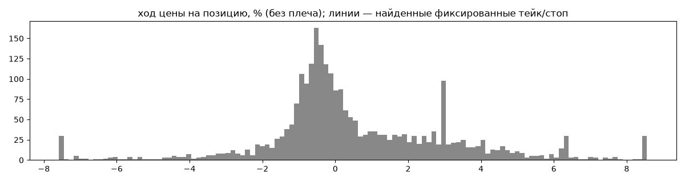
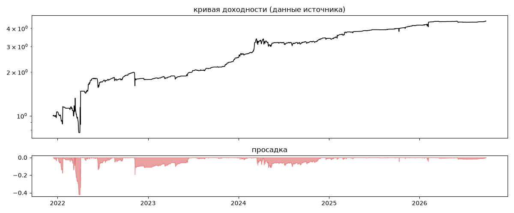
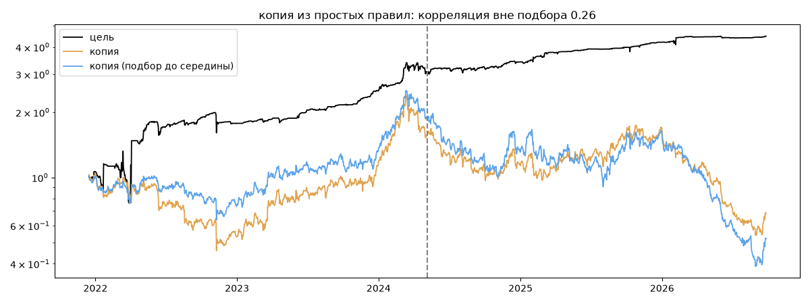

# Knife Catcher — обратный инжиниринг

*Источник: invvo · https://invvo.com/strategy/13 · разбор 26.09.2026*

> «Ловец ножей» — контр-трендовая стратегия, основанная на ловле резких проливов (или коррекции) цены. 
Стратегия демонстрирует хорошие показатели и в «боковике», и в обоих фазах («медвежьей или бычьей»), если присутствуют резкие откаты. 
Неблагоприятная фаза рынка — медвежий тренд без откатов. 
У стратегии есть внутренние механихмы ограничения риска. Среднее время жизни сделки составляет от 12 до 48 часов. EdKhan — независимый трейдер, торгующий криптовалютами более 7 лет. Автор нескольких популярных криптостратегий и собственных торговых ботов. Управляет капиталом &amp;amp;amp;amp;amp;amp;g

## Коротко

- **Тип:** контртренд (вход против движения) · продаёт страховку (по кривой) · **бот**
  - контекст входа: вход ПРОТИВ движения (контртренд/докупка на проливе) (11% входов по ходу 4–24 ч движения)
  - по кривой: худший месяц = -5.5 средних хороших месяцев
  - сверка с самоописанием: заявлено «контртренд, тренд» → ✅ совпало
- **Контекст входа:** вход ПРОТИВ движения (контртренд/докупка на проливе): за 4ч 11% по ходу (медиана -1.52%), за 24ч 10% по ходу (медиана -3.04%), за 72ч 32% по ходу (медиана -2.45%)
- **Когда входит:** на закрытии свечи 30 мин (≈0.0 мин после закрытия, 64% входов); 53% входов пачками по разным монетам
- **Правило входа:** правило не найдено — лучшее: «Боллинджер 20×2 возврат | —», на проверке F1 0.003 (охват 0.05, точность 0.0 на всей истории)
- **Как выходит:** 51% выходов сразу сменяются новым входом — переворот или перезапуск бота
- **Результат:** ×4.49, +37% в год, макс. просадка -42%, сейчас +0% (0 дн.). По годам: 2021: +6%, 2022: +67%, 2023: +41%, 2024: +36%, 2025: +23%, 2026: +7%
- **Хвосты:** месяцев в плюс 75%, худший месяц = -5.5 средних хороших, просадка/волатильность -0.85 → продаёт страховку: один плохой месяц съедает много хороших
- **Природа по кривой:** тренд 48%, возврат к среднему 46%, держание (бета рынка) 6% · совпадение копии вне подбора 0.26 (на подборе 0.36)
- **Форма доходности:** участие в росте рынка 0.06, в падении 0.17 → в обычные дни в падениях участвует сильнее, чем в росте
- **Оговорки:** полная история с запуска; p_open = средняя позиции (cost/lots): доливки внутри, при нескольких стратегиях — неттинг

## Почерк

| | |
|---|---|
| период | 2021-12-15 → 2026-09-23 (1743 дн.) |
| позиций | 2615 (10.5 в неделю), открыто сейчас 0 |
| монет | 12: ETH 462, XRP 453, BTC 413, TRX 287, BNB 233, LINK 230 |
| доля BTC/ETH/SOL/XRP/BNB/золото | 60% |
| шорты | 32% |
| в плюс | 48% |
| средний плюс / минус | 2.49% / -1.31% (отношение 1.89) |
| худшая / лучшая | -19.92% / 15.54% |
| удержание 10/50/90% | {'p10': 1.0, 'p50': 5.0, 'p90': 54.7} ч |
| одновременно открыто макс. | 11 |
| доливки | {'multi_order_share': 0.0, 'size_ratio': None, 'add_dir': None, 'max_orders': 1, 'cost_mult_max': 541.6, 'cost_cv': 4.9} |
| уровни цен | {'round_price_share': 0.0, 'repeat_price_share': 0.03, 'grid': None} |







## Копия по кривой

Подбор на 1747 днях, разрез 2024-05-06. Корреляция дневной доходности: подбор 0.36, **проверка 0.26**, вся история 0.29 (R² 0.09).

| компонента копии | вес |
|---|---|
| TRX [день] возврат 5 | 0.099 |
| BTC [4ч] держать | 0.045 |
| BNB [4ч] возврат 2 | 0.031 |
| BTC [4ч] ход 1 | 0.03 |
| TRX [день] ход 3 | 0.03 |
| ETH [4ч] ход 2 | 0.025 |
| BTC [4ч] возврат 2 | 0.024 |
| TRX [4ч] ход 20 | 0.023 |
| TRX [день] EMA50/200 | 0.022 |
| BNB [день] EMA20/100 | 0.021 |

Сильнее всего совпадает по одиночке: BTC [4ч] держать (0.13), BTC [день] держать (0.13), ETH [4ч] держать (0.12), ETH [день] держать (0.12), SOL [4ч] держать (0.12), SOL [день] держать (0.11)

Сильнее всего противоположна: BNB [день] ход 2 (-0.11), LINK [день] ход 5 (-0.1), XRP [4ч] ход 10 (-0.1), BTC [4ч] ход 10 (-0.1)



## Правило входа

Таймфрейм 30, монет 12, входов в окне 826. Точность считается только по свечам, где цель вне позиции по монете.

| правило                                                      |   совпало |   сработало |   охват |   точность |    F1 |   F1_подбор |   F1_проверка |
|:-------------------------------------------------------------|----------:|------------:|--------:|-----------:|------:|------------:|--------------:|
| Боллинджер 20×2 возврат | —                                  |        39 |       44260 |    0.05 |          0 | 0.002 |       0.001 |         0.003 |
| RSI14×30 (по ходу) | —                                       |        14 |       19602 |    0.02 |          0 | 0.001 |       0.001 |         0.002 |
| Боллинджер 20×2 возврат | BTC>EMA200                         |         8 |       14917 |    0.01 |          0 | 0.001 |       0.001 |         0.002 |
| RSI7×30 (по ходу) | BTC свеча того же цвета                  |        25 |       49270 |    0.03 |          0 | 0.001 |       0.001 |         0.002 |
| RSI14 выход из зоны 30/70 (против) | BTC свеча того же цвета |        10 |       16004 |    0.01 |          0 | 0.001 |       0.001 |         0.002 |
| RSI14 выход из зоны 30/70 (против) | —                       |        14 |       19602 |    0.02 |          0 | 0.001 |       0.001 |         0.002 |
| Боллинджер 20×2 возврат | BTC свеча того же цвета            |        23 |       33205 |    0.03 |          0 | 0.001 |       0.001 |         0.003 |
| RSI7×30 (по ходу) | —                                        |        34 |       59881 |    0.04 |          0 | 0.001 |       0.001 |         0.002 |
| Боллинджер 20×2 возврат | BTC>EMA50                          |         4 |        9838 |    0    |          0 | 0.001 |       0.001 |         0.001 |
| RSI7 выход из зоны 30/70 (против) | —                        |        34 |       59881 |    0.04 |          0 | 0.001 |       0.001 |         0.002 |
| RSI7 выход из зоны 30/70 (против) | BTC>EMA200               |        14 |       20593 |    0.02 |          0 | 0.001 |       0.001 |         0.003 |
| RSI7 выход из зоны 30/70 (против) | BTC свеча того же цвета  |        25 |       49270 |    0.03 |          0 | 0.001 |       0.001 |         0.002 |

**Подпись свечи входа** (эффект = сдвиг медианы входов от обычных свечей в межквартильных размахах):

| признак        | сторона   |   медиана_входов |   p10 |   p90 |   медиана_обычных |   эффект |
|:---------------|:----------|-----------------:|------:|------:|------------------:|---------:|
| от EMA20 %     | лонг      |            -1.49 | -3.22 | -0.36 |              0.02 |    -1.74 |
| от EMA50 %     | лонг      |            -2.25 | -4.14 | -0.54 |              0.07 |    -1.57 |
| ход 4 св %     | лонг      |            -1.16 | -3.24 |  0.06 |              0.01 |    -1.43 |
| ход 12 св %    | лонг      |            -1.99 | -4.65 | -0.26 |              0.03 |    -1.38 |
| BTC от EMA20 % | лонг      |            -0.72 | -2.04 | -0.03 |              0.02 |    -1.33 |
| наклон EMA20 % | лонг      |            -0.45 | -0.98 | -0.06 |              0.01 |    -1.33 |
| ход 1 св %     | лонг      |            -0.51 | -1.8  |  0.15 |              0    |    -1.22 |
| тело %         | лонг      |            -0.51 | -1.8  |  0.15 |              0    |    -1.22 |
| ход 28 св %    | лонг      |            -2.8  | -5.39 | -0.35 |              0.08 |    -1.21 |
| наклон EMA50 % | лонг      |            -0.26 | -0.53 | -0.03 |              0.01 |    -1.16 |
| RSI14          | лонг      |            33.59 | 22.74 | 44.29 |             50.54 |    -1.12 |
| RSI7           | лонг      |            25.98 | 13.45 | 43.1  |             50.59 |    -1.12 |
| BTC от EMA50 % | лонг      |            -1.03 | -2.82 |  0.07 |              0.07 |    -1.09 |
| BTC ход 4 св % | лонг      |            -0.54 | -1.88 |  0.2  |              0.01 |    -1.05 |

**Дерево решений** (подбор на первых 2/3; на проверке {'охват': 0.81, 'точность': 0.0, 'F1': 0.002}):
```
|--- от EMA20 % <= -0.28
|   |--- место в канале 55 <= 0.43
|   |   |--- ход 4 св % <= 0.56
|   |   |   |--- class: 1
|   |   |--- ход 4 св % >  0.56
|   |   |   |--- class: 0
|   |--- место в канале 55 >  0.43
|   |   |--- BTC наклон EMA20 % <= -1.82
|   |   |   |--- class: 0
|   |   |--- BTC наклон EMA20 % >  -1.82
|   |   |   |--- class: 0
|--- от EMA20 % >  -0.28
|   |--- BTC ход 1 св % <= 1.18
|   |   |--- место в канале 55 <= 0.29
|   |   |   |--- class: 1
|   |   |--- место в канале 55 >  0.29
|   |   |   |--- class: 0
|   |--- BTC ход 1 св % >  1.18
|   |   |--- от EMA200 % <= 2.71
|   |   |   |--- class: 1
|   |   |--- от EMA200 % >  2.71
|   |   |   |--- class: 0
```

## Выходы

```
{
 "fixed_tp": null,
 "fixed_sl": null,
 "reentry": 0.51,
 "exit_on_candle_close": {
  "15": 0.65,
  "60": 0.32,
  "240": 0.09,
  "1440": 0.03
 },
 "hold_mode_h": 1.0,
 "hold_mode_share": 0.08,
 "atr": {
  "interval": "30",
  "win_pct_cv": 0.69,
  "win_atr_cv": 0.7,
  "loss_pct_cv": 1.01,
  "loss_atr_cv": 1.16,
  "win_k_median": 3.55,
  "loss_k_median": -3.11
 },
 "verdict": [
  "51% выходов сразу сменяются новым входом — переворот или перезапуск бота"
 ]
}
```