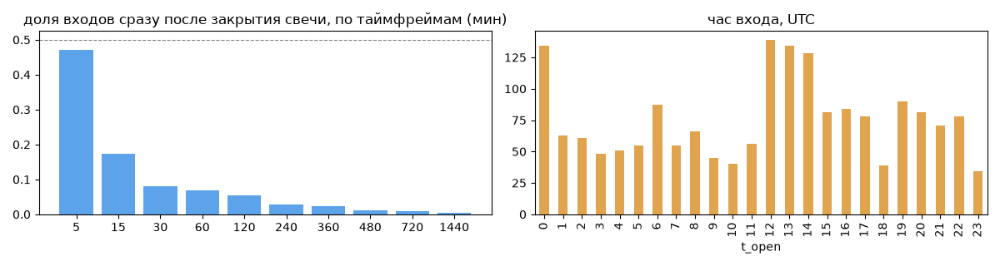
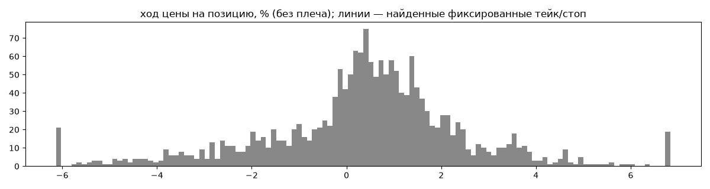
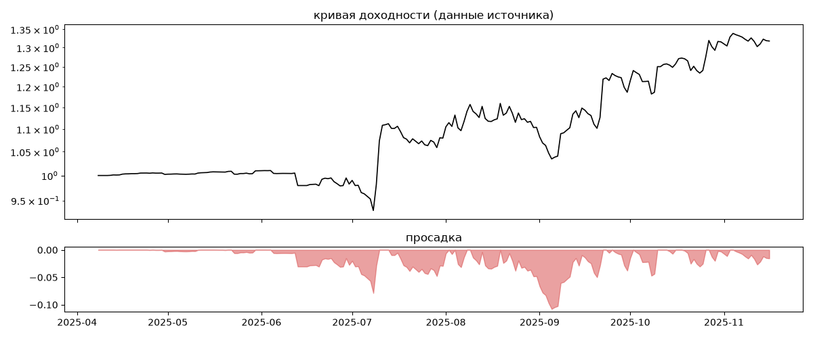
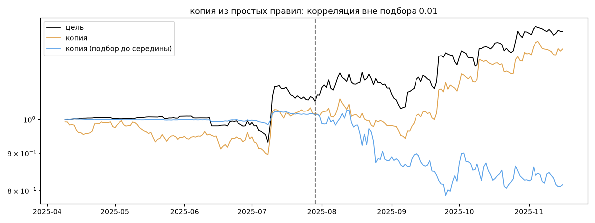

# Low Risk Bybit — обратный инжиниринг

*Источник: invvo · https://invvo.com/strategy/19 · разбор 26.09.2026*

> - -

## Коротко

- **Тип:** возврат к среднему · нейтрально · **бот**
  - часто в плюс (66%), но плюс меньше минуса
  - контекст входа: вход ПО ХОДУ движения (тренд/пробой) (82% входов по ходу 4–24 ч движения)
- **Контекст входа:** вход ПО ХОДУ движения (тренд/пробой): за 4ч 82% по ходу (медиана 1.05%), за 24ч 83% по ходу (медиана 1.99%), за 72ч 66% по ходу (медиана 1.85%)
- **Когда входит:** без привязки к свечам; 46% входов пачками по разным монетам
- **Правило входа:** не искали — у входов нет сетки свечей — входы лимитками/вручную или по тикам; укажите таймфрейм вручную (--tf)
- **Как выходит:** выход плавающий: по сигналу или скользящему стопу
- **Результат:** ×1.32, +57% в год, макс. просадка -11%, сейчас -2% (12 дн.). По годам: 2025: +32%
- **Хвосты:** месяцев в плюс 86%, худший месяц = -0.5 средних хороших, просадка/волатильность -0.39 → хвост умеренный: худший месяц сопоставим с обычным хорошим
- **Природа по кривой:** тренд 55%, возврат к среднему 27%, докупка (продажа страховки) 18% · совпадение копии вне подбора 0.01 (на подборе 0.99)
- **Форма доходности:** участие в росте рынка 0.16, в падении -0.25 → в обычные дни в росте участвует сильнее, чем в падениях (редкие обвалы тут не видны — см. «хвосты»)
- **Оговорки:** полная история с запуска; p_open = средняя позиции (cost/lots): доливки внутри, при нескольких стратегиях — неттинг

## Почерк

| | |
|---|---|
| период | 2025-04-11 → 2025-11-14 (217 дн.) |
| позиций | 1798 (57.9 в неделю), открыто сейчас 2 |
| монет | 30: KAS 122, RUNE 117, ONDO 106, 1000PEPE 93, LTC 86, STX 82 |
| доля BTC/ETH/SOL/XRP/BNB/золото | 6% |
| шорты | 17% |
| в плюс | 66% |
| средний плюс / минус | 1.54% / -1.8% (отношение 0.85) |
| худшая / лучшая | -10.7% / 17.64% |
| удержание 10/50/90% | {'p10': 0.5, 'p50': 1.7, 'p90': 40.5} ч |
| одновременно открыто макс. | 23 |
| доливки | {'multi_order_share': 0.0, 'size_ratio': None, 'add_dir': None, 'max_orders': 1, 'cost_mult_max': 62.8, 'cost_cv': 1.26} |
| уровни цен | {'round_price_share': 0.0, 'repeat_price_share': 0.01, 'grid': None} |







## Копия по кривой

Подбор на 222 днях, разрез 2025-07-29. Корреляция дневной доходности: подбор 0.99, **проверка 0.01**, вся история 0.82 (R² 0.68).

| компонента копии | вес |
|---|---|
| BTC [4ч] докупка шаг 3% тейк 3% | 0.049 |
| BTC [4ч] ход 1 | 0.04 |
| RUNE [4ч] докупка шаг 3% тейк 3% | 0.035 |
| RUNE [день] EMA50/200 | 0.034 |
| BTC [4ч] пробой 10 | 0.033 |
| BTC [4ч] докупка шаг 2% тейк 2% | 0.029 |
| BTC [4ч] ход 3 | 0.026 |
| BTC [день] ход 60 | 0.024 |
| 1000PEPE [4ч] докупка шаг 3% тейк 3% | 0.023 |
| BTC [4ч] EMA10/50 | 0.023 |

Сильнее всего совпадает по одиночке: 1000PEPE [4ч] ход 10 (0.5), 1000PEPE [4ч] EMA5/20 (0.49), 1000PEPE [4ч] пробой 10 (0.47), RUNE [4ч] ход 10 (0.46), ONDO [4ч] EMA5/20 (0.46), BTC [4ч] EMA5/20 (0.46)

Сильнее всего противоположна: BTC [день] возврат 3 (-0.4), 1000PEPE [день] возврат 2 (-0.39), ONDO [4ч] возврат 5 (-0.38), 1000PEPE [день] возврат 3 (-0.38)




## Выходы

```
{
 "fixed_tp": null,
 "fixed_sl": null,
 "reentry": 0.03,
 "exit_on_candle_close": {
  "15": 0.23,
  "60": 0.11,
  "240": 0.06,
  "1440": 0.01
 },
 "hold_mode_h": 0.75,
 "hold_mode_share": 0.02,
 "atr": {
  "interval": "60",
  "win_pct_cv": 0.77,
  "win_atr_cv": 0.89,
  "loss_pct_cv": 0.75,
  "loss_atr_cv": 0.74,
  "win_k_median": 0.97,
  "loss_k_median": -1.54
 },
 "verdict": [
  "выход плавающий: по сигналу или скользящему стопу"
 ]
}
```