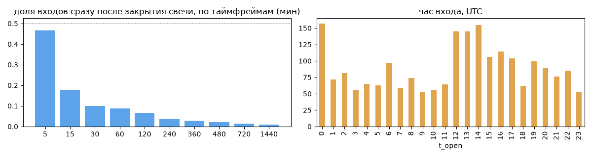
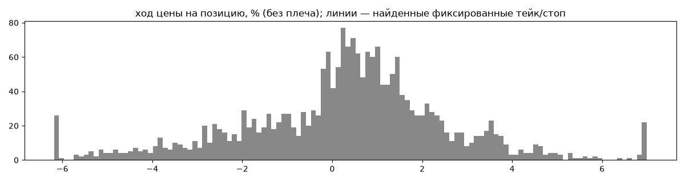
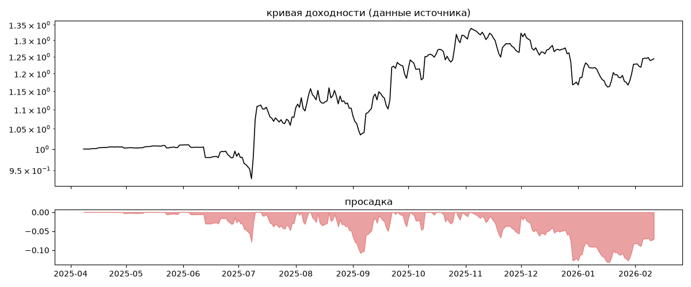
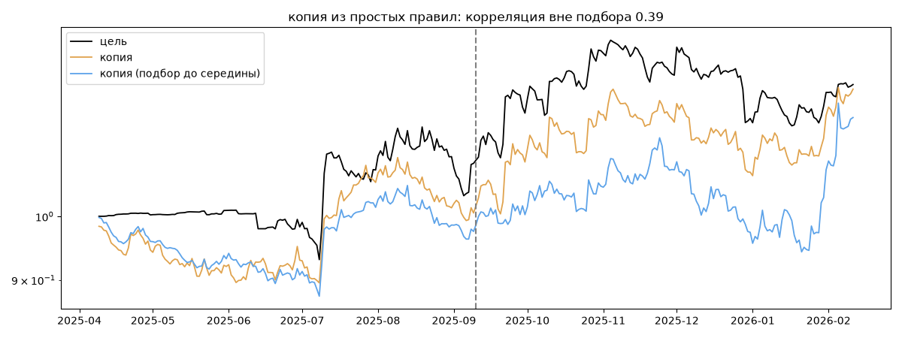

# Low Risk — обратный инжиниринг

*Источник: invvo · https://invvo.com/strategy/27 · разбор 26.09.2026*

> - Paracels — команда профессиональных трейдеров и разработчиков, специализирующихся на автоматизированной торговле криптовалютой. Ключевая компетенция — создание и внедрение торговых роботов собственной разработки, основанных на продвинутых алгоритмах.

Используя глубокий анализ рыночных данных и адаптивные стратегии, мы предлагаем решения, обеспечивающие высокую эффективность и минимальные риски. Мы уделяем особое внимание безопасности, прозрачности процессов и оптимизации результатов, что позволяет клиентам и партнерам получать стабильную прибыль в условиях динамичного рынка.

Наша мисси

## Коротко

- **Тип:** возврат к среднему · нейтрально · **бот**
  - часто в плюс (63%), но плюс меньше минуса
  - контекст входа: вход ПО ХОДУ движения (тренд/пробой) (87% входов по ходу 4–24 ч движения)
- **Контекст входа:** вход ПО ХОДУ движения (тренд/пробой): за 4ч 88% по ходу (медиана 1.34%), за 24ч 86% по ходу (медиана 2.12%), за 72ч 77% по ходу (медиана 2.39%)
- **Когда входит:** без привязки к свечам; 42% входов пачками по разным монетам
- **Правило входа:** не искали — у входов нет сетки свечей — входы лимитками/вручную или по тикам; укажите таймфрейм вручную (--tf)
- **Как выходит:** выход плавающий: по сигналу или скользящему стопу
- **Результат:** ×1.24, +29% в год, макс. просадка -13%, сейчас -7% (99 дн.). По годам: 2025: +18%, 2026: +6%
- **Хвосты:** месяцев в плюс 70%, худший месяц = -1.3 средних хороших, просадка/волатильность -0.5 → хвост умеренный: худший месяц сопоставим с обычным хорошим
- **Природа по кривой:** тренд 54%, возврат к среднему 27%, докупка (продажа страховки) 19% · совпадение копии вне подбора 0.39 (на подборе 0.79)
- **Форма доходности:** участие в росте рынка 0.13, в падении -0.23 → в обычные дни в росте участвует сильнее, чем в падениях (редкие обвалы тут не видны — см. «хвосты»)
- **Оговорки:** полная история с запуска; p_open = средняя позиции (cost/lots): доливки внутри, при нескольких стратегиях — неттинг

## Почерк

| | |
|---|---|
| период | 2025-04-11 → 2026-02-11 (306 дн.) |
| позиций | 2129 (48.71 в неделю), открыто сейчас 2 |
| монет | 30: KAS 201, RUNE 151, ONDO 106, TRUMP 95, 1000PEPE 93, LTC 86 |
| доля BTC/ETH/SOL/XRP/BNB/золото | 6% |
| шорты | 24% |
| в плюс | 63% |
| средний плюс / минус | 1.66% / -1.96% (отношение 0.85) |
| худшая / лучшая | -10.7% / 17.64% |
| удержание 10/50/90% | {'p10': 0.6, 'p50': 2.7, 'p90': 44.8} ч |
| одновременно открыто макс. | 23 |
| доливки | {'multi_order_share': 0.0, 'size_ratio': None, 'add_dir': None, 'max_orders': 1, 'cost_mult_max': 76.0, 'cost_cv': 1.19} |
| уровни цен | {'round_price_share': 0.0, 'repeat_price_share': 0.01, 'grid': None} |







## Копия по кривой

Подбор на 309 днях, разрез 2025-09-10. Корреляция дневной доходности: подбор 0.79, **проверка 0.39**, вся история 0.74 (R² 0.54).

| компонента копии | вес |
|---|---|
| BTC [4ч] докупка шаг 3% тейк 3% | 0.109 |
| BTC [день] возврат 3 | 0.058 |
| BTC [4ч] ход 20 | 0.056 |
| BTC [4ч] ход 3 | 0.043 |
| RUNE [4ч] докупка шаг 3% тейк 3% | 0.041 |
| BTC [4ч] возврат 2 | 0.031 |
| BTC [день] ход 60 | 0.031 |
| ETH [день] ход 2 | 0.029 |
| RUNE [день] EMA50/200 | 0.028 |
| BTC [4ч] ход 1 | 0.027 |

Сильнее всего совпадает по одиночке: RUNE [4ч] ход 20 (0.48), RUNE [4ч] EMA5/20 (0.47), SOL [4ч] ход 10 (0.45), RUNE [4ч] ход 10 (0.44), SOL [4ч] EMA5/20 (0.44), BTC [4ч] ход 20 (0.44)

Сильнее всего противоположна: RUNE [4ч] возврат 5 (-0.39), ETH [4ч] возврат 5 (-0.38), RUNE [день] возврат 3 (-0.37), BTC [день] возврат 3 (-0.37)




## Выходы

```
{
 "fixed_tp": null,
 "fixed_sl": null,
 "reentry": 0.03,
 "exit_on_candle_close": {
  "15": 0.23,
  "60": 0.12,
  "240": 0.06,
  "1440": 0.02
 },
 "hold_mode_h": 0.75,
 "hold_mode_share": 0.02,
 "atr": {
  "interval": "60",
  "win_pct_cv": 0.88,
  "win_atr_cv": 1.34,
  "loss_pct_cv": 0.6,
  "loss_atr_cv": 0.63,
  "win_k_median": 1.54,
  "loss_k_median": -1.72
 },
 "verdict": [
  "выход плавающий: по сигналу или скользящему стопу"
 ]
}
```