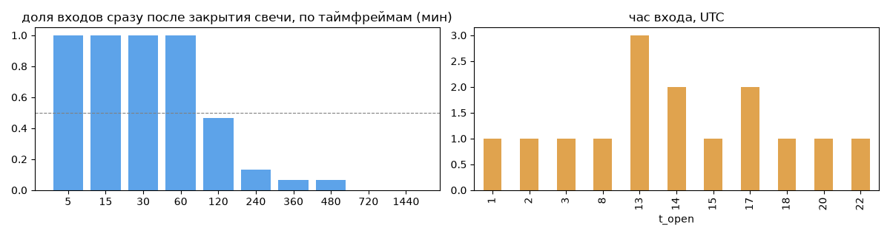
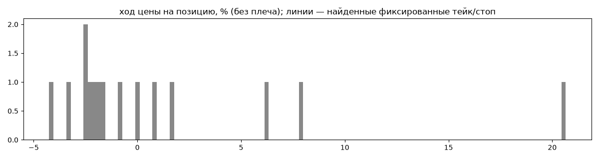
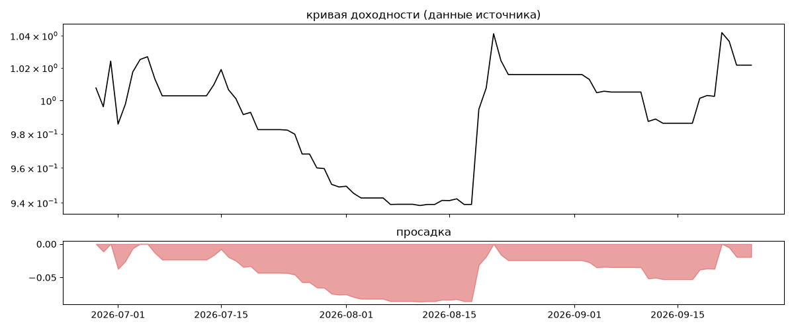
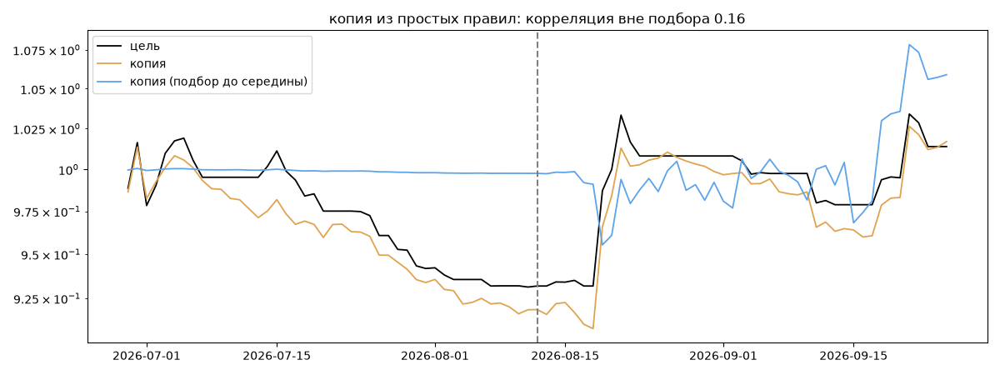

# LQD PHOTON — обратный инжиниринг

*Источник: bybit · https://www.bybit.com/copyTrade/trade-center/detail?leaderMark=ghJc1nSfo/CQ096M4+AETQ== · разбор 26.09.2026*

> PHOTON trading algorithm model with coverage of more than 50 trading pairs, part of the LIQVIDATOR algo trading project. Use standard settings with full duplication of trader’s actions. Oriented towards long-term trading (6-12 months). The minimum recommended subscription amount is 500 USDT. The maximum possible drawdown is approximately -30% (based on backtests over the past 6 years). Only use funds you can afford to lose! Find us: LIQVIDAT / LQDAGENT

## Коротко

- **Тип:** тренд · покупает страховку · **бот**
  - в плюс 40% сделок, средний плюс в 2.73 раза больше минуса
  - контекст входа: вход ПО ХОДУ движения (тренд/пробой) (97% входов по ходу 4–24 ч движения)
- **Контекст входа:** вход ПО ХОДУ движения (тренд/пробой): за 4ч 93% по ходу (медиана 1.51%), за 24ч 100% по ходу (медиана 2.36%), за 72ч 93% по ходу (медиана 3.05%)
- **Когда входит:** на закрытии свечи 60 мин (≈0.0 мин после закрытия, 100% входов)
- **Правило входа:** не искали — мало позиций (15 < 60)
- **Как выходит:** выход плавающий: по сигналу или скользящему стопу
- **Результат:** ×1.01, +6% в год, макс. просадка -9%, сейчас -2% (4 дн.). По годам: 2026: +1%
- **Хвосты:** месяцев в плюс 67%, худший месяц = None средних хороших, просадка/волатильность -0.39 → не ясно
- **Природа по кривой:** тренд 66%, возврат к среднему 28%, докупка (продажа страховки) 5% · совпадение копии вне подбора 0.16 (на подборе 0.98) — ⚠️ кривая короткая, вывод слабый
- **Форма доходности:** участие в росте рынка 0.39, в падении -0.18 → в обычные дни в росте участвует сильнее, чем в падениях (редкие обвалы тут не видны — см. «хвосты»)
- **Оговорки:** только последние 90 дней — выводы о правилах ограничены; p_open = средняя позиции, order_price = цена ордера; кривая = cumResetRoi за 90 дней (ROI витрины, с плечом)

## Почерк

| | |
|---|---|
| период | 2026-06-24 → 2026-09-21 (88 дн.) |
| позиций | 15 (1.19 в неделю), открыто сейчас 0 |
| монет | 2: BTC 8, ETH 7 |
| доля BTC/ETH/SOL/XRP/BNB/золото | 100% |
| шорты | 40% |
| в плюс | 40% |
| средний плюс / минус | 6.56% / -2.4% (отношение 2.73) |
| худшая / лучшая | -4.4% / 22.72% |
| удержание 10/50/90% | {'p10': 27.2, 'p50': 66.0, 'p90': 129.2} ч |
| одновременно открыто макс. | 2 |
| доливки | {'multi_order_share': 0.0, 'size_ratio': None, 'add_dir': None, 'max_orders': 1, 'cost_mult_max': 2.8, 'cost_cv': 0.38} |
| уровни цен | {'round_price_share': 0.0, 'repeat_price_share': 0.0, 'grid': None} |







## Копия по кривой

Подбор на 89 днях, разрез 2026-08-12. Корреляция дневной доходности: подбор 0.98, **проверка 0.16**, вся история 0.94 (R² 0.89).

| компонента копии | вес |
|---|---|
| BTC [4ч] ход 20 | 0.075 |
| ETH [день] ход 5 | 0.052 |
| BTC [день] пробой 55 | 0.049 |
| BTC [4ч] ход 3 | 0.048 |
| BTC [4ч] докупка шаг 1% тейк 1% | 0.047 |
| BTC [день] возврат 3 | 0.045 |
| BTC [4ч] ход 5 | 0.041 |
| ETH [день] ход 3 | 0.04 |
| BTC [день] возврат 2 | 0.039 |
| ETH [день] ход 1 | 0.038 |

Сильнее всего совпадает по одиночке: ETH [день] ход 20 (0.67), ETH [4ч] ход 20 (0.66), BTC [4ч] ход 20 (0.65), ETH [день] ход 5 (0.65), ETH [день] ход 1 (0.65), ETH [день] ход 2 (0.64)

Сильнее всего противоположна: ETH [день] возврат 5 (-0.65), ETH [день] возврат 1 (-0.65), ETH [день] возврат 2 (-0.64), BTC [день] возврат 5 (-0.63)




## Выходы

```
{
 "fixed_tp": null,
 "fixed_sl": null,
 "reentry": 0.0,
 "exit_on_candle_close": {
  "15": 1.0,
  "60": 1.0,
  "240": 0.27,
  "1440": 0.0
 },
 "hold_mode_h": 6.0,
 "hold_mode_share": 0.07,
 "verdict": [
  "выход плавающий: по сигналу или скользящему стопу"
 ]
}
```