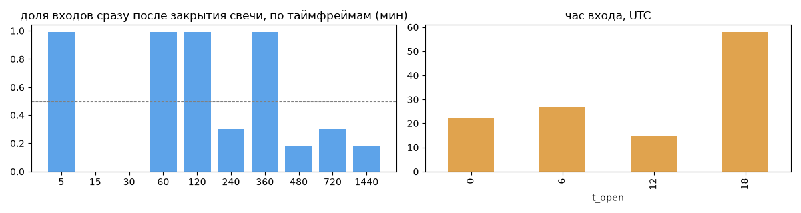
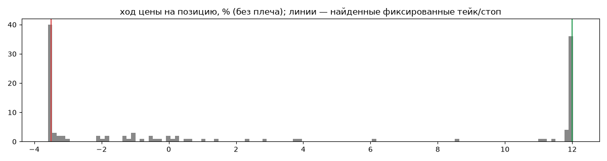
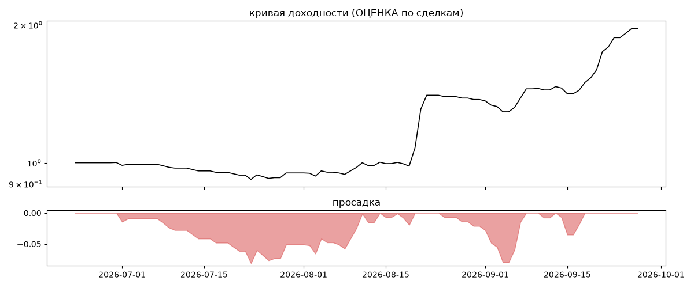

# Meridian Trend edge — обратный инжиниринг

*Источник: csv ·  · разбор 26.09.2026*

## Коротко

- **Тип:** сканер с фиксированными тейком и стопом · покупает страховку · **бот**
  - тейк +12.0% / стоп -3.5%
  - 60% входов пачками по разным монетам
  - контекст входа: вход ПО ХОДУ движения (тренд/пробой) (95% входов по ходу 4–24 ч движения)
  - сверка с самоописанием: заявлено «тренд» → ✅ совпало
- **Контекст входа:** вход ПО ХОДУ движения (тренд/пробой): за 4ч 93% по ходу (медиана 1.65%), за 24ч 97% по ходу (медиана 3.18%), за 72ч 82% по ходу (медиана 2.04%)
- **Когда входит:** на закрытии свечи 360 мин (≈5.5 мин после закрытия, 99% входов); 60% входов пачками по разным монетам
- **Правило входа:** правило найдено частично — лучшее: «Supertrend10/2 | BTC>EMA200», на проверке F1 0.306 (охват 0.31, точность 0.21 на всей истории)
- **Как выходит:** тейк фиксированный ≈ +12.0%; стоп фиксированный ≈ -3.5%
- **Результат (оценка по сделкам):** ×1.96, +1202% в год, макс. просадка -8%, сейчас +0% (0 дн.). По годам: 2026: +96%
- **Хвосты:** месяцев в плюс 67%, худший месяц = None средних хороших, просадка/волатильность -0.14 → не ясно

## Почерк

| | |
|---|---|
| период | 2026-06-23 → 2026-09-25 (94 дн.) |
| позиций | 122 (9.11 в неделю), открыто сейчас 0 |
| монет | 25: OP 9, HBAR 8, AXS 6, LTC 6, DYDX 6, SOL 6 |
| доля BTC/ETH/SOL/XRP/BNB/золото | 9% |
| шорты | 45% |
| в плюс | 46% |
| средний плюс / минус | 9.55% / -2.87% (отношение 3.33) |
| худшая / лучшая | -3.68% / 12.2% |
| удержание 10/50/90% | {'p10': 9.0, 'p50': 44.0, 'p90': 174.6} ч |
| одновременно открыто макс. | 12 |
| доливки | {'multi_order_share': 0.0, 'size_ratio': None, 'add_dir': None, 'max_orders': 1} |
| уровни цен | {'round_price_share': 0.06, 'repeat_price_share': 0.0, 'grid': None} |







## Копия по кривой

Не делали: у источника нет своей кривой доходности — по оценочной кривой копию не подбираем

## Правило входа

Таймфрейм 360, монет 25, входов в окне 116. Точность считается только по свечам, где цель вне позиции по монете.

| правило                                                 |   совпало |   сработало |   охват |   точность |    F1 |   F1_подбор |   F1_проверка |
|:--------------------------------------------------------|----------:|------------:|--------:|-----------:|------:|------------:|--------------:|
| импульс объём≥1.2× + цена×EMA30 | BTC>EMA200            |        39 |         171 |    0.34 |       0.23 | 0.272 |       0.223 |         0.395 |
| импульс объём≥1.2× + цена×EMA50 | BTC>EMA200            |        33 |         140 |    0.28 |       0.24 | 0.258 |       0.19  |         0.416 |
| Supertrend10/2 | BTC>EMA200                             |        36 |         173 |    0.31 |       0.21 | 0.249 |       0.225 |         0.306 |
| Supertrend7/2 | BTC>EMA200                              |        36 |         176 |    0.31 |       0.2  | 0.247 |       0.213 |         0.329 |
| импульс объём≥1.2× + цена×EMA30 | BTC>EMA50             |        34 |         162 |    0.29 |       0.21 | 0.245 |       0.189 |         0.39  |
| Supertrend14/2 | BTC>EMA200                             |        33 |         170 |    0.28 |       0.19 | 0.231 |       0.209 |         0.282 |
| импульс объём≥1.2× + цена×EMA50 | BTC>EMA50             |        28 |         145 |    0.24 |       0.19 | 0.215 |       0.156 |         0.377 |
| импульс объём≥1.2× + цена×EMA20 | BTC>EMA200            |        31 |         177 |    0.27 |       0.18 | 0.212 |       0.206 |         0.228 |
| импульс объём≥1.2× + цена×EMA50 | —                     |        41 |         273 |    0.35 |       0.15 | 0.211 |       0.152 |         0.38  |
| импульс объём≥1.2× + цена×EMA30 | —                     |        46 |         320 |    0.4  |       0.14 | 0.211 |       0.165 |         0.349 |
| импульс тело≥1.2% объём≥1.2× у края канала | BTC>EMA200 |        78 |         631 |    0.67 |       0.12 | 0.209 |       0.192 |         0.244 |
| импульс тело≥1.2% объём≥1.5× у края канала | BTC>EMA200 |        62 |         485 |    0.53 |       0.13 | 0.206 |       0.198 |         0.225 |

**Подпись свечи входа** (эффект = сдвиг медианы входов от обычных свечей в межквартильных размахах):

| признак        | сторона   |   медиана_входов |   p10 |   p90 |   медиана_обычных |   эффект |
|:---------------|:----------|-----------------:|------:|------:|------------------:|---------:|
| тело/ATR       | лонг      |             1.14 |  0.56 |  1.96 |             -0.02 |     1.71 |
| объём/ср20     | лонг      |             1.84 |  1.36 |  3.07 |              0.82 |     1.56 |
| ход 1 св %     | лонг      |             2.56 |  1.19 |  5.51 |             -0.04 |     1.45 |
| тело %         | лонг      |             2.56 |  1.19 |  5.51 |             -0.04 |     1.45 |
| объём/ср50     | лонг      |             1.75 |  1.08 |  2.99 |              0.79 |     1.44 |
| BTC тело %     | шорт      |            -1.2  | -1.81 |  0.13 |              0.08 |    -1.41 |
| BTC ход 1 св % | шорт      |            -1.2  | -1.81 |  0.13 |              0.08 |    -1.41 |
| BTC тело/ATR   | шорт      |            -0.91 | -1.23 |  0.11 |              0.06 |    -1.4  |
| BTC объём/ср20 | шорт      |             1.78 |  0.78 |  2.6  |              0.84 |     1.35 |
| объём/ср20     | шорт      |             1.7  |  1.26 |  2.52 |              0.82 |     1.34 |
| BTC объём/ср50 | шорт      |             1.7  |  0.85 |  2.36 |              0.78 |     1.3  |
| тело/ATR       | шорт      |            -0.84 | -1.47 | -0.57 |             -0.02 |    -1.22 |
| ход 4 св %     | лонг      |             4.53 |  1.04 | 10.86 |             -0.03 |     1.18 |
| объём/ср50     | шорт      |             1.53 |  1.07 |  2.35 |              0.79 |     1.12 |

**Дерево решений** (подбор на первых 2/3; на проверке {'охват': 0.89, 'точность': 0.12, 'F1': 0.211}):
```
|--- объём/ср20 <= 1.22
|   |--- ход 28 св % <= -55.17
|   |   |--- class: 0
|   |--- ход 28 св % >  -55.17
|   |   |--- class: 0
|--- объём/ср20 >  1.22
|   |--- RSI7 <= 51.81
|   |   |--- class: 0
|   |--- RSI7 >  51.81
|   |   |--- ход 12 св % <= 8.76
|   |   |   |--- class: 1
|   |   |--- ход 12 св % >  8.76
|   |   |   |--- class: 0
```

## Выходы

```
{
 "fixed_tp": {
  "level": 12.0,
  "share": 0.7
 },
 "fixed_sl": {
  "level": -3.5,
  "share": 0.65
 },
 "reentry": 0.04,
 "exit_on_candle_close": {
  "15": 0.13,
  "60": 0.04,
  "240": 0.01,
  "1440": 0.0
 },
 "hold_mode_h": 78.0,
 "hold_mode_share": 0.03,
 "atr": {
  "interval": "360",
  "win_pct_cv": 0.59,
  "win_atr_cv": 0.78,
  "loss_pct_cv": 0.37,
  "loss_atr_cv": 0.45,
  "win_k_median": 3.81,
  "loss_k_median": -1.12
 },
 "verdict": [
  "тейк фиксированный ≈ +12.0%",
  "стоп фиксированный ≈ -3.5%"
 ]
}
```