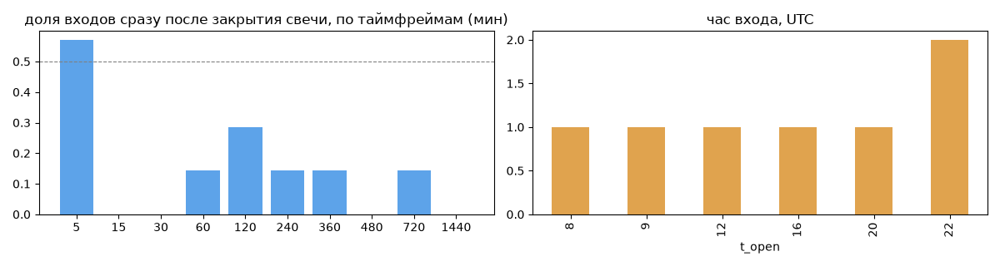
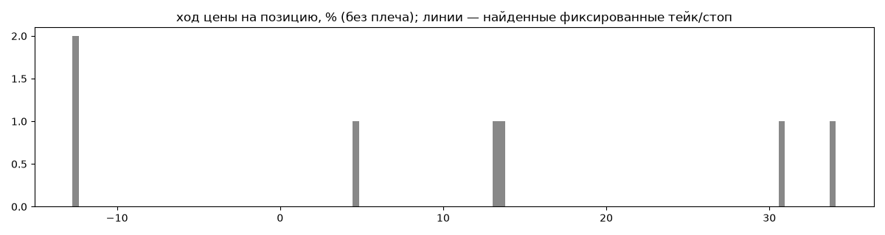
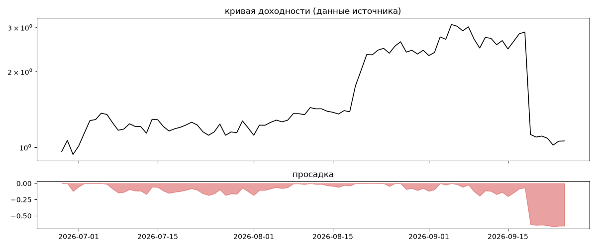
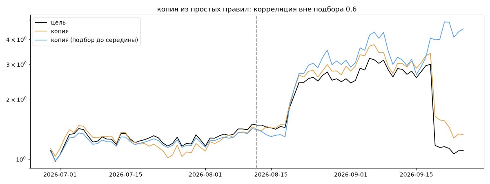

# Papai — обратный инжиниринг

*Источник: bybit · https://www.bybit.com/copyTrade/trade-center/detail?leaderMark=V61bxMC+BHTIXUbogJUzMA== · разбор 26.09.2026*

> NEVER SET "Trailing Stop"


## Коротко

- **Тип:** долгая докупка (накопление) · продаёт страховку · **не ясно, бот или человек**
  - держит ~116 дней, 100% позиций набраны частями с доливкой вниз
- **Когда входит:** без привязки к свечам
- **Правило входа:** не искали — у входов нет сетки свечей — входы лимитками/вручную или по тикам; укажите таймфрейм вручную (--tf)
- **Как выходит:** выход плавающий: по сигналу или скользящему стопу
- **Результат:** ×1.1, +49% в год, макс. просадка -67%, сейчас -66% (20 дн.). По годам: 2026: +10%
- **Хвосты:** месяцев в плюс 67%, худший месяц = None средних хороших, просадка/волатильность -0.37 → не ясно
- **Природа по кривой:** тренд 47%, возврат к среднему 33%, докупка (продажа страховки) 21% · совпадение копии вне подбора 0.6 (на подборе 1.0) — ⚠️ кривая короткая, вывод слабый
- **Форма доходности:** участие в росте рынка 2.12, в падении 2.6 → в обычные дни в падениях участвует сильнее, чем в росте
- **Оговорки:** только последние 90 дней — выводы о правилах ограничены; p_open = средняя позиции, order_price = цена ордера; кривая = cumResetRoi за 90 дней (ROI витрины, с плечом)

## Почерк

| | |
|---|---|
| период | 2026-03-16 → 2026-06-04 (80 дн.) |
| позиций | 7 (0.61 в неделю), открыто сейчас 0 |
| монет | 6: MNT 2, SOL 1, BTC 1, ETH 1, BNB 1, HYPE 1 |
| доля BTC/ETH/SOL/XRP/BNB/золото | 56% |
| шорты | 0% |
| в плюс | 71% |
| средний плюс / минус | 19.31% / -12.72% (отношение 1.52) |
| худшая / лучшая | -12.72% / 34.28% |
| удержание 10/50/90% | {'p10': 2462.5, 'p50': 2773.5, 'p90': 3990.7} ч |
| одновременно открыто макс. | 7 |
| доливки | {'multi_order_share': 1.0, 'size_ratio': 1.04, 'add_dir': 'усреднение вниз', 'max_orders': 18} |
| уровни цен | {'round_price_share': 0.11, 'repeat_price_share': 0.0, 'grid': None} |







## Копия по кривой

Подбор на 89 днях, разрез 2026-08-12. Корреляция дневной доходности: подбор 1.0, **проверка 0.6**, вся история 0.96 (R² 0.92).

| компонента копии | вес |
|---|---|
| BTC [4ч] докупка шаг 1% тейк 1% | 0.063 |
| BNB [4ч] докупка шаг 3% тейк 3% | 0.052 |
| MNT [день] EMA50/200 | 0.036 |
| SOL [4ч] возврат 2 | 0.036 |
| BTC [день] возврат 5 | 0.033 |
| BNB [4ч] ход 10 | 0.031 |
| ETH [4ч] ход 1 | 0.028 |
| BNB [4ч] ход 2 | 0.028 |
| BTC [день] ход 1 | 0.027 |
| MNT [день] ход 3 | 0.026 |

Сильнее всего совпадает по одиночке: BNB [день] держать (0.64), BNB [4ч] держать (0.64), BNB [4ч] докупка шаг 2% тейк 2% (0.6), BNB [4ч] докупка шаг 1% тейк 1% (0.59), SOL [4ч] докупка шаг 3% тейк 3% (0.59), SOL [4ч] докупка шаг 1% тейк 1% (0.59)

Сильнее всего противоположна: BNB [день] EMA50/200 (-0.52), BTC [день] EMA50/200 (-0.47), ETH [день] EMA50/200 (-0.4), SOL [день] EMA50/200 (-0.39)




## Выходы

```
{
 "fixed_tp": null,
 "fixed_sl": null,
 "reentry": 0.0,
 "exit_on_candle_close": {
  "15": 0.0,
  "60": 0.0,
  "240": 0.0,
  "1440": 0.0
 },
 "hold_mode_h": 2368.78,
 "hold_mode_share": 0.14,
 "verdict": [
  "выход плавающий: по сигналу или скользящему стопу"
 ]
}
```