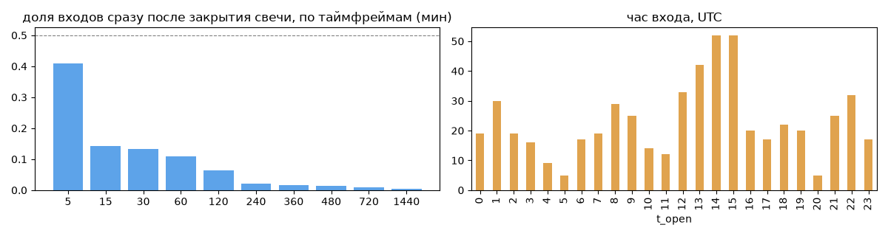
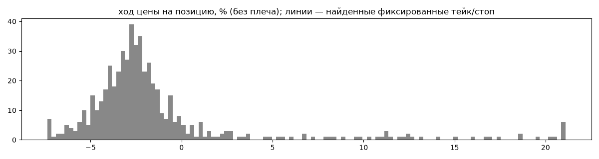
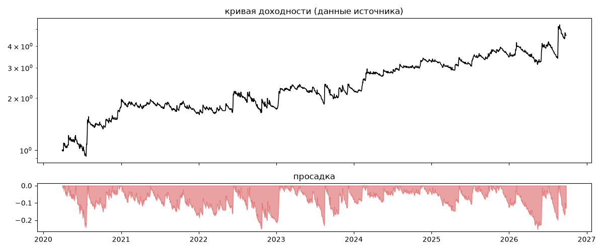
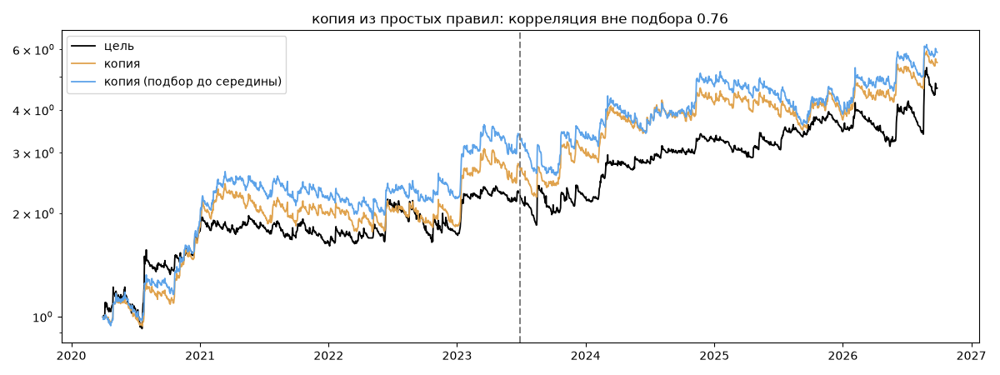

# Quant Hill — обратный инжиниринг

*Источник: invvo · https://invvo.com/strategy/10 · разбор 26.09.2026*

> Трендовая алгоритмическая стратегия. Торговля по тренду — одна из самых надежных стратегий, использующаяся уже более 150 лет. Она будет продолжать эффективно работать, пока существуют рынки.
При этом, любой рынок находится в фазе тренда всего 10-20% времении. Чтобы оперативно распознавать тренды и их смену, мы создали алгоритм, чья торговая логика оптимизирована на максимально доступном массиве исторических данных с применением форвардного анализа. Вся стратегия полностью автоматизированы, 
Убыточная фаза стратегии — боковик. Ориентировочно 70% совершаемых сделок будут приводить к убыткам. О

## Коротко

- **Тип:** тренд · покупает страховку · **бот**
  - в плюс 14% сделок, средний плюс в 2.85 раза больше минуса
  - контекст входа: вход ПО ХОДУ движения (тренд/пробой) (89% входов по ходу 4–24 ч движения)
  - сверка с самоописанием: заявлено «тренд» → ✅ совпало
- **Контекст входа:** вход ПО ХОДУ движения (тренд/пробой): за 4ч 89% по ходу (медиана 0.79%), за 24ч 89% по ходу (медиана 2.06%), за 72ч 80% по ходу (медиана 1.61%)
- **Когда входит:** без привязки к свечам
- **Правило входа:** не искали — у входов нет сетки свечей — входы лимитками/вручную или по тикам; укажите таймфрейм вручную (--tf)
- **Как выходит:** выход плавающий: по сигналу или скользящему стопу
- **Результат:** ×4.62, +27% в год, макс. просадка -25%, сейчас -13% (30 дн.). По годам: 2020: +77%, 2021: -7%, 2022: +6%, 2023: +27%, 2024: +46%, 2025: +7%, 2026: +34%
- **Хвосты:** месяцев в плюс 56%, худший месяц = -1.6 средних хороших, просадка/волатильность -0.74 → хвост умеренный: худший месяц сопоставим с обычным хорошим
- **Природа по кривой:** тренд 96%, докупка (продажа страховки) 4% · совпадение копии вне подбора 0.76 (на подборе 0.77)
- **Форма доходности:** участие в росте рынка 0.27, в падении -0.25 → в обычные дни в росте участвует сильнее, чем в падениях (редкие обвалы тут не видны — см. «хвосты»)
- **Оговорки:** полная история с запуска; p_open = средняя позиции (cost/lots): доливки внутри, при нескольких стратегиях — неттинг

## Почерк

| | |
|---|---|
| период | 2026-01-15 → 2026-09-21 (248 дн.) |
| позиций | 551 (15.52 в неделю), открыто сейчас 11 |
| монет | 12: AVAX 50, BNB 50, DOGE 50, FIL 49, ETH 49, BTC 47 |
| доля BTC/ETH/SOL/XRP/BNB/золото | 43% |
| шорты | 50% |
| в плюс | 14% |
| средний плюс / минус | 8.6% / -3.01% (отношение 2.85) |
| худшая / лучшая | -9.12% / 52.02% |
| удержание 10/50/90% | {'p10': 11.3, 'p50': 51.6, 'p90': 229.0} ч |
| одновременно открыто макс. | 12 |
| доливки | {'multi_order_share': 0.0, 'size_ratio': None, 'add_dir': None, 'max_orders': 1, 'cost_mult_max': 474.9, 'cost_cv': 2.86} |
| уровни цен | {'round_price_share': 0.0, 'repeat_price_share': 0.0, 'grid': None} |







## Копия по кривой

Подбор на 2371 днях, разрез 2023-06-29. Корреляция дневной доходности: подбор 0.77, **проверка 0.76**, вся история 0.78 (R² 0.61).

| компонента копии | вес |
|---|---|
| BTC [день] ход 5 | 0.123 |
| BTC [4ч] ход 40 | 0.114 |
| BTC [день] ход 3 | 0.111 |
| BTC [4ч] EMA5/20 | 0.088 |
| BTC [день] пробой 20 | 0.085 |
| BTC [4ч] пробой 20 | 0.079 |
| BTC [4ч] ход 10 | 0.072 |
| BTC [день] ход 1 | 0.054 |
| BTC [день] пробой 10 | 0.05 |
| BTC [день] ход 2 | 0.038 |

Сильнее всего совпадает по одиночке: BTC [4ч] EMA5/20 (0.64), BTC [день] ход 5 (0.61), BTC [день] ход 3 (0.61), BTC [4ч] EMA10/50 (0.6), BTC [4ч] пробой 20 (0.6), BTC [4ч] ход 20 (0.59)

Сильнее всего противоположна: BTC [день] возврат 5 (-0.61), BTC [день] возврат 3 (-0.61), BTC [день] возврат 2 (-0.55), BTC [день] возврат 1 (-0.45)




## Выходы

```
{
 "fixed_tp": null,
 "fixed_sl": null,
 "reentry": 0.24,
 "exit_on_candle_close": {
  "15": 0.15,
  "60": 0.04,
  "240": 0.01,
  "1440": 0.0
 },
 "hold_mode_h": 28.07,
 "hold_mode_share": 0.01,
 "atr": {
  "interval": "60",
  "win_pct_cv": 1.12,
  "win_atr_cv": 1.48,
  "loss_pct_cv": 0.53,
  "loss_atr_cv": 0.5,
  "win_k_median": 3.72,
  "loss_k_median": -3.64
 },
 "verdict": [
  "выход плавающий: по сигналу или скользящему стопу"
 ]
}
```