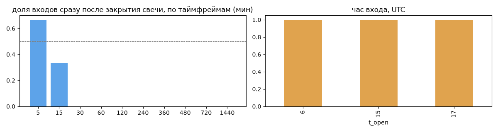
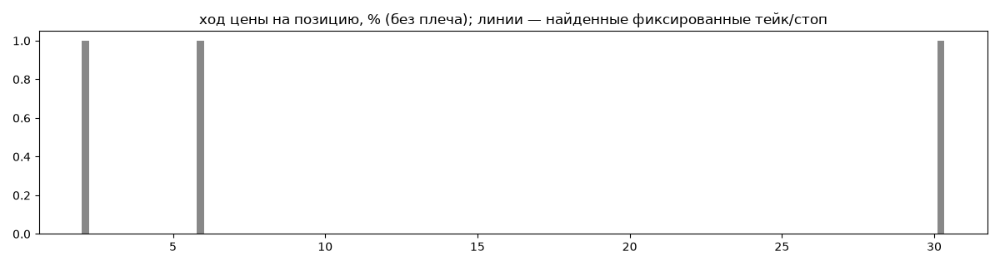
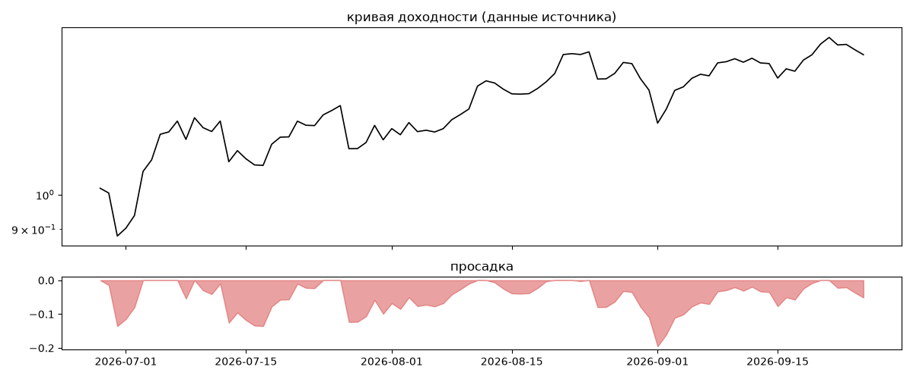
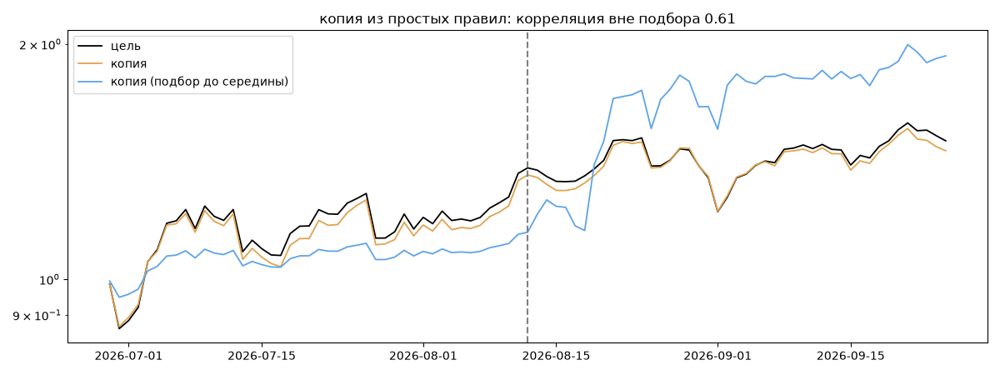

# Quant-S — обратный инжиниринг

*Источник: bybit · https://www.bybit.com/copyTrade/trade-center/detail?leaderMark=4Pf1hj/Su6XoH51r/fnIrQ== · разбор 26.09.2026*

> TRX Institutional Grid Algo

Asset: TRX/USDT only.
Method: Positional Counter-Trend.
Entries: Initial order is 2.5% to 3.5% of equity, followed by a grid of additional entries (DCA). Order sizes grow proportionally as the account capital increases.
Leverage: 20x. This allows the strategy to build a grid of positions with low margin usage per trade.

Automation: All entries and exits via TradingView Webhooks. Zero emotions.

Risks: Occasional losses may occur as the algorithm executes a Stop Loss (SL) to protect capital according to its signals. Equity growth is not linear.

Copying: Use Smart 

## Коротко

- **Тип:** докупка/мартингейл · продаёт страховку · **бот**
  - доливки с множителем ×1.0
  - 100% сделок в плюс, стопа нет
  - сверка с самоописанием: заявлено «докупка/сетка, контртренд» → ✅ совпало
- **Когда входит:** без привязки к свечам
- **Правило входа:** не искали — у входов нет сетки свечей — входы лимитками/вручную или по тикам; укажите таймфрейм вручную (--tf)
- **Как выходит:** выход по времени ≈ через 2.69 ч
- **Результат:** ×1.5, +433% в год, макс. просадка -20%, сейчас -5% (4 дн.). По годам: 2026: +50%
- **Хвосты:** месяцев в плюс 100%, худший месяц = None средних хороших, просадка/волатильность -0.25 → не ясно
- **Природа по кривой:** держание (бета рынка) 34%, докупка (продажа страховки) 28%, тренд 22%, возврат к среднему 16% · совпадение копии вне подбора 0.61 (на подборе 1.0) — ⚠️ кривая короткая, вывод слабый
- **Форма доходности:** участие в росте рынка 0.27, в падении 1.98 → в обычные дни в падениях участвует сильнее, чем в росте
- **Оговорки:** только последние 90 дней — выводы о правилах ограничены; p_open = средняя позиции, order_price = цена ордера; кривая = cumResetRoi за 90 дней (ROI витрины, с плечом)

## Почерк

| | |
|---|---|
| период | 2026-06-04 → 2026-09-20 (108 дн.) |
| позиций | 3 (0.2 в неделю), открыто сейчас 0 |
| монет | 2: AKE 2, TRX 1 |
| доля BTC/ETH/SOL/XRP/BNB/золото | 0% |
| шорты | 33% |
| в плюс | 100% |
| средний плюс / минус | 12.93% / 0.0% (отношение None) |
| худшая / лучшая | 1.93% / 30.83% |
| удержание 10/50/90% | {'p10': 3.2, 'p50': 5.4, 'p90': 1338.0} ч |
| одновременно открыто макс. | 1 |
| доливки | {'multi_order_share': 0.33, 'size_ratio': 1.0, 'add_dir': 'усреднение вниз', 'max_orders': 5} |
| уровни цен | {'round_price_share': 0.0, 'repeat_price_share': 0.0, 'grid': None} |







## Копия по кривой

Подбор на 89 днях, разрез 2026-08-12. Корреляция дневной доходности: подбор 1.0, **проверка 0.61**, вся история 1.0 (R² 0.99).

| компонента копии | вес |
|---|---|
| TRX [4ч] докупка шаг 3% тейк 3% | 0.251 |
| TRX [4ч] держать | 0.219 |
| TRX [день] держать | 0.122 |
| TRX [день] возврат 5 | 0.046 |
| TRX [день] ход 100 | 0.036 |
| BTC [4ч] докупка шаг 2% тейк 2% | 0.023 |
| TRX [день] ход 20 | 0.018 |
| TRX [4ч] ход 2 | 0.016 |
| TRX [день] ход 1 | 0.016 |
| SOL [день] возврат 3 | 0.014 |

Сильнее всего совпадает по одиночке: TRX [день] держать (0.95), TRX [4ч] держать (0.95), TRX [4ч] докупка шаг 2% тейк 2% (0.94), TRX [4ч] докупка шаг 1% тейк 1% (0.94), TRX [4ч] докупка шаг 3% тейк 3% (0.9), TRX [день] EMA50/200 (0.89)

Сильнее всего противоположна: TRX [день] возврат 2 (-0.45), BTC [день] EMA50/200 (-0.31), TRX [день] пробой 20 (-0.3), TRX [день] возврат 1 (-0.27)




## Выходы

```
{
 "fixed_tp": null,
 "fixed_sl": null,
 "reentry": 0.0,
 "exit_on_candle_close": {
  "15": 0.0,
  "60": 0.0,
  "240": 0.0,
  "1440": 0.0
 },
 "hold_mode_h": 2.69,
 "hold_mode_share": 0.33,
 "verdict": [
  "выход по времени ≈ через 2.69 ч"
 ]
}
```