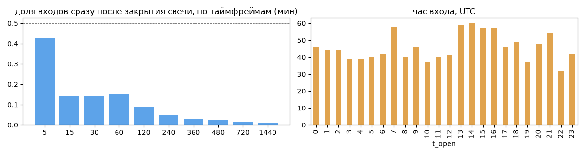
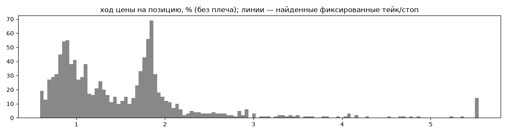
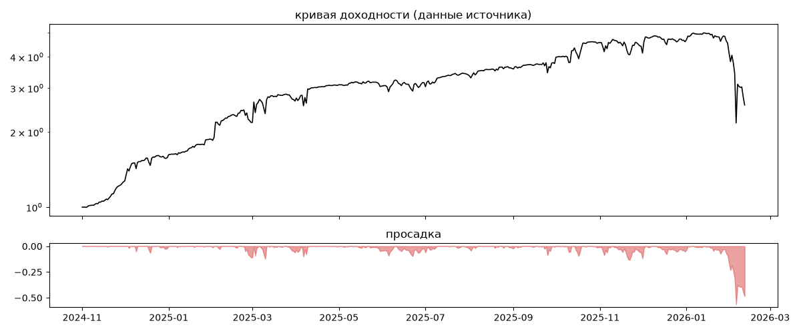
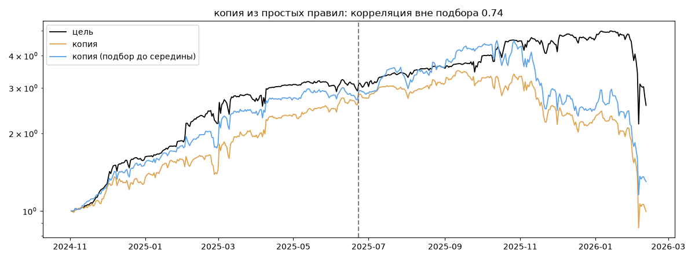

# Quantex — обратный инжиниринг

*Источник: invvo · https://invvo.com/strategy/24 · разбор 26.09.2026*

> В стратегии используются только фундаментальные торговые пары (ETH, BNB, SOL, ADA, XRP). Направление торговли Long, иногда Short. Направление торговли будет выбираться в зависимости от тренда. 

Торговля идет Futures in Bybit. 
Режим маржи - изолированная. 
Максимальное кредитное плечо - X5. Quantex - полностью автоматизированная стратегия одноименной финтех платформы, которая уже более 7 лет занимается разработкой алгоритмов на базе собственного ИИ. Помимо направления Алготрейдинг платформа имеет собственный кошелек для хранения и обмена криптовалют, GameFi направление и направление Finan

## Коротко

- **Тип:** докупка/мартингейл · продаёт страховку · **бот**
  - объём позиции растёт до ×129.6 от базового
  - 99% сделок в плюс, стопа нет
  - контекст входа: вход ПО ХОДУ движения (тренд/пробой) (93% входов по ходу 4–24 ч движения)
  - сверка с самоописанием: заявлено «тренд» → ❌ НЕ совпало — разобрать, поправить classify.py, записать в KNOWLEDGE.md
- **Контекст входа:** вход ПО ХОДУ движения (тренд/пробой): за 4ч 92% по ходу (медиана 1.7%), за 24ч 94% по ходу (медиана 3.91%), за 72ч 89% по ходу (медиана 5.84%)
- **Когда входит:** без привязки к свечам
- **Правило входа:** не искали — у входов нет сетки свечей — входы лимитками/вручную или по тикам; укажите таймфрейм вручную (--tf)
- **Как выходит:** выход плавающий: по сигналу или скользящему стопу
- **Результат:** ×2.57, +109% в год, макс. просадка -56%, сейчас -49% (29 дн.). По годам: 2024: +58%, 2025: +191%, 2026: -44%
- **Хвосты:** месяцев в плюс 73%, худший месяц = -2.9 средних хороших, просадка/волатильность -0.77 → не ясно
- **Природа по кривой:** возврат к среднему 35%, тренд 30%, докупка (продажа страховки) 26%, держание (бета рынка) 9% · совпадение копии вне подбора 0.74 (на подборе 0.92)
- **Форма доходности:** участие в росте рынка 0.71, в падении 0.88 → в обычные дни в падениях участвует сильнее, чем в росте
- **Оговорки:** полная история с запуска; p_open = средняя позиции (cost/lots): доливки внутри, при нескольких стратегиях — неттинг

## Почерк

| | |
|---|---|
| период | 2024-11-04 → 2026-02-02 (455 дн.) |
| позиций | 1097 (16.88 в неделю), открыто сейчас 5 |
| монет | 7: XRP 416, SOL 255, ADA 209, BNB 122, SOLO 58, ETH 29 |
| доля BTC/ETH/SOL/XRP/BNB/золото | 76% |
| шорты | 1% |
| в плюс | 99% |
| средний плюс / минус | 1.53% / -0.16% (отношение 9.81) |
| худшая / лучшая | -0.16% / 9.05% |
| удержание 10/50/90% | {'p10': 0.5, 'p50': 6.2, 'p90': 67.8} ч |
| одновременно открыто макс. | 6 |
| доливки | {'multi_order_share': 0.0, 'size_ratio': None, 'add_dir': None, 'max_orders': 1, 'cost_mult_max': 129.6, 'cost_cv': 2.16} |
| уровни цен | {'round_price_share': 0.0, 'repeat_price_share': 0.01, 'grid': None} |







## Копия по кривой

Подбор на 467 днях, разрез 2025-06-23. Корреляция дневной доходности: подбор 0.92, **проверка 0.74**, вся история 0.87 (R² 0.76).

| компонента копии | вес |
|---|---|
| BTC [4ч] докупка шаг 3% тейк 3% | 0.208 |
| XRP [4ч] держать | 0.058 |
| BNB [4ч] докупка шаг 3% тейк 3% | 0.055 |
| XRP [день] возврат 3 | 0.043 |
| BNB [день] возврат 3 | 0.035 |
| BTC [4ч] ход 3 | 0.034 |
| SOL [день] возврат 2 | 0.029 |
| ADA [день] ход 3 | 0.029 |
| BTC [4ч] возврат 5 | 0.028 |
| BTC [день] возврат 3 | 0.023 |

Сильнее всего совпадает по одиночке: BTC [4ч] докупка шаг 3% тейк 3% (0.76), BTC [4ч] докупка шаг 2% тейк 2% (0.7), BTC [4ч] держать (0.67), BTC [день] держать (0.67), BTC [4ч] докупка шаг 1% тейк 1% (0.65), XRP [4ч] докупка шаг 3% тейк 3% (0.63)

Сильнее всего противоположна: XRP [день] EMA5/20 (-0.5), ADA [день] EMA5/20 (-0.47), XRP [день] EMA10/50 (-0.45), BTC [день] EMA5/20 (-0.45)




## Выходы

```
{
 "fixed_tp": null,
 "fixed_sl": null,
 "reentry": 0.03,
 "exit_on_candle_close": {
  "15": 0.25,
  "60": 0.08,
  "240": 0.02,
  "1440": 0.0
 },
 "hold_mode_h": 0.48,
 "hold_mode_share": 0.01,
 "atr": {
  "interval": "60",
  "win_pct_cv": 0.47,
  "win_atr_cv": 0.58,
  "loss_pct_cv": NaN,
  "loss_atr_cv": NaN,
  "win_k_median": 1.2,
  "loss_k_median": -0.1
 },
 "verdict": [
  "выход плавающий: по сигналу или скользящему стопу"
 ]
}
```