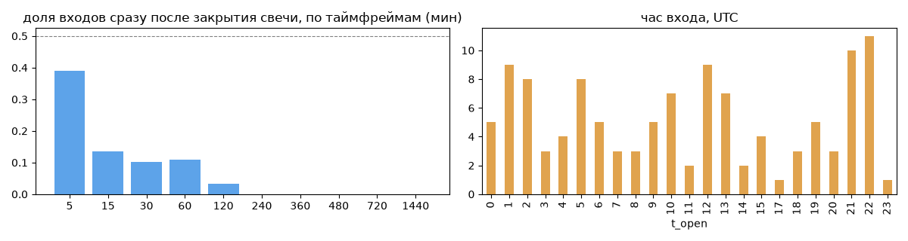
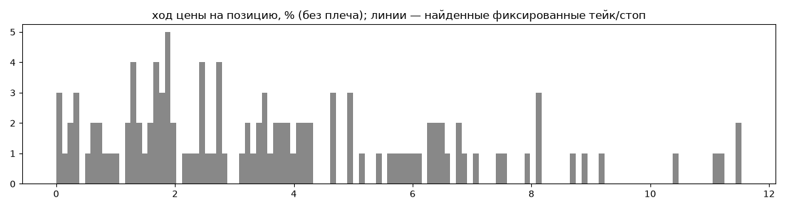
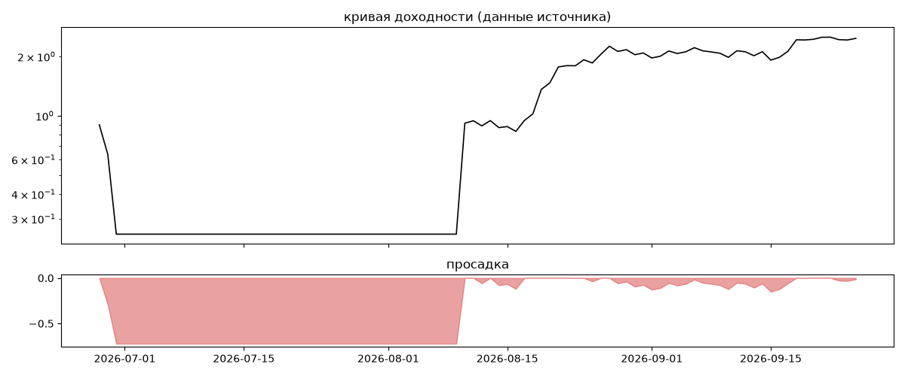
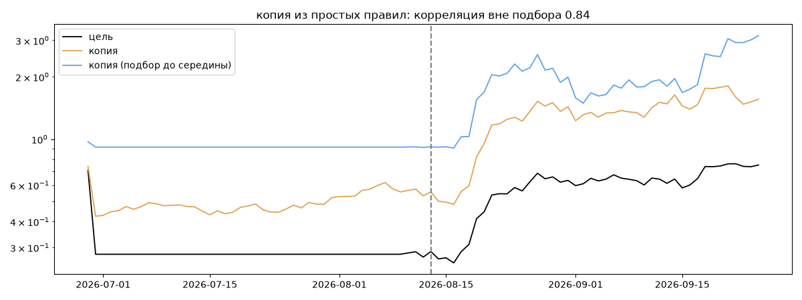

# safemoneymaker — обратный инжиниринг

*Источник: bybit · https://www.bybit.com/copyTrade/trade-center/detail?leaderMark=keHsDrRVyVZZYz6HubAw8w== · разбор 26.09.2026*

> Unlock consistent profits by copying my master trading account! With over 5 years of crypto trading expertise, I master low-risk, low-leverage strategies, focusing primarily on XAUT to deliver steady, sustainable gains. My disciplined approach minimizes risk while maximizing returns, proven by an impeccable 100% win rate. Check my trade history before copying to see the win trades  and join me to build wealth with confidence!

## Коротко

- **Тип:** докупка/мартингейл · продаёт страховку · **человек**
  - доливки с множителем ×1.0
  - объём позиции растёт до ×24.6 от базового
  - 98% сделок в плюс, стопа нет
  - контекст входа: вход ПО ХОДУ движения (тренд/пробой) (68% входов по ходу 4–24 ч движения)
- **Контекст входа:** вход ПО ХОДУ движения (тренд/пробой): за 4ч 64% по ходу (медиана 0.57%), за 24ч 71% по ходу (медиана 2.44%), за 72ч 81% по ходу (медиана 8.51%)
- **Когда входит:** без привязки к свечам
- **Правило входа:** не искали — у входов нет сетки свечей — входы лимитками/вручную или по тикам; укажите таймфрейм вручную (--tf)
- **Как выходит:** выход плавающий: по сигналу или скользящему стопу
- **Результат:** ×2.75, +6214% в год, макс. просадка -72%, сейчас -1% (3 дн.). По годам: 2026: +175%
- **Хвосты:** месяцев в плюс 67%, худший месяц = None средних хороших, просадка/волатильность -0.13 → не ясно
- **Природа по кривой:** докупка (продажа страховки) 39%, тренд 33%, возврат к среднему 19%, держание (бета рынка) 9% · совпадение копии вне подбора 0.84 (на подборе 1.0) — ⚠️ кривая короткая, вывод слабый
- **Форма доходности:** участие в росте рынка 1.88, в падении 2.49 → в обычные дни в падениях участвует сильнее, чем в росте
- **Оговорки:** только последние 90 дней — выводы о правилах ограничены; p_open = средняя позиции, order_price = цена ордера; кривая = cumResetRoi за 90 дней (ROI витрины, с плечом)

## Почерк

| | |
|---|---|
| период | 2026-06-24 → 2026-09-25 (93 дн.) |
| позиций | 118 (8.92 в неделю), открыто сейчас 0 |
| монет | 2: SOL 108, XAUT 10 |
| доля BTC/ETH/SOL/XRP/BNB/золото | 100% |
| шорты | 0% |
| в плюс | 98% |
| средний плюс / минус | 3.85% / -1.52% (отношение 2.53) |
| худшая / лучшая | -3.04% / 11.92% |
| удержание 10/50/90% | {'p10': 16.0, 'p50': 55.0, 'p90': 304.7} ч |
| одновременно открыто макс. | 22 |
| доливки | {'multi_order_share': 0.21, 'size_ratio': 1.0, 'add_dir': 'усреднение вниз', 'max_orders': 16, 'cost_mult_max': 24.6, 'cost_cv': 1.42} |
| уровни цен | {'round_price_share': 0.44, 'repeat_price_share': 0.38, 'grid': None} |







## Копия по кривой

Подбор на 88 днях, разрез 2026-08-13. Корреляция дневной доходности: подбор 1.0, **проверка 0.84**, вся история 0.9 (R² 0.8).

| компонента копии | вес |
|---|---|
| XAUT [4ч] докупка шаг 3% тейк 3% | 0.294 |
| XAUT [день] держать | 0.092 |
| XAUT [день] EMA50/200 | 0.089 |
| XAUT [4ч] докупка шаг 2% тейк 2% | 0.051 |
| XAUT [день] ход 200 | 0.042 |
| XAUT [4ч] ход 5 | 0.035 |
| XAUT [день] ход 3 | 0.03 |
| XAUT [день] возврат 1 | 0.026 |
| BTC [4ч] докупка шаг 1% тейк 1% | 0.022 |
| BTC [4ч] возврат 5 | 0.019 |

Сильнее всего совпадает по одиночке: SOL [день] EMA5/20 (0.61), SOL [4ч] пробой 55 (0.56), SOL [день] ход 60 (0.54), BTC [4ч] держать (0.52), BTC [день] держать (0.52), ETH [день] держать (0.51)

Сильнее всего противоположна: ETH [день] возврат 1 (-0.46), SOL [день] возврат 2 (-0.44), BTC [день] возврат 1 (-0.44), BTC [день] возврат 2 (-0.44)




## Выходы

```
{
 "fixed_tp": null,
 "fixed_sl": null,
 "reentry": 0.02,
 "exit_on_candle_close": {
  "15": 0.12,
  "60": 0.05,
  "240": 0.01,
  "1440": 0.0
 },
 "hold_mode_h": 0.0,
 "hold_mode_share": 0.01,
 "atr": {
  "interval": "60",
  "win_pct_cv": 0.72,
  "win_atr_cv": 0.82,
  "loss_pct_cv": NaN,
  "loss_atr_cv": NaN,
  "win_k_median": 2.47,
  "loss_k_median": -3.53
 },
 "verdict": [
  "выход плавающий: по сигналу или скользящему стопу"
 ]
}
```