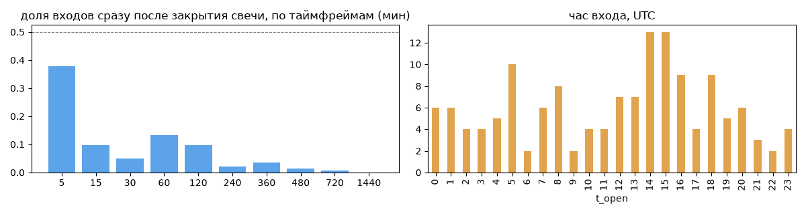
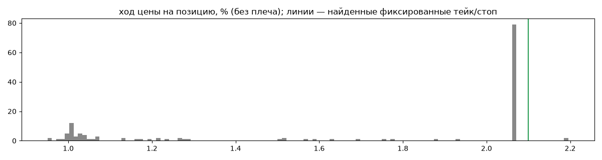
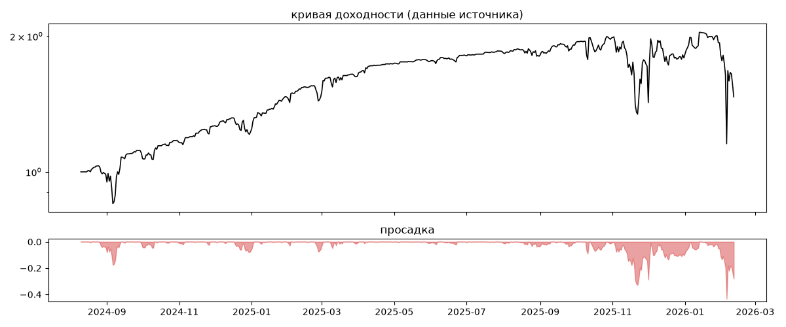
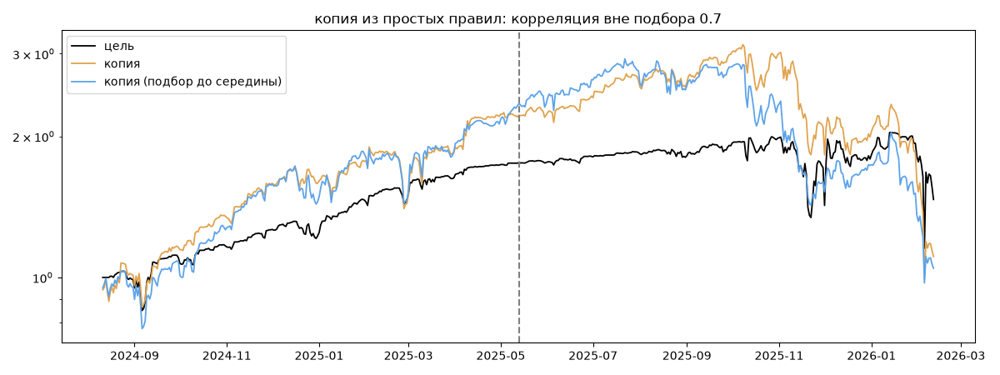

# Syndicate Bybit — обратный инжиниринг

*Источник: invvo · https://invvo.com/strategy/5 · разбор 26.09.2026*

> Контртрендовая консервативная алгоритмическая стратегия с низким порогом входа. Подходит для умеренных инвесторов. Syndicate — стратегия одноименного хедж-фонда. Руководство компании более 15 лет успешно торгует на фондовом рынке и 8 лет разрабатывает решения для разных финансовых рынков, включая криптовалютный.  Фокусируются на работе со smart money и долгосрочными инвесторами

## Коротко

- **Тип:** докупка/мартингейл · продаёт страховку · **бот**
  - объём позиции растёт до ×213.0 от базового
  - выход на фиксированном проценте от средней: +2.1% (56%), +1.0% (27%) прибыльных
  - 100% сделок в плюс, стопа нет
  - контекст входа: вход без выраженной стороны (45% входов по ходу 4–24 ч движения)
  - сверка с самоописанием: заявлено «контртренд» → ✅ совпало
- **Контекст входа:** вход без выраженной стороны: за 4ч 27% по ходу (медиана -0.49%), за 24ч 62% по ходу (медиана 0.46%), за 72ч 72% по ходу (медиана 1.88%)
- **Когда входит:** без привязки к свечам
- **Правило входа:** не искали — у входов нет сетки свечей — входы лимитками/вручную или по тикам; укажите таймфрейм вручную (--tf)
- **Как выходит:** тейк фиксированный ≈ +2.1%
- **Результат:** ×1.47, +29% в год, макс. просадка -43%, сейчас -28% (28 дн.). По годам: 2024: +23%, 2025: +46%, 2026: -18%
- **Хвосты:** месяцев в плюс 78%, худший месяц = -3.2 средних хороших, просадка/волатильность -0.68 → не ясно
- **Природа по кривой:** докупка (продажа страховки) 48%, возврат к среднему 24%, тренд 18%, держание (бета рынка) 10% · совпадение копии вне подбора 0.7 (на подборе 0.88)
- **Форма доходности:** участие в росте рынка 0.62, в падении 0.67 → в обычные дни симметрично
- **Оговорки:** полная история с запуска; p_open = средняя позиции (cost/lots): доливки внутри, при нескольких стратегиях — неттинг

## Почерк

| | |
|---|---|
| период | 2024-08-16 → 2026-01-14 (516 дн.) |
| позиций | 143 (1.94 в неделю), открыто сейчас 1 |
| монет | 3: BTC 83, INJ 58, ETH 2 |
| доля BTC/ETH/SOL/XRP/BNB/золото | 59% |
| шорты | 0% |
| в плюс | 100% |
| средний плюс / минус | 1.69% / 0.0% (отношение None) |
| худшая / лучшая | 0.83% / 2.79% |
| удержание 10/50/90% | {'p10': 2.1, 'p50': 22.5, 'p90': 211.4} ч |
| одновременно открыто макс. | 2 |
| доливки | {'multi_order_share': 0.0, 'size_ratio': None, 'add_dir': None, 'max_orders': 1, 'cost_mult_max': 213.0, 'cost_cv': 1.98} |
| уровни цен | {'round_price_share': 0.0, 'repeat_price_share': 0.0, 'grid': None} |







## Копия по кривой

Подбор на 550 днях, разрез 2025-05-13. Корреляция дневной доходности: подбор 0.88, **проверка 0.7**, вся история 0.8 (R² 0.64).

| компонента копии | вес |
|---|---|
| BTC [4ч] докупка шаг 3% тейк 3% | 0.401 |
| BTC [день] держать | 0.096 |
| BTC [4ч] докупка шаг 1% тейк 1% | 0.042 |
| BTC [день] возврат 3 | 0.036 |
| BTC [4ч] докупка шаг 2% тейк 2% | 0.036 |
| BTC [день] возврат 1 | 0.032 |
| ETH [день] ход 1 | 0.027 |
| ETH [день] возврат 5 | 0.022 |
| BTC [день] возврат 2 | 0.019 |
| BTC [4ч] возврат 3 | 0.017 |

Сильнее всего совпадает по одиночке: BTC [4ч] докупка шаг 3% тейк 3% (0.74), BTC [4ч] докупка шаг 2% тейк 2% (0.71), BTC [4ч] держать (0.63), BTC [день] держать (0.63), BTC [4ч] докупка шаг 1% тейк 1% (0.63), ETH [4ч] держать (0.5)

Сильнее всего противоположна: INJ [день] EMA50/200 (-0.39), BTC [день] EMA5/20 (-0.37), ETH [день] ход 40 (-0.35), INJ [день] EMA10/50 (-0.35)




## Выходы

```
{
 "fixed_tp": {
  "level": 2.1,
  "share": 0.56
 },
 "fixed_sl": null,
 "reentry": 0.01,
 "exit_on_candle_close": {
  "15": 0.15,
  "60": 0.02,
  "240": 0.0,
  "1440": 0.0
 },
 "hold_mode_h": 1.48,
 "hold_mode_share": 0.01,
 "atr": {
  "interval": "60",
  "win_pct_cv": 0.29,
  "win_atr_cv": 0.65,
  "loss_pct_cv": NaN,
  "loss_atr_cv": NaN,
  "win_k_median": 1.69,
  "loss_k_median": null
 },
 "verdict": [
  "тейк фиксированный ≈ +2.1%"
 ]
}
```