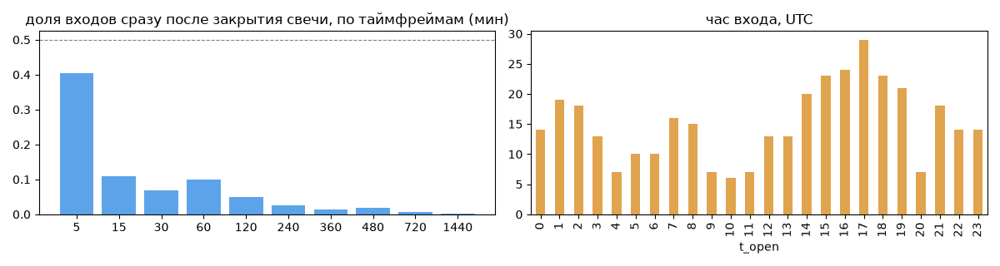
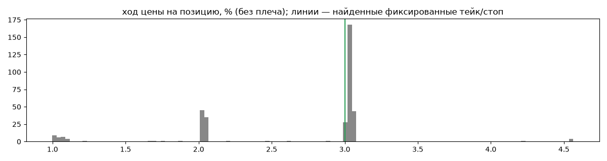
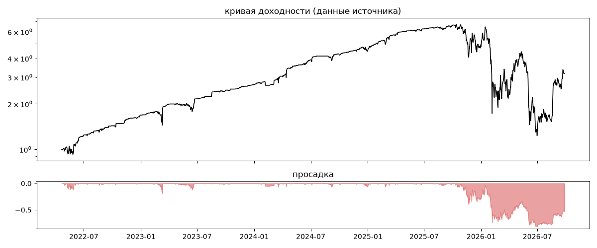
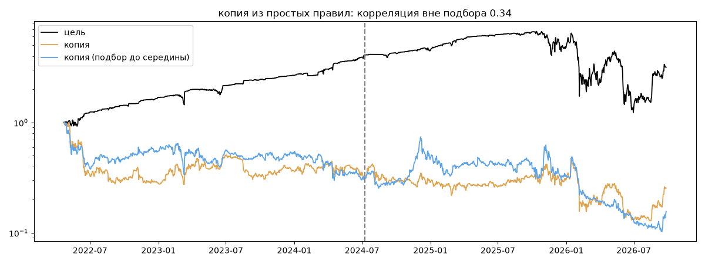

# Syndicate — обратный инжиниринг

*Источник: invvo · https://invvo.com/strategy/9 · разбор 26.09.2026*

> Контртрендовая консервативная алгоритмическая стратегия с низким порогом входа. Подходит для умеренных инвесторов. Syndicate — стратегия одноименного хедж-фонда. Руководство компании более 15 лет успешно торгует на фондовом рынке и 8 лет разрабатывает решения для разных финансовых рынков, включая криптовалютный.  Фокусируются на работе со smart money и долгосрочными инвесторами

## Коротко

- **Тип:** докупка/мартингейл · продаёт страховку · **бот**
  - объём позиции растёт до ×102.3 от базового
  - выход на фиксированном проценте от средней: +3.0% (68%), +2.0% (23%) прибыльных
  - 99% сделок в плюс, стопа нет
  - контекст входа: вход ПРОТИВ движения (контртренд/докупка на проливе) (14% входов по ходу 4–24 ч движения)
  - сверка с самоописанием: заявлено «контртренд» → ✅ совпало
- **Контекст входа:** вход ПРОТИВ движения (контртренд/докупка на проливе): за 4ч 12% по ходу (медиана -1.4%), за 24ч 16% по ходу (медиана -2.8%), за 72ч 33% по ходу (медиана -2.5%)
- **Когда входит:** без привязки к свечам
- **Правило входа:** не искали — у входов нет сетки свечей — входы лимитками/вручную или по тикам; укажите таймфрейм вручную (--tf)
- **Как выходит:** тейк фиксированный ≈ +3.0%
- **Результат:** ×3.17, +30% в год, макс. просадка -82%, сейчас -53% (348 дн.). По годам: 2022: +69%, 2023: +59%, 2024: +68%, 2025: +6%, 2026: -33%
- **Хвосты:** месяцев в плюс 75%, худший месяц = -6.4 средних хороших, просадка/волатильность -1.09 → продаёт страховку: один плохой месяц съедает много хороших
- **Природа по кривой:** докупка (продажа страховки) 35%, тренд 33%, возврат к среднему 32% · совпадение копии вне подбора 0.34 (на подборе 0.64)
- **Форма доходности:** участие в росте рынка 0.71, в падении 0.55 → в обычные дни в росте участвует сильнее, чем в падениях (редкие обвалы тут не видны — см. «хвосты»)
- **Оговорки:** полная история с запуска; p_open = средняя позиции (cost/lots): доливки внутри, при нескольких стратегиях — неттинг

## Почерк

| | |
|---|---|
| период | 2022-04-24 → 2026-07-21 (1549 дн.) |
| позиций | 361 (1.63 в неделю), открыто сейчас 1 |
| монет | 15: BTC 86, SOL 38, ETC 31, ETH 30, DOT 29, BCH 26 |
| доля BTC/ETH/SOL/XRP/BNB/золото | 47% |
| шорты | 0% |
| в плюс | 99% |
| средний плюс / минус | 2.76% / -4.11% (отношение 0.67) |
| худшая / лучшая | -11.04% / 25.1% |
| удержание 10/50/90% | {'p10': 1.7, 'p50': 18.8, 'p90': 162.1} ч |
| одновременно открыто макс. | 4 |
| доливки | {'multi_order_share': 0.0, 'size_ratio': None, 'add_dir': None, 'max_orders': 1, 'cost_mult_max': 102.3, 'cost_cv': 1.78} |
| уровни цен | {'round_price_share': 0.0, 'repeat_price_share': 0.0, 'grid': None} |







## Копия по кривой

Подбор на 1619 днях, разрез 2024-07-09. Корреляция дневной доходности: подбор 0.64, **проверка 0.34**, вся история 0.64 (R² 0.41).

| компонента копии | вес |
|---|---|
| BTC [4ч] докупка шаг 3% тейк 3% | 0.196 |
| BTC [4ч] докупка шаг 2% тейк 2% | 0.057 |
| DASH [4ч] докупка шаг 3% тейк 3% | 0.043 |
| BTC [4ч] ход 1 | 0.034 |
| BTC [день] возврат 1 | 0.03 |
| ETH [день] возврат 5 | 0.028 |
| BCH [день] ход 3 | 0.025 |
| BCH [4ч] докупка шаг 3% тейк 3% | 0.024 |
| ETH [день] ход 2 | 0.024 |
| DOT [4ч] ход 2 | 0.022 |

Сильнее всего совпадает по одиночке: BTC [4ч] докупка шаг 3% тейк 3% (0.54), BTC [4ч] докупка шаг 2% тейк 2% (0.52), BTC [4ч] докупка шаг 1% тейк 1% (0.49), BTC [день] держать (0.49), BTC [4ч] держать (0.49), ETH [4ч] держать (0.44)

Сильнее всего противоположна: ETC [день] EMA50/200 (-0.34), ETC [день] ход 200 (-0.33), DOT [день] EMA50/200 (-0.33), DOT [день] ход 200 (-0.32)




## Выходы

```
{
 "fixed_tp": {
  "level": 3.0,
  "share": 0.68
 },
 "fixed_sl": null,
 "reentry": 0.03,
 "exit_on_candle_close": {
  "15": 0.14,
  "60": 0.05,
  "240": 0.01,
  "1440": 0.0
 },
 "hold_mode_h": 0.15,
 "hold_mode_share": 0.01,
 "atr": {
  "interval": "60",
  "win_pct_cv": 0.27,
  "win_atr_cv": 0.53,
  "loss_pct_cv": NaN,
  "loss_atr_cv": NaN,
  "win_k_median": 2.15,
  "loss_k_median": -0.72
 },
 "verdict": [
  "тейк фиксированный ≈ +3.0%"
 ]
}
```