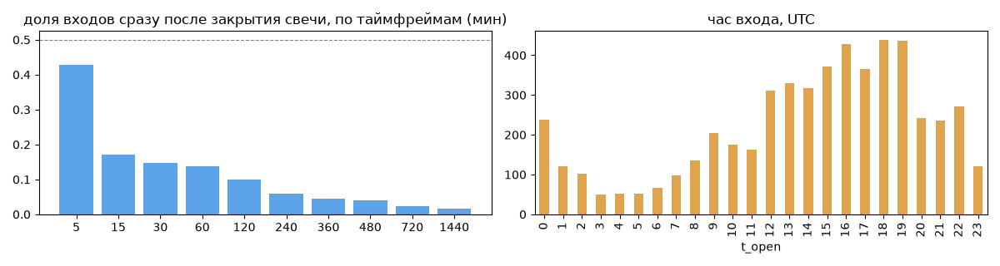
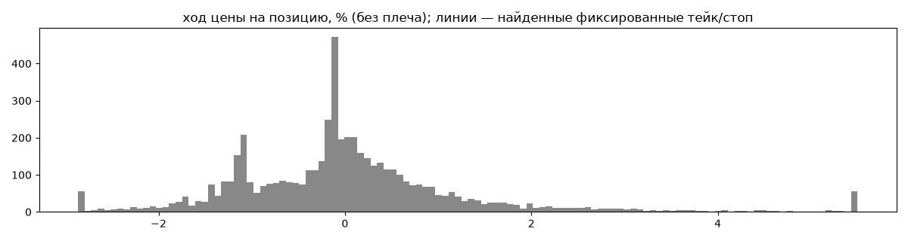
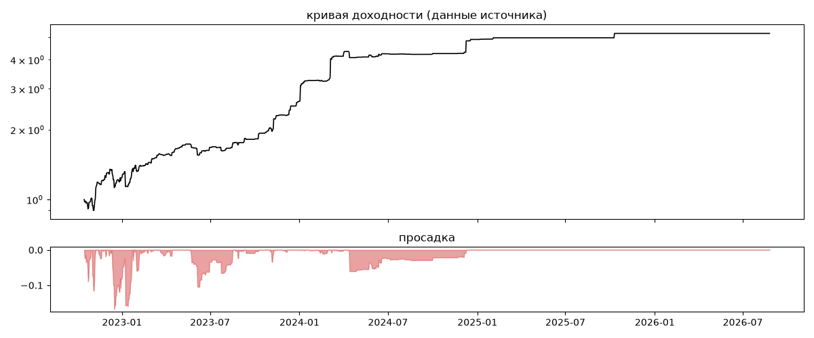
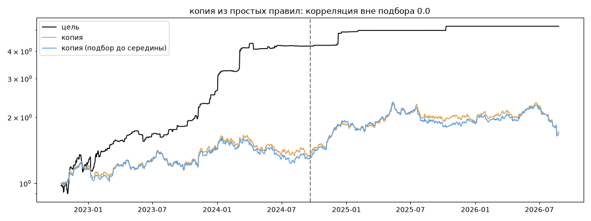

# Team Core — обратный инжиниринг

*Источник: invvo · https://invvo.com/strategy/8 · разбор 26.09.2026*

> Ручная консервативная стратегия с высоким винрейтом, управляемая командой опытных трейдеров. Подходит для инвесторов с умеренным риск-аппетитом. В стратегии одновременно может быть открыто до 15 ордеров, поэтому для корректного копирования следует вложить не менее рекомендуемой суммы Team Core/Venture — команда опытных и начинающих трейдеров, торгующая вместе с 2021 года. Команда использует фундаментальные знания о рынках и современные технологии трейдинга

## Коротко

- **Тип:** скальпер · нейтрально · **бот**
  - сделка держится ~0 ч, 34.2 сделок в неделю
  - контекст входа: вход ПРОТИВ движения (контртренд/докупка на проливе) (22% входов по ходу 4–24 ч движения)
- **Контекст входа:** вход ПРОТИВ движения (контртренд/докупка на проливе): за 4ч 21% по ходу (медиана -2.65%), за 24ч 24% по ходу (медиана -5.39%), за 72ч 30% по ходу (медиана -6.41%)
- **Когда входит:** без привязки к свечам; 39% входов пачками по разным монетам
- **Правило входа:** не искали — у входов нет сетки свечей — входы лимитками/вручную или по тикам; укажите таймфрейм вручную (--tf)
- **Как выходит:** 70% выходов сразу сменяются новым входом — переворот или перезапуск бота
- **Результат:** ×5.19, +53% в год, макс. просадка -17%, сейчас +0% (0 дн.). По годам: 2022: +24%, 2023: +113%, 2024: +85%, 2025: +6%, 2026: +0%
- **Хвосты:** месяцев в плюс 50%, худший месяц = -0.6 средних хороших, просадка/волатильность -0.7 → хвост умеренный: худший месяц сопоставим с обычным хорошим
- **Природа по кривой:** тренд 50%, возврат к среднему 46%, докупка (продажа страховки) 4% · совпадение копии вне подбора 0.0 (на подборе 0.41)
- **Форма доходности:** участие в росте рынка 0.05, в падении -0.13 → в обычные дни в росте участвует сильнее, чем в падениях (редкие обвалы тут не видны — см. «хвосты»)
- **Оговорки:** полная история с запуска; p_open = средняя позиции (cost/lots): доливки внутри, при нескольких стратегиях — неттинг

## Почерк

| | |
|---|---|
| период | 2022-10-16 → 2025-10-10 (1090 дн.) |
| позиций | 5325 (34.2 в неделю), открыто сейчас 0 |
| монет | 277: SOL 171, PEOPLE 154, DOGE 146, MASK 137, TRB 124, APT 120 |
| доля BTC/ETH/SOL/XRP/BNB/золото | 7% |
| шорты | 35% |
| в плюс | 44% |
| средний плюс / минус | 1.03% / -0.76% (отношение 1.35) |
| худшая / лучшая | -14.78% / 19.84% |
| удержание 10/50/90% | {'p10': 0.0, 'p50': 0.0, 'p90': 0.0} ч |
| одновременно открыто макс. | 7 |
| доливки | {'multi_order_share': 0.0, 'size_ratio': None, 'add_dir': None, 'max_orders': 1, 'cost_mult_max': 15411.4, 'cost_cv': 2.1} |
| уровни цен | {'round_price_share': 0.0, 'repeat_price_share': 0.05, 'grid': {'sym': 'IOTX', 'step': 1e-05, 'step_pct': np.float64(0.07), 'levels': 14, 'on_grid': 1.0}} |







## Копия по кривой

Подбор на 1410 днях, разрез 2024-09-20. Корреляция дневной доходности: подбор 0.41, **проверка 0.0**, вся история 0.31 (R² 0.09).

| компонента копии | вес |
|---|---|
| BTC [4ч] возврат 2 | 0.1 |
| BTC [день] ход 3 | 0.09 |
| BTC [4ч] ход 5 | 0.074 |
| ETH [день] возврат 3 | 0.065 |
| SOL [4ч] возврат 3 | 0.062 |
| BTC [4ч] ход 3 | 0.059 |
| BTC [день] возврат 5 | 0.055 |
| ETH [4ч] ход 10 | 0.044 |
| ETH [4ч] докупка шаг 3% тейк 3% | 0.043 |
| BTC [день] возврат 2 | 0.04 |

Сильнее всего совпадает по одиночке: BTC [4ч] ход 5 (0.1), SOL [4ч] возврат 3 (0.08), ETH [4ч] ход 10 (0.07), SOL [день] ход 1 (0.07), BTC [4ч] ход 3 (0.07), SOL [день] ход 2 (0.06)

Сильнее всего противоположна: BTC [4ч] EMA20/100 (-0.13), BTC [4ч] ход 100 (-0.12), BTC [день] ход 60 (-0.1), BTC [день] ход 40 (-0.1)




## Выходы

```
{
 "fixed_tp": null,
 "fixed_sl": null,
 "reentry": 0.7,
 "exit_on_candle_close": {
  "15": 0.17,
  "60": 0.06,
  "240": 0.02,
  "1440": 0.01
 },
 "hold_mode_h": 0.0,
 "hold_mode_share": 0.62,
 "atr": {
  "interval": "60",
  "win_pct_cv": 1.11,
  "win_atr_cv": 2.01,
  "loss_pct_cv": 0.93,
  "loss_atr_cv": 1.49,
  "win_k_median": 0.13,
  "loss_k_median": -0.12
 },
 "verdict": [
  "70% выходов сразу сменяются новым входом — переворот или перезапуск бота"
 ]
}
```