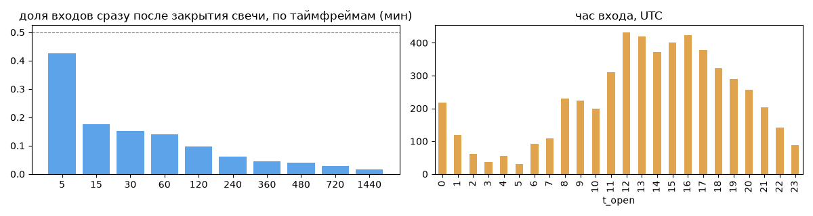
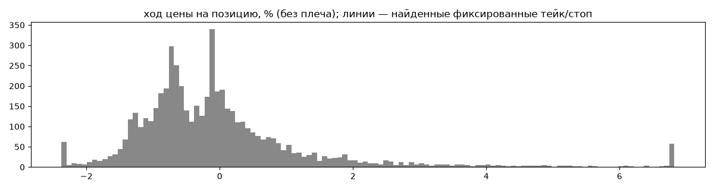
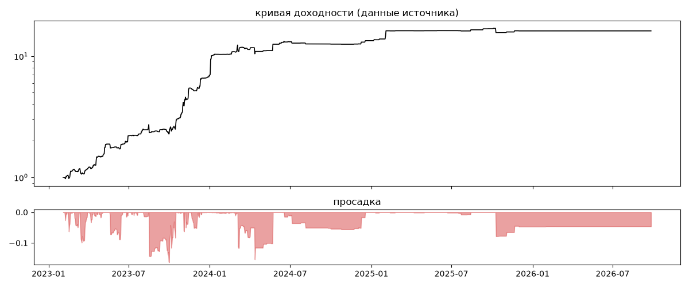
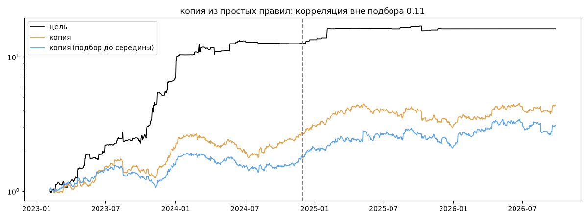

# Team Venture — обратный инжиниринг

*Источник: invvo · https://invvo.com/strategy/7 · разбор 26.09.2026*

> Ручная высокорисковая стратегия с высоким винрейтом , управляемая командой трейдеров в расчете на повышенную доходность. Подходит инвесторам с высоким риск-аппетитом. Team Core/Venture — команда опытных и начинающих трейдеров, торгующая вместе с 2021 года. Команда использует фундаментальные экономические знания и современные технологии трейдинга

## Коротко

- **Тип:** скальпер · покупает страховку · **бот**
  - сделка держится ~0 ч, 34.1 сделок в неделю
  - контекст входа: вход ПРОТИВ движения (контртренд/докупка на проливе) (34% входов по ходу 4–24 ч движения)
- **Контекст входа:** вход ПРОТИВ движения (контртренд/докупка на проливе): за 4ч 32% по ходу (медиана -1.51%), за 24ч 36% по ходу (медиана -2.26%), за 72ч 39% по ходу (медиана -4.59%)
- **Когда входит:** без привязки к свечам; 38% входов пачками по разным монетам
- **Правило входа:** не искали — у входов нет сетки свечей — входы лимитками/вручную или по тикам; укажите таймфрейм вручную (--tf)
- **Как выходит:** 51% выходов сразу сменяются новым входом — переворот или перезапуск бота
- **Результат:** ×16.15, +114% в год, макс. просадка -16%, сейчас -5% (352 дн.). По годам: 2023: +596%, 2024: +93%, 2025: +20%, 2026: +0%
- **Хвосты:** месяцев в плюс 56%, худший месяц = -0.5 средних хороших, просадка/волатильность -0.45 → хвост умеренный: худший месяц сопоставим с обычным хорошим
- **Природа по кривой:** тренд 49%, возврат к среднему 47%, докупка (продажа страховки) 4% · совпадение копии вне подбора 0.11 (на подборе 0.32)
- **Форма доходности:** участие в росте рынка -0.0, в падении -0.04 → в обычные дни симметрично
- **Оговорки:** полная история с запуска; p_open = средняя позиции (cost/lots): доливки внутри, при нескольких стратегиях — неттинг

## Почерк

| | |
|---|---|
| период | 2023-02-07 → 2026-02-22 (1111 дн.) |
| позиций | 5410 (34.1 в неделю), открыто сейчас 0 |
| монет | 294: XRP 158, PERP 139, TRB 106, FRONT 105, BLZ 99, WLD 94 |
| доля BTC/ETH/SOL/XRP/BNB/золото | 6% |
| шорты | 36% |
| в плюс | 37% |
| средний плюс / минус | 1.33% / -0.75% (отношение 1.78) |
| худшая / лучшая | -6.33% / 45.79% |
| удержание 10/50/90% | {'p10': 0.0, 'p50': 0.0, 'p90': 0.4} ч |
| одновременно открыто макс. | 11 |
| доливки | {'multi_order_share': 0.0, 'size_ratio': None, 'add_dir': None, 'max_orders': 1, 'cost_mult_max': 1007.5, 'cost_cv': 2.78} |
| уровни цен | {'round_price_share': 0.0, 'repeat_price_share': 0.01, 'grid': {'sym': 'FIL', 'step': 0.0010004, 'step_pct': np.float64(0.02), 'levels': 3, 'on_grid': 1.0}} |







## Копия по кривой

Подбор на 1331 днях, разрез 2024-11-30. Корреляция дневной доходности: подбор 0.32, **проверка 0.11**, вся история 0.24 (R² 0.06).

| компонента копии | вес |
|---|---|
| BTC [4ч] пробой 20 | 0.096 |
| BTC [день] возврат 5 | 0.077 |
| BTC [день] возврат 3 | 0.07 |
| BTC [4ч] ход 5 | 0.066 |
| BTC [4ч] возврат 3 | 0.057 |
| BTC [день] возврат 1 | 0.056 |
| ETH [4ч] ход 3 | 0.052 |
| BTC [день] ход 2 | 0.046 |
| BTC [4ч] докупка шаг 2% тейк 2% | 0.043 |
| SOL [4ч] ход 5 | 0.043 |

Сильнее всего совпадает по одиночке: ETH [день] возврат 5 (0.11), BTC [день] возврат 5 (0.1), BTC [день] возврат 3 (0.09), ETH [день] возврат 1 (0.09), BTC [день] возврат 1 (0.08), ETH [день] возврат 3 (0.08)

Сильнее всего противоположна: ETH [день] ход 5 (-0.11), BTC [день] ход 5 (-0.1), BTC [день] EMA5/20 (-0.1), BTC [день] ход 40 (-0.1)




## Выходы

```
{
 "fixed_tp": null,
 "fixed_sl": null,
 "reentry": 0.51,
 "exit_on_candle_close": {
  "15": 0.17,
  "60": 0.06,
  "240": 0.02,
  "1440": 0.01
 },
 "hold_mode_h": 0.0,
 "hold_mode_share": 0.39,
 "atr": {
  "interval": "60",
  "win_pct_cv": 1.67,
  "win_atr_cv": 1.51,
  "loss_pct_cv": 0.9,
  "loss_atr_cv": 1.1,
  "win_k_median": 0.44,
  "loss_k_median": -0.19
 },
 "verdict": [
  "51% выходов сразу сменяются новым входом — переворот или перезапуск бота"
 ]
}
```