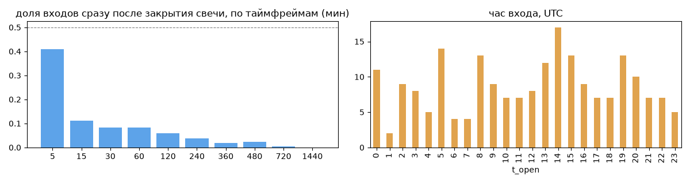
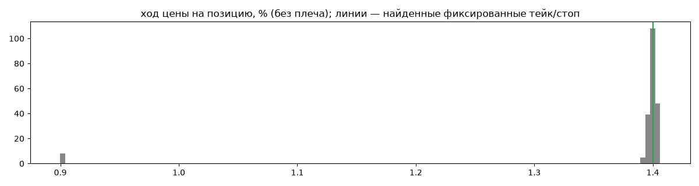
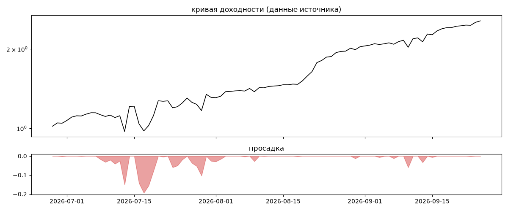

# 2Moon — обратный инжиниринг

*Источник: bybit · https://www.bybit.com/copyTrade/trade-center/detail?leaderMark=BUIrXxYBt14yzj0GGyu2sw== · разбор 26.09.2026*

> if there are not enough slots, follow the link: https://i.bybit.com/1abz7yps?action=inviteToCopy

## Коротко

- **Тип:** докупка/мартингейл · продаёт страховку · **бот**
  - доливки с множителем ×1.41
  - объём позиции растёт до ×45.5 от базового
  - выход на фиксированном проценте от средней: +1.4% (96%) прибыльных
  - 100% сделок в плюс, стопа нет
  - контекст входа: вход ПО ХОДУ движения (тренд/пробой) (83% входов по ходу 4–24 ч движения)
- **Контекст входа:** вход ПО ХОДУ движения (тренд/пробой): за 4ч 81% по ходу (медиана 1.37%), за 24ч 85% по ходу (медиана 2.95%), за 72ч 87% по ходу (медиана 4.39%)
- **Когда входит:** без привязки к свечам
- **Правило входа:** не искали — у входов нет сетки свечей — входы лимитками/вручную или по тикам; укажите таймфрейм вручную (--tf)
- **Как выходит:** тейк фиксированный ≈ +1.4%; 98% выходов сразу сменяются новым входом — переворот или перезапуск бота
- **Результат:** ×2.51, +4286% в год, макс. просадка -19%, сейчас +0% (0 дн.). По годам: 2026: +151%
- **Хвосты:** месяцев в плюс 100%, худший месяц = None средних хороших, просадка/волатильность -0.21 → не ясно
- **Оговорки:** только последние 90 дней — выводы о правилах ограничены; p_open = средняя позиции, order_price = цена ордера; кривая = cumResetRoi за 90 дней (ROI витрины, с плечом)

## Почерк

| | |
|---|---|
| период | 2026-06-26 → 2026-09-24 (90 дн.) |
| позиций | 208 (16.14 в неделю), открыто сейчас 0 |
| монет | 1: HYPE 208 |
| доля BTC/ETH/SOL/XRP/BNB/золото | 0% |
| шорты | 0% |
| в плюс | 100% |
| средний плюс / минус | 1.38% / 0.0% (отношение None) |
| худшая / лучшая | 0.9% / 1.41% |
| удержание 10/50/90% | {'p10': 0.2, 'p50': 3.9, 'p90': 31.6} ч |
| одновременно открыто макс. | 3 |
| доливки | {'multi_order_share': 0.58, 'size_ratio': 1.41, 'add_dir': 'усреднение вниз', 'max_orders': 10, 'cost_mult_max': 45.5, 'cost_cv': 1.65} |
| уровни цен | {'round_price_share': 0.09, 'repeat_price_share': 0.07, 'grid': {'sym': 'HYPE', 'step': 0.01, 'step_pct': np.float64(0.01), 'levels': 17, 'on_grid': 0.94}} |








## Выходы

```
{
 "fixed_tp": {
  "level": 1.4,
  "share": 0.96
 },
 "fixed_sl": null,
 "reentry": 0.98,
 "exit_on_candle_close": {
  "15": 0.12,
  "60": 0.04,
  "240": 0.01,
  "1440": 0.0
 },
 "hold_mode_h": 0.01,
 "hold_mode_share": 0.02,
 "atr": {
  "interval": "60",
  "win_pct_cv": 0.07,
  "win_atr_cv": 0.35,
  "loss_pct_cv": NaN,
  "loss_atr_cv": NaN,
  "win_k_median": 1.08,
  "loss_k_median": null
 },
 "verdict": [
  "тейк фиксированный ≈ +1.4%",
  "98% выходов сразу сменяются новым входом — переворот или перезапуск бота"
 ]
}
```