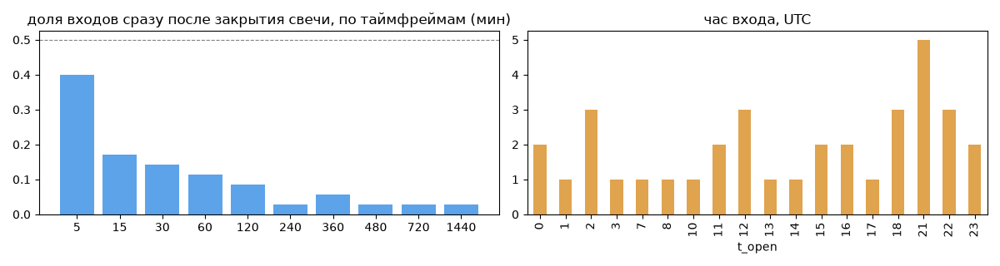
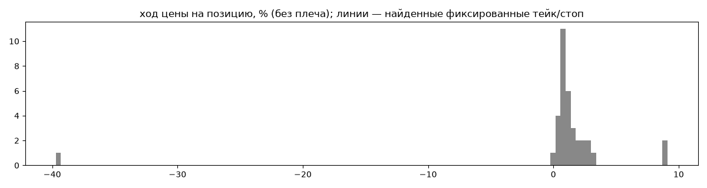
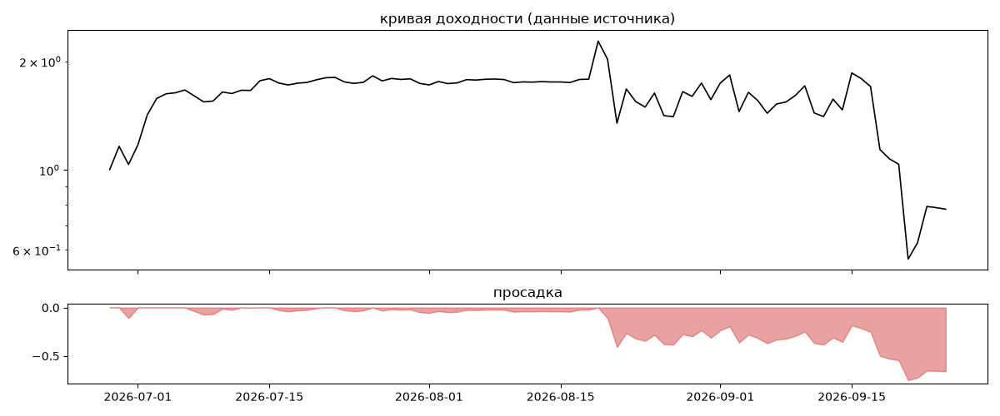

# Aristocrat Invest — обратный инжиниринг

*Источник: bybit · https://www.bybit.com/copyTrade/trade-center/detail?leaderMark=Sf5GrvLadWM0wzlsrRoKCw== · разбор 26.09.2026*

> I trade with a disciplined and risk-controlled approach.
Each position is opened with a small portion of the deposit (around 0.5).
If the market moves temporarily against the position, I manage it by scaling in according to the plan.
I don’t chase high percentages and I don’t take unnecessary risks.
Quality setups over frequent trades.
If market conditions are not clear, I stay out of the market.
Transparency, patience and consistency are the core of my strategy.


## Коротко

- **Тип:** докупка/мартингейл · продаёт страховку · **не ясно, бот или человек**
  - доливки с множителем ×1.02
  - объём позиции растёт до ×21.5 от базового
  - 94% сделок в плюс, стопа нет
  - контекст входа: вход ПО ХОДУ движения (тренд/пробой) (74% входов по ходу 4–24 ч движения)
- **Контекст входа:** вход ПО ХОДУ движения (тренд/пробой): за 4ч 66% по ходу (медиана 0.72%), за 24ч 83% по ходу (медиана 2.34%), за 72ч 74% по ходу (медиана 2.02%)
- **Когда входит:** без привязки к свечам
- **Правило входа:** не искали — у входов нет сетки свечей — входы лимитками/вручную или по тикам; укажите таймфрейм вручную (--tf)
- **Как выходит:** выход плавающий: по сигналу или скользящему стопу
- **Результат:** ×0.78, -65% в год, макс. просадка -75%, сейчас -66% (37 дн.). По годам: 2026: -22%
- **Хвосты:** месяцев в плюс 33%, худший месяц = None средних хороших, просадка/волатильность -0.35 → не ясно
- **Оговорки:** только последние 90 дней — выводы о правилах ограничены; p_open = средняя позиции, order_price = цена ордера; кривая = cumResetRoi за 90 дней (ROI витрины, с плечом)

## Почерк

| | |
|---|---|
| период | 2026-05-11 → 2026-09-21 (133 дн.) |
| позиций | 35 (1.84 в неделю), открыто сейчас 0 |
| монет | 1: ETH 35 |
| доля BTC/ETH/SOL/XRP/BNB/золото | 100% |
| шорты | 14% |
| в плюс | 94% |
| средний плюс / минус | 1.75% / -30.14% (отношение 0.06) |
| худшая / лучшая | -60.07% / 9.11% |
| удержание 10/50/90% | {'p10': 1.3, 'p50': 17.3, 'p90': 86.4} ч |
| одновременно открыто макс. | 4 |
| доливки | {'multi_order_share': 0.37, 'size_ratio': 1.02, 'add_dir': 'усреднение вниз', 'max_orders': 6, 'cost_mult_max': 21.5, 'cost_cv': 1.39} |
| уровни цен | {'round_price_share': 0.02, 'repeat_price_share': 0.03, 'grid': None} |








## Выходы

```
{
 "fixed_tp": null,
 "fixed_sl": null,
 "reentry": 0.03,
 "exit_on_candle_close": {
  "15": 0.17,
  "60": 0.09,
  "240": 0.03,
  "1440": 0.03
 },
 "hold_mode_h": 0.14,
 "hold_mode_share": 0.03,
 "atr": {
  "interval": "60",
  "win_pct_cv": 1.17,
  "win_atr_cv": 1.74,
  "loss_pct_cv": NaN,
  "loss_atr_cv": NaN,
  "win_k_median": 1.38,
  "loss_k_median": -34.35
 },
 "verdict": [
  "выход плавающий: по сигналу или скользящему стопу"
 ]
}
```