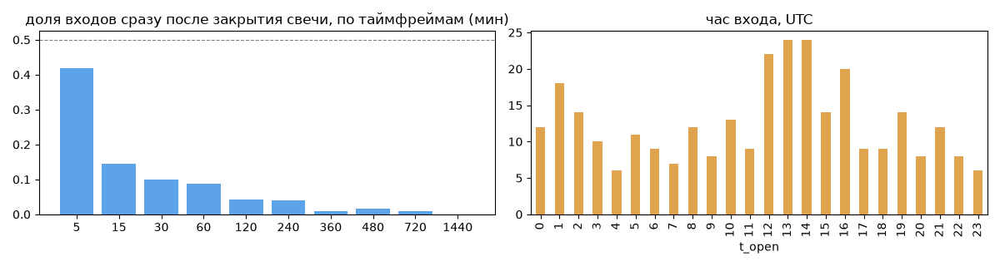
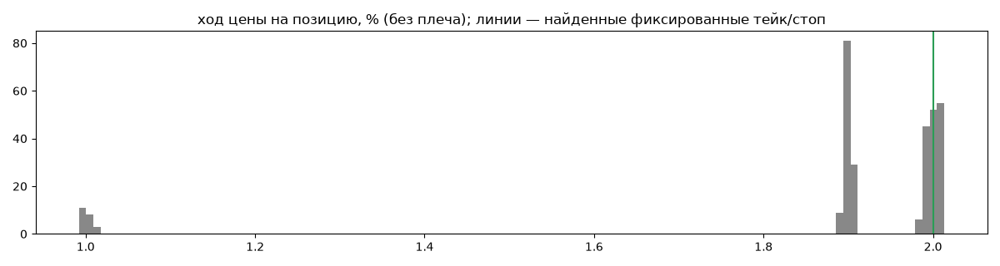
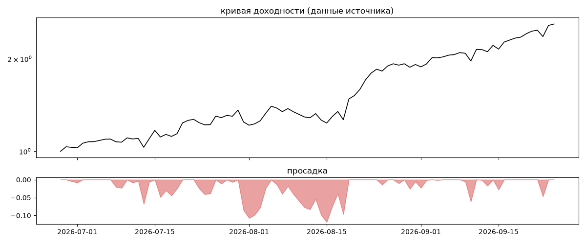

# Buick — обратный инжиниринг

*Источник: bybit · https://www.bybit.com/copyTrade/trade-center/detail?leaderMark=EDGeX+g6QOUaMTDIm7gizw== · разбор 26.09.2026*

>  Do not forget to withdraw profit regularly. If all slots are filled use this link: https://i.bybit.com/1ri0abAd?action=inviteToCopy

## Коротко

- **Тип:** докупка/мартингейл · продаёт страховку · **бот**
  - доливки с множителем ×1.32
  - объём позиции растёт до ×36.2 от базового
  - выход на фиксированном проценте от средней: +2.0% (93%) прибыльных
  - 100% сделок в плюс, стопа нет
  - контекст входа: вход ПО ХОДУ движения (тренд/пробой) (86% входов по ходу 4–24 ч движения)
- **Контекст входа:** вход ПО ХОДУ движения (тренд/пробой): за 4ч 83% по ходу (медиана 1.54%), за 24ч 89% по ходу (медиана 3.71%), за 72ч 84% по ходу (медиана 5.92%)
- **Когда входит:** без привязки к свечам
- **Правило входа:** не искали — у входов нет сетки свечей — входы лимитками/вручную или по тикам; укажите таймфрейм вручную (--tf)
- **Как выходит:** тейк фиксированный ≈ +2.0%; 95% выходов сразу сменяются новым входом — переворот или перезапуск бота
- **Результат:** ×2.6, +4920% в год, макс. просадка -12%, сейчас +0% (0 дн.). По годам: 2026: +160%
- **Хвосты:** месяцев в плюс 100%, худший месяц = None средних хороших, просадка/волатильность -0.16 → не ясно
- **Оговорки:** только последние 90 дней — выводы о правилах ограничены; p_open = средняя позиции, order_price = цена ордера; кривая = cumResetRoi за 90 дней (ROI витрины, с плечом)

## Почерк

| | |
|---|---|
| период | 2026-06-26 → 2026-09-25 (91 дн.) |
| позиций | 299 (22.93 в неделю), открыто сейчас 0 |
| монет | 2: ONDO 177, HYPE 122 |
| доля BTC/ETH/SOL/XRP/BNB/золото | 0% |
| шорты | 0% |
| в плюс | 100% |
| средний плюс / минус | 1.89% / 0.0% (отношение None) |
| худшая / лучшая | 0.99% / 2.01% |
| удержание 10/50/90% | {'p10': 0.3, 'p50': 4.8, 'p90': 54.3} ч |
| одновременно открыто макс. | 7 |
| доливки | {'multi_order_share': 0.68, 'size_ratio': 1.32, 'add_dir': 'усреднение вниз', 'max_orders': 11, 'cost_mult_max': 36.2, 'cost_cv': 1.34} |
| уровни цен | {'round_price_share': 0.09, 'repeat_price_share': 0.19, 'grid': {'sym': 'ONDO', 'step': 0.0001, 'step_pct': np.float64(0.03), 'levels': 55, 'on_grid': 1.0}} |








## Выходы

```
{
 "fixed_tp": {
  "level": 2.0,
  "share": 0.93
 },
 "fixed_sl": null,
 "reentry": 0.95,
 "exit_on_candle_close": {
  "15": 0.11,
  "60": 0.02,
  "240": 0.01,
  "1440": 0.0
 },
 "hold_mode_h": 0.01,
 "hold_mode_share": 0.02,
 "atr": {
  "interval": "60",
  "win_pct_cv": 0.14,
  "win_atr_cv": 0.38,
  "loss_pct_cv": NaN,
  "loss_atr_cv": NaN,
  "win_k_median": 1.21,
  "loss_k_median": null
 },
 "verdict": [
  "тейк фиксированный ≈ +2.0%",
  "95% выходов сразу сменяются новым входом — переворот или перезапуск бота"
 ]
}
```