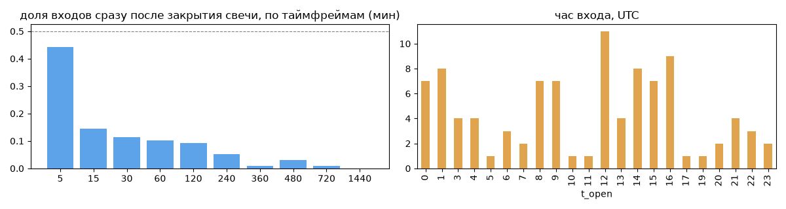
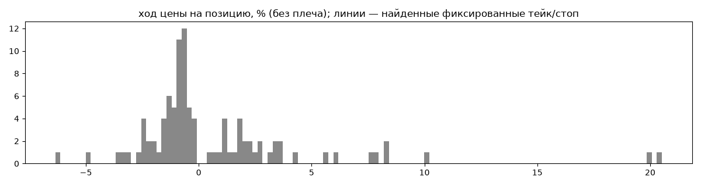
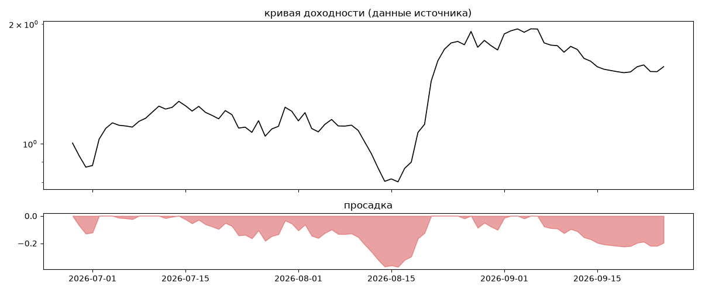

# Camry759 — обратный инжиниринг

*Источник: bybit · https://www.bybit.com/copyTrade/trade-center/detail?leaderMark=ZlHZdNf/1nQcnxod1oIy6g== · разбор 26.09.2026*

> I have been trading in the market for 15 years, robotic trading. Average annual yield ~150%, maximum drawdown ~50%. To achieve an average annual return, the recommended investment period is 3 years

## Коротко

- **Тип:** тренд · покупает страховку · **бот**
  - в плюс 36% сделок, средний плюс в 2.44 раза больше минуса
  - контекст входа: вход без выраженной стороны (56% входов по ходу 4–24 ч движения)
  - сверка с самоописанием: заявлено «докупка/сетка» → ❌ НЕ совпало — разобрать, поправить classify.py, записать в KNOWLEDGE.md
- **Контекст входа:** вход без выраженной стороны: за 4ч 64% по ходу (медиана 0.23%), за 24ч 49% по ходу (медиана -0.09%), за 72ч 62% по ходу (медиана 1.17%)
- **Когда входит:** без привязки к свечам
- **Правило входа:** не искали — у входов нет сетки свечей — входы лимитками/вручную или по тикам; укажите таймфрейм вручную (--tf)
- **Как выходит:** стоп похож на ≈-1.67×ATR
- **Результат:** ×1.56, +515% в год, макс. просадка -37%, сейчас -20% (20 дн.). По годам: 2026: +56%
- **Хвосты:** месяцев в плюс 67%, худший месяц = None средних хороших, просадка/волатильность -0.32 → не ясно
- **Оговорки:** только последние 90 дней — выводы о правилах ограничены; p_open = средняя позиции, order_price = цена ордера; кривая = cumResetRoi за 90 дней (ROI витрины, с плечом)

## Почерк

| | |
|---|---|
| период | 2026-01-03 → 2026-09-22 (262 дн.) |
| позиций | 97 (2.59 в неделю), открыто сейчас 0 |
| монет | 5: UNI 28, SOL 25, ADA 22, BTC 21, POL 1 |
| доля BTC/ETH/SOL/XRP/BNB/золото | 47% |
| шорты | 25% |
| в плюс | 36% |
| средний плюс / минус | 4.72% / -1.94% (отношение 2.44) |
| худшая / лучшая | -42.99% / 36.36% |
| удержание 10/50/90% | {'p10': 1.4, 'p50': 20.8, 'p90': 5696.5} ч |
| одновременно открыто макс. | 25 |
| доливки | {'multi_order_share': 0.03, 'size_ratio': 1.0, 'add_dir': 'пирамида по ходу', 'max_orders': 26, 'cost_mult_max': 122.9, 'cost_cv': 1.47} |
| уровни цен | {'round_price_share': 0.04, 'repeat_price_share': 0.13, 'grid': None} |








## Выходы

```
{
 "fixed_tp": null,
 "fixed_sl": null,
 "reentry": 0.0,
 "exit_on_candle_close": {
  "15": 0.13,
  "60": 0.02,
  "240": 0.0,
  "1440": 0.0
 },
 "hold_mode_h": 0.73,
 "hold_mode_share": 0.02,
 "atr": {
  "interval": "60",
  "win_pct_cv": 1.41,
  "win_atr_cv": 2.58,
  "loss_pct_cv": 2.77,
  "loss_atr_cv": 0.97,
  "win_k_median": 1.87,
  "loss_k_median": -1.67
 },
 "verdict": [
  "стоп похож на ≈-1.67×ATR"
 ]
}
```