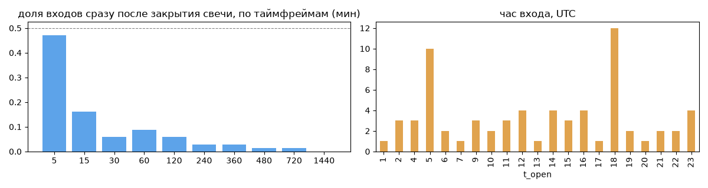
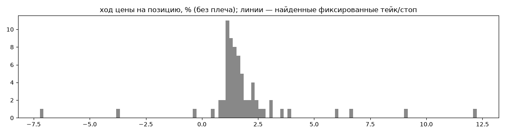
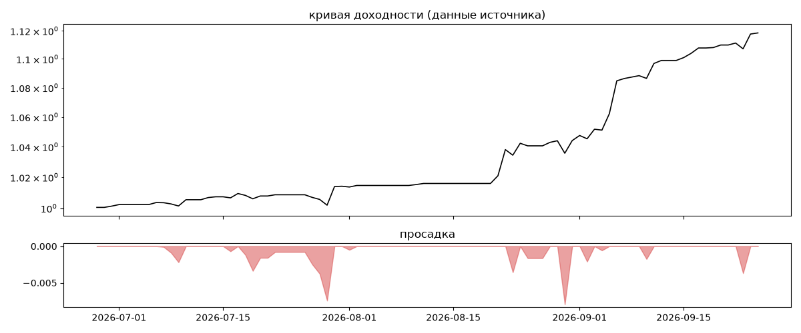

# CryptoAdventurer — обратный инжиниринг

*Источник: bybit · https://www.bybit.com/copyTrade/trade-center/detail?leaderMark=GUDDfCdQwkFmd8svGwG2Mg== · разбор 26.09.2026*

> ||| t me: SortOfTrading ||| From the author of HFT. Sort of and TopROI. Sort of bot.

## Коротко

- **Тип:** докупка/мартингейл · продаёт страховку · **бот**
  - доливки с множителем ×1.5
  - объём позиции растёт до ×4.9 от базового
  - 95% сделок в плюс, стопа нет
  - контекст входа: вход ПРОТИВ движения (контртренд/докупка на проливе) (30% входов по ходу 4–24 ч движения)
  - сверка с самоописанием: заявлено «скальпинг» → ❌ НЕ совпало — разобрать, поправить classify.py, записать в KNOWLEDGE.md
- **Контекст входа:** вход ПРОТИВ движения (контртренд/докупка на проливе): за 4ч 25% по ходу (медиана -1.57%), за 24ч 35% по ходу (медиана -1.19%), за 72ч 56% по ходу (медиана 0.52%)
- **Когда входит:** без привязки к свечам
- **Правило входа:** не искали — у входов нет сетки свечей — входы лимитками/вручную или по тикам; укажите таймфрейм вручную (--tf)
- **Как выходит:** выход плавающий: по сигналу или скользящему стопу
- **Результат:** ×1.12, +58% в год, макс. просадка -1%, сейчас +0% (0 дн.). По годам: 2026: +12%
- **Хвосты:** месяцев в плюс 100%, худший месяц = None средних хороших, просадка/волатильность -0.1 → не ясно
- **Оговорки:** только последние 90 дней — выводы о правилах ограничены; p_open = средняя позиции, order_price = цена ордера; кривая = cumResetRoi за 90 дней (ROI витрины, с плечом)

## Почерк

| | |
|---|---|
| период | 2026-06-28 → 2026-09-25 (89 дн.) |
| позиций | 68 (5.36 в неделю), открыто сейчас 0 |
| монет | 5: HYPE 19, TAO 14, RENDER 12, ASTER 12, ICP 11 |
| доля BTC/ETH/SOL/XRP/BNB/золото | 0% |
| шорты | 4% |
| в плюс | 95% |
| средний плюс / минус | 2.18% / -6.14% (отношение 0.35) |
| худшая / лучшая | -14.35% / 18.82% |
| удержание 10/50/90% | {'p10': 0.2, 'p50': 3.9, 'p90': 49.4} ч |
| одновременно открыто макс. | 5 |
| доливки | {'multi_order_share': 0.18, 'size_ratio': 1.5, 'add_dir': 'усреднение вниз', 'max_orders': 3, 'cost_mult_max': 4.9, 'cost_cv': 0.61} |
| уровни цен | {'round_price_share': 0.06, 'repeat_price_share': 0.0, 'grid': None} |








## Выходы

```
{
 "fixed_tp": null,
 "fixed_sl": null,
 "reentry": 0.06,
 "exit_on_candle_close": {
  "15": 0.93,
  "60": 0.32,
  "240": 0.07,
  "1440": 0.0
 },
 "hold_mode_h": 0.08,
 "hold_mode_share": 0.04,
 "atr": {
  "interval": "60",
  "win_pct_cv": 1.15,
  "win_atr_cv": 1.31,
  "loss_pct_cv": NaN,
  "loss_atr_cv": NaN,
  "win_k_median": 1.06,
  "loss_k_median": -1.49
 },
 "verdict": [
  "выход плавающий: по сигналу или скользящему стопу"
 ]
}
```