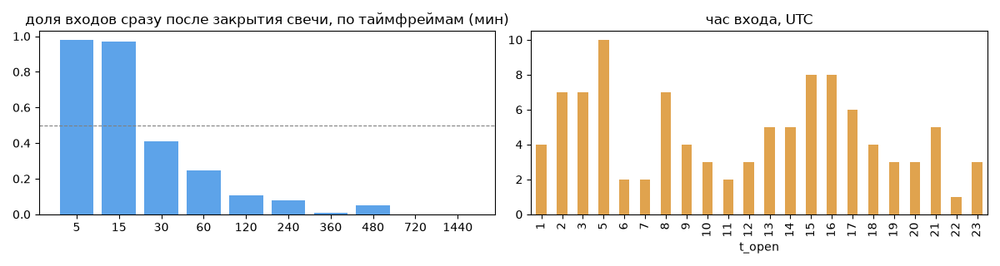
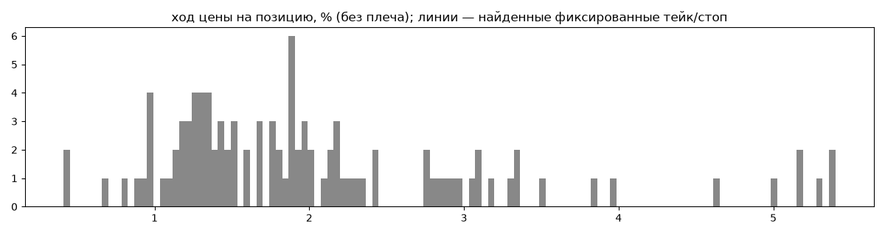
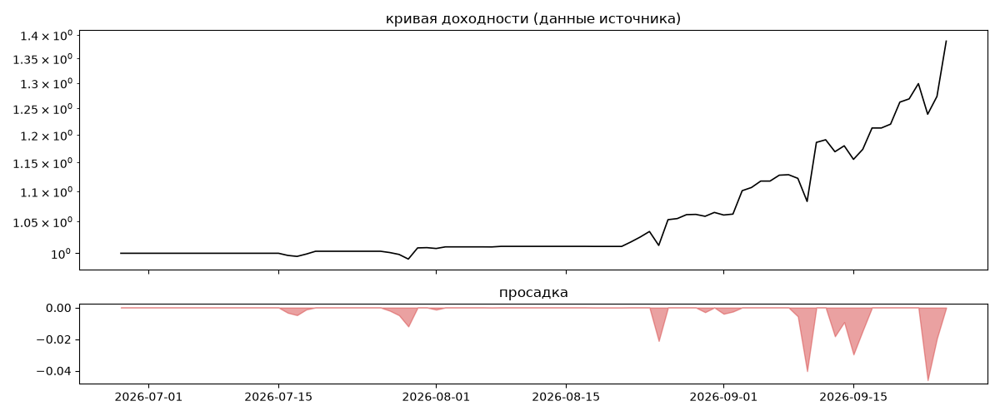

# CryptoExplorer — обратный инжиниринг

*Источник: bybit · https://www.bybit.com/copyTrade/trade-center/detail?leaderMark=1nj7BISHIY5aXxhWQWAnEQ== · разбор 26.09.2026*

> |||t me: SortOfTrading |||
I trade mean reversion on a dynamic whitelist: coins selected by criteria, not just the big names. Same strategy and risk management as HFT. Sort of and TopROI. Sort of, but with more positions open at once. That means drawdowns can go deeper, and if you set a custom stop loss you may get stopped out. If a drawdown gets too deep, risk management closes positions at a loss instead of waiting for a bounce. I will not be adding margin because you have no way of knowing if and when I did that. I don't withdraw profits here – this account is my test bed for new coins and 

## Коротко

- **Тип:** докупка/мартингейл · продаёт страховку · **бот**
  - доливки с множителем ×1.5
  - объём позиции растёт до ×13.9 от базового
  - 100% сделок в плюс, стопа нет
  - контекст входа: вход ПРОТИВ движения (контртренд/докупка на проливе) (37% входов по ходу 4–24 ч движения)
  - сверка с самоописанием: заявлено «контртренд, скальпинг» → ✅ совпало
- **Контекст входа:** вход ПРОТИВ движения (контртренд/докупка на проливе): за 4ч 22% по ходу (медиана -1.76%), за 24ч 52% по ходу (медиана 0.13%), за 72ч 59% по ходу (медиана 2.54%)
- **Когда входит:** на закрытии свечи 15 мин (≈0.2 мин после закрытия, 97% входов); 47% входов пачками по разным монетам
- **Правило входа:** правило не найдено — лучшее: «RSI14×30 (по ходу) | BTC>EMA50», на проверке F1 0.0 (охват 0.01, точность 0.0 на всей истории)
- **Как выходит:** выход плавающий: по сигналу или скользящему стопу
- **Результат:** ×1.39, +282% в год, макс. просадка -5%, сейчас +0% (0 дн.). По годам: 2026: +39%
- **Хвосты:** месяцев в плюс 100%, худший месяц = None средних хороших, просадка/волатильность -0.13 → не ясно
- **Оговорки:** только последние 90 дней — выводы о правилах ограничены; p_open = средняя позиции, order_price = цена ордера; кривая = cumResetRoi за 90 дней (ROI витрины, с плечом)

## Почерк

| | |
|---|---|
| период | 2026-07-16 → 2026-09-25 (71 дн.) |
| позиций | 102 (10.06 в неделю), открыто сейчас 0 |
| монет | 36: UNI 11, WIF 7, HYPE 5, DOGE 5, VIRTUAL 5, BCH 5 |
| доля BTC/ETH/SOL/XRP/BNB/золото | 0% |
| шорты | 0% |
| в плюс | 100% |
| средний плюс / минус | 2.06% / 0.0% (отношение None) |
| худшая / лучшая | 0.01% / 5.46% |
| удержание 10/50/90% | {'p10': 1.0, 'p50': 5.9, 'p90': 46.6} ч |
| одновременно открыто макс. | 7 |
| доливки | {'multi_order_share': 0.35, 'size_ratio': 1.5, 'add_dir': 'усреднение вниз', 'max_orders': 5, 'cost_mult_max': 13.9, 'cost_cv': 1.11} |
| уровни цен | {'round_price_share': 0.07, 'repeat_price_share': 0.0, 'grid': None} |







## Правило входа

Таймфрейм 15, монет 14, входов в окне 67. Точность считается только по свечам, где цель вне позиции по монете.

| правило                                         |   совпало |   сработало |   охват |   точность |    F1 |   F1_подбор |   F1_проверка |
|:------------------------------------------------|----------:|------------:|--------:|-----------:|------:|------------:|--------------:|
| RSI14×30 (по ходу) | BTC>EMA200                 |         2 |         607 |    0.03 |          0 | 0.006 |       0.004 |         0.015 |
| RSI14 выход из зоны 30/70 (против) | BTC>EMA200 |         2 |         607 |    0.03 |          0 | 0.006 |       0.004 |         0.015 |
| RSI14×30 (по ходу) | BTC>EMA50                  |         1 |         470 |    0.01 |          0 | 0.004 |       0.005 |         0     |
| RSI14 выход из зоны 30/70 (против) | BTC>EMA50  |         1 |         470 |    0.01 |          0 | 0.004 |       0.005 |         0     |
| Боллинджер 20×2 возврат | BTC>EMA200            |         3 |        1878 |    0.04 |          0 | 0.003 |       0.003 |         0.005 |
| RSI14×30 (по ходу) | —                          |         2 |        2281 |    0.03 |          0 | 0.002 |       0.001 |         0.003 |
| RSI7 выход из зоны 30/70 (против) | BTC>EMA200  |         3 |        2662 |    0.04 |          0 | 0.002 |       0.002 |         0.004 |
| RSI14 выход из зоны 30/70 (против) | —          |         2 |        2281 |    0.03 |          0 | 0.002 |       0.001 |         0.003 |
| RSI7×30 (по ходу) | BTC>EMA200                  |         3 |        2662 |    0.04 |          0 | 0.002 |       0.002 |         0.004 |
| Боллинджер 20×2 возврат | —                     |         4 |        5168 |    0.06 |          0 | 0.002 |       0.001 |         0.002 |
| цена×EMA200 | BTC>EMA200                        |         1 |        2099 |    0.01 |          0 | 0.001 |       0.001 |         0     |
| цена×EMA100 | BTC>EMA200                        |         1 |        3027 |    0.01 |          0 | 0.001 |       0.001 |         0     |

**Подпись свечи входа** (эффект = сдвиг медианы входов от обычных свечей в межквартильных размахах):

| признак         | сторона   |   медиана_входов |   p10 |   p90 |   медиана_обычных |   эффект |
|:----------------|:----------|-----------------:|------:|------:|------------------:|---------:|
| объём/ср50      | лонг      |             3.23 |  1.26 |  6.93 |              0.71 |     3.07 |
| объём/ср20      | лонг      |             3.01 |  1.56 |  6    |              0.76 |     2.82 |
| ход 1 св %      | лонг      |            -1.17 | -2.84 |  0.13 |              0    |    -2.56 |
| тело %          | лонг      |            -1.17 | -2.84 |  0.13 |              0    |    -2.56 |
| от EMA20 %      | лонг      |            -2.34 | -3.7  | -0.98 |              0.01 |    -2.52 |
| ход 4 св %      | лонг      |            -2.16 | -4.52 | -0.66 |              0    |    -2.38 |
| ход 12 св %     | лонг      |            -3.05 | -4.59 | -0.72 |              0.01 |    -1.95 |
| BTC ход 4 св %  | лонг      |            -0.58 | -1.45 | -0.1  |              0    |    -1.95 |
| BTC от EMA20 %  | лонг      |            -0.52 | -1.11 | -0.06 |              0.01 |    -1.7  |
| BTC объём/ср50  | лонг      |             2.08 |  0.59 |  5.25 |              0.72 |     1.69 |
| BTC ход 12 св % | лонг      |            -0.85 | -1.73 | -0.08 |              0.02 |    -1.61 |
| BTC объём/ср20  | лонг      |             1.97 |  0.57 |  5.54 |              0.77 |     1.6  |
| BTC тело %      | лонг      |            -0.24 | -0.87 |  0.06 |              0    |    -1.56 |
| BTC ход 1 св %  | лонг      |            -0.24 | -0.87 |  0.06 |              0    |    -1.56 |

## Выходы

```
{
 "fixed_tp": null,
 "fixed_sl": null,
 "reentry": 0.0,
 "exit_on_candle_close": {
  "15": 0.95,
  "60": 0.23,
  "240": 0.01,
  "1440": 0.0
 },
 "hold_mode_h": 1.75,
 "hold_mode_share": 0.06,
 "atr": {
  "interval": "15",
  "win_pct_cv": 0.57,
  "win_atr_cv": 0.62,
  "loss_pct_cv": NaN,
  "loss_atr_cv": NaN,
  "win_k_median": 1.38,
  "loss_k_median": null
 },
 "verdict": [
  "выход плавающий: по сигналу или скользящему стопу"
 ]
}
```