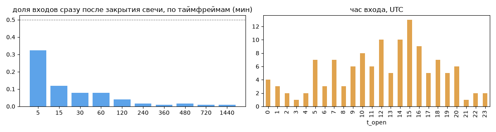
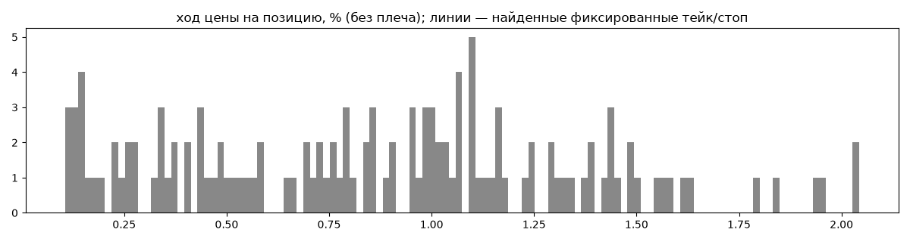
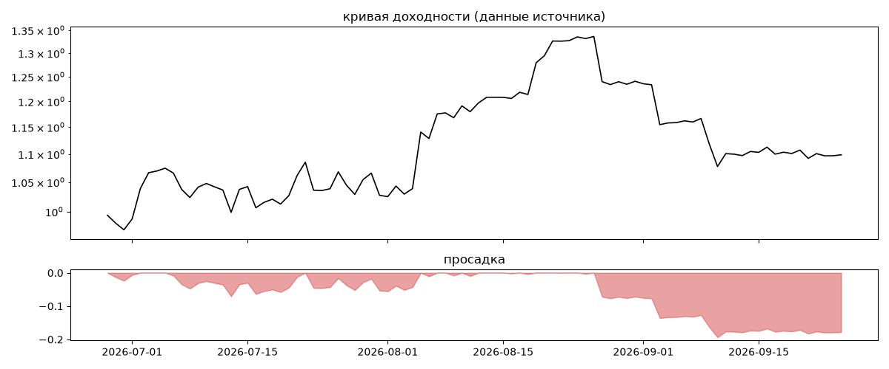

# CTMASTERCOPY | Controlled Risk — обратный инжиниринг

*Источник: bybit · https://www.bybit.com/copyTrade/trade-center/detail?leaderMark=Gsc9Um9XUQ6ilT4BY+Fa8w== · разбор 26.09.2026*

> CTMASTERCOPY – Risk-Focused Copy Trading
Disciplined trading with controlled leverage and active drawdown management. Our focus is consistent performance and long-term capital growth — not aggressive, high-risk returns.
Follow CTMASTERCOPY on Bybit:
https://i.bybit.com/1AOabNAi?action=inviteToCopy

## Коротко

- **Тип:** докупка/мартингейл · продаёт страховку · **бот**
  - доливки с множителем ×1.0
  - объём позиции растёт до ×10.5 от базового
  - 100% сделок в плюс, стопа нет
  - контекст входа: вход ПО ХОДУ движения (тренд/пробой) (62% входов по ходу 4–24 ч движения)
- **Контекст входа:** вход ПО ХОДУ движения (тренд/пробой): за 4ч 59% по ходу (медиана 0.25%), за 24ч 66% по ходу (медиана 1.35%), за 72ч 72% по ходу (медиана 2.52%)
- **Когда входит:** без привязки к свечам
- **Правило входа:** не искали — у входов нет сетки свечей — входы лимитками/вручную или по тикам; укажите таймфрейм вручную (--tf)
- **Как выходит:** выход плавающий: по сигналу или скользящему стопу
- **Результат:** ×1.11, +51% в год, макс. просадка -19%, сейчас -18% (30 дн.). По годам: 2026: +10%
- **Хвосты:** месяцев в плюс 67%, худший месяц = None средних хороших, просадка/волатильность -0.44 → не ясно
- **Оговорки:** только последние 90 дней — выводы о правилах ограничены; p_open = средняя позиции, order_price = цена ордера; кривая = cumResetRoi за 90 дней (ROI витрины, с плечом)

## Почерк

| | |
|---|---|
| период | 2026-01-15 → 2026-09-25 (253 дн.) |
| позиций | 127 (3.52 в неделю), открыто сейчас 0 |
| монет | 6: HYPE 46, ZEC 42, BTC 23, LINK 11, PAXG 3, ETH 2 |
| доля BTC/ETH/SOL/XRP/BNB/золото | 22% |
| шорты | 0% |
| в плюс | 100% |
| средний плюс / минус | 0.87% / 0.0% (отношение None) |
| худшая / лучшая | 0.09% / 2.14% |
| удержание 10/50/90% | {'p10': 0.5, 'p50': 3.4, 'p90': 40.6} ч |
| одновременно открыто макс. | 5 |
| доливки | {'multi_order_share': 0.23, 'size_ratio': 1.0, 'add_dir': 'усреднение вниз', 'max_orders': 5, 'cost_mult_max': 10.5, 'cost_cv': 0.74} |
| уровни цен | {'round_price_share': 0.04, 'repeat_price_share': 0.02, 'grid': None} |








## Выходы

```
{
 "fixed_tp": null,
 "fixed_sl": null,
 "reentry": 0.05,
 "exit_on_candle_close": {
  "15": 0.13,
  "60": 0.03,
  "240": 0.0,
  "1440": 0.0
 },
 "hold_mode_h": 1.37,
 "hold_mode_share": 0.02,
 "atr": {
  "interval": "60",
  "win_pct_cv": 0.56,
  "win_atr_cv": 0.82,
  "loss_pct_cv": NaN,
  "loss_atr_cv": NaN,
  "win_k_median": 0.61,
  "loss_k_median": null
 },
 "verdict": [
  "выход плавающий: по сигналу или скользящему стопу"
 ]
}
```