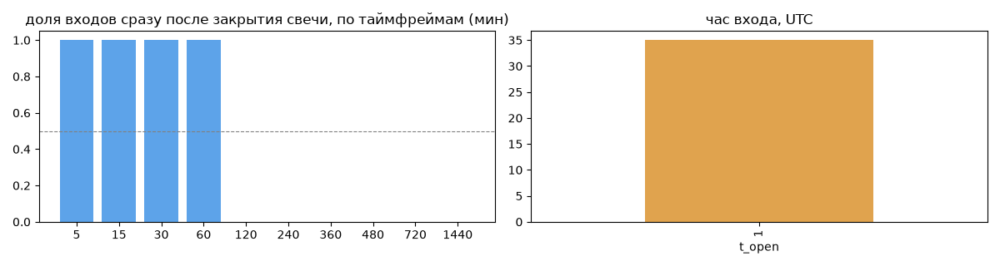
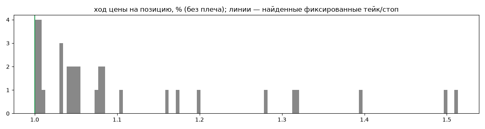
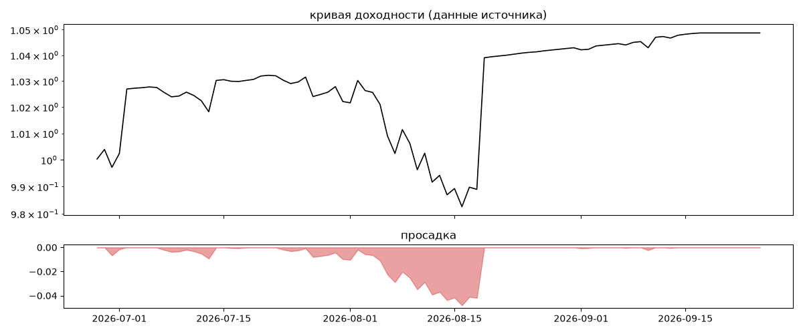

# CuteMewTrader — обратный инжиниринг

*Источник: bybit · https://www.bybit.com/copyTrade/trade-center/detail?leaderMark=LgbhDGwPVRPMBhnC7IAJAA== · разбор 26.09.2026*

> https://i.bybit.com/ElCAab2?action=inviteToCopy

## Коротко

- **Тип:** докупка/мартингейл · продаёт страховку · **бот**
  - доливки с множителем ×1.0
  - объём позиции растёт до ×17.1 от базового
  - выход на фиксированном проценте от средней: +1.0% (74%), +1.2% (17%), +1.5% (9%) прибыльных
  - 100% сделок в плюс, стопа нет
  - контекст входа: вход без выраженной стороны (55% входов по ходу 4–24 ч движения)
- **Контекст входа:** вход без выраженной стороны: за 4ч 40% по ходу (медиана -0.16%), за 24ч 71% по ходу (медиана 0.89%), за 72ч 63% по ходу (медиана 1.61%)
- **Когда входит:** на закрытии свечи 60 мин (≈0.6 мин после закрытия, 100% входов)
- **Правило входа:** не искали — мало позиций (35 < 60)
- **Как выходит:** тейк фиксированный ≈ +1.0%
- **Результат:** ×1.05, +21% в год, макс. просадка -5%, сейчас +0% (0 дн.). По годам: 2026: +5%
- **Хвосты:** месяцев в плюс 100%, худший месяц = None средних хороших, просадка/волатильность -0.36 → не ясно
- **Оговорки:** только последние 90 дней — выводы о правилах ограничены; p_open = средняя позиции, order_price = цена ордера; кривая = cumResetRoi за 90 дней (ROI витрины, с плечом)

## Почерк

| | |
|---|---|
| период | 2026-06-17 → 2026-09-17 (92 дн.) |
| позиций | 35 (2.66 в неделю), открыто сейчас 0 |
| монет | 1: XRP 35 |
| доля BTC/ETH/SOL/XRP/BNB/золото | 100% |
| шорты | 0% |
| в плюс | 100% |
| средний плюс / минус | 1.11% / 0.0% (отношение None) |
| худшая / лучшая | 1.0% / 1.52% |
| удержание 10/50/90% | {'p10': 0.5, 'p50': 8.3, 'p90': 170.5} ч |
| одновременно открыто макс. | 2 |
| доливки | {'multi_order_share': 0.23, 'size_ratio': 1.0, 'add_dir': 'усреднение вниз', 'max_orders': 17, 'cost_mult_max': 17.1, 'cost_cv': 1.54} |
| уровни цен | {'round_price_share': 0.01, 'repeat_price_share': 0.08, 'grid': None} |








## Выходы

```
{
 "fixed_tp": {
  "level": 1.0,
  "share": 0.74
 },
 "fixed_sl": null,
 "reentry": 0.0,
 "exit_on_candle_close": {
  "15": 0.09,
  "60": 0.0,
  "240": 0.0,
  "1440": 0.0
 },
 "hold_mode_h": 3.07,
 "hold_mode_share": 0.06,
 "atr": {
  "interval": "60",
  "win_pct_cv": 0.13,
  "win_atr_cv": 0.39,
  "loss_pct_cv": NaN,
  "loss_atr_cv": NaN,
  "win_k_median": 1.07,
  "loss_k_median": null
 },
 "verdict": [
  "тейк фиксированный ≈ +1.0%"
 ]
}
```