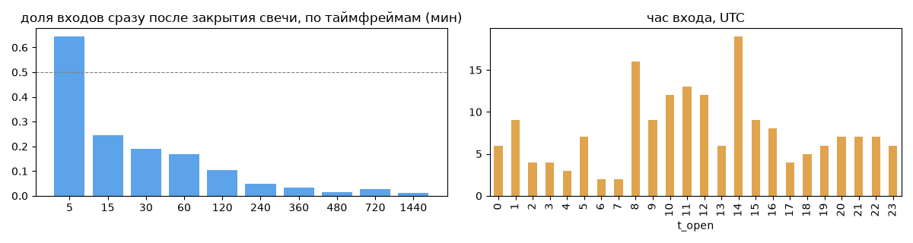
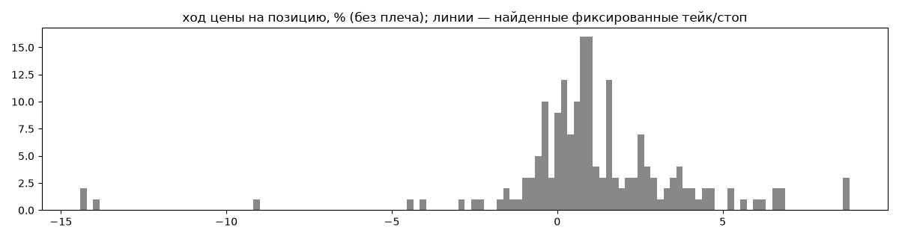
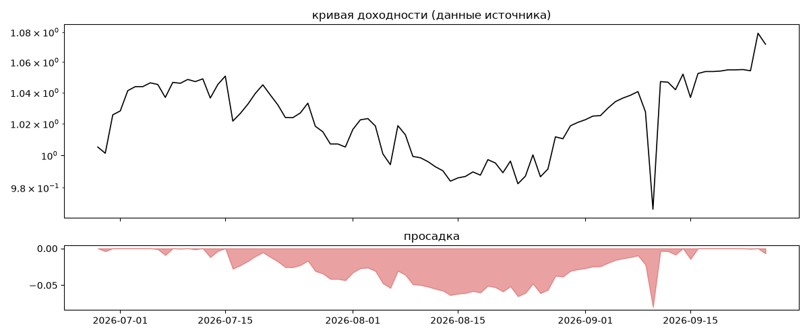

# digital trading systems ISA — обратный инжиниринг

*Источник: bybit · https://www.bybit.com/copyTrade/trade-center/detail?leaderMark=q5wPVsX46k3wTEnSO1pq4A== · разбор 26.09.2026*

> Портфелем управляют алгоритмы проекта iSpecAlgo.
Все вопросы  можно обсудить в чате, ищите в телеге DTSChat

## Коротко

- **Тип:** возврат к среднему · продаёт страховку · **бот**
  - часто в плюс (77%), но плюс меньше минуса
  - контекст входа: вход без выраженной стороны (42% входов по ходу 4–24 ч движения)
- **Контекст входа:** вход без выраженной стороны: за 4ч 30% по ходу (медиана -0.53%), за 24ч 53% по ходу (медиана 0.2%), за 72ч 62% по ходу (медиана 1.21%)
- **Когда входит:** без привязки к свечам
- **Правило входа:** не искали — у входов нет сетки свечей — входы лимитками/вручную или по тикам; укажите таймфрейм вручную (--tf)
- **Как выходит:** выход плавающий: по сигналу или скользящему стопу
- **Результат:** ×1.07, +30% в год, макс. просадка -8%, сейчас -1% (1 дн.). По годам: 2026: +7%
- **Хвосты:** месяцев в плюс 67%, худший месяц = None средних хороших, просадка/волатильность -0.3 → не ясно
- **Оговорки:** только последние 90 дней — выводы о правилах ограничены; p_open = средняя позиции, order_price = цена ордера; кривая = cumResetRoi за 90 дней (ROI витрины, с плечом)

## Почерк

| | |
|---|---|
| период | 2026-06-26 → 2026-09-24 (90 дн.) |
| позиций | 183 (14.23 в неделю), открыто сейчас 0 |
| монет | 21: HYPE 31, ONDO 22, ZEC 19, SUI 13, ENA 12, NEAR 11 |
| доля BTC/ETH/SOL/XRP/BNB/золото | 5% |
| шорты | 32% |
| в плюс | 77% |
| средний плюс / минус | 2.0% / -2.41% (отношение 0.83) |
| худшая / лучшая | -20.86% / 10.55% |
| удержание 10/50/90% | {'p10': 1.5, 'p50': 8.9, 'p90': 47.9} ч |
| одновременно открыто макс. | 10 |
| доливки | {'multi_order_share': 0.25, 'size_ratio': 1.01, 'add_dir': 'усреднение вниз', 'max_orders': 7, 'cost_mult_max': 7.6, 'cost_cv': 0.72} |
| уровни цен | {'round_price_share': 0.04, 'repeat_price_share': 0.02, 'grid': None} |








## Выходы

```
{
 "fixed_tp": null,
 "fixed_sl": null,
 "reentry": 0.08,
 "exit_on_candle_close": {
  "15": 0.19,
  "60": 0.06,
  "240": 0.01,
  "1440": 0.0
 },
 "hold_mode_h": 5.75,
 "hold_mode_share": 0.02,
 "atr": {
  "interval": "60",
  "win_pct_cv": 0.93,
  "win_atr_cv": 0.91,
  "loss_pct_cv": 1.87,
  "loss_atr_cv": 1.82,
  "win_k_median": 0.89,
  "loss_k_median": -0.6
 },
 "verdict": [
  "выход плавающий: по сигналу или скользящему стопу"
 ]
}
```