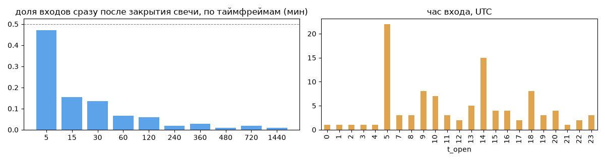
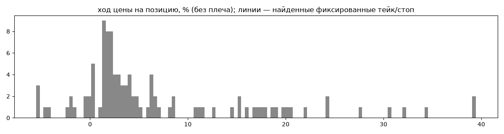
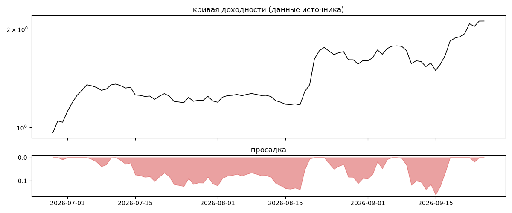

# ITEKCrypto Kamaz — обратный инжиниринг

*Источник: bybit · https://www.bybit.com/copyTrade/trade-center/detail?leaderMark=k1cwzhKkWm/8mD/Pdp6nWw== · разбор 26.09.2026*

> Плечо Х5 : Stop Loss OFF : Интервал сделок 5-10 дней :  т\г ITEKCryptoS. Торговли может не быть более 5 дней, если нету рынка. Если вы подписались увидев у меня положительные сделки, то скорее всего я буду их вести до закрытия и при этом у вас не будут открываться новые. Нужно ждать нового цикла входа в сделки.
Попробуй другие стратегии ITEKCrypto, ITEKCrypto R/R, ITEKCrypto Kamaz, ITEKCrypto  Moscvich, ITEKCrypto Niva, ITEKCrypto REINVEST X1, ITEKCrypto x1 Low Risk, ITEKCrypto REINVEST, ItekCrypto Priora. 
Торговля это риск, инвестируй сумму которую готов потерять. 

## Коротко

- **Тип:** докупка/мартингейл · продаёт страховку · **бот**
  - доливки с множителем ×1.24
  - объём позиции растёт до ×7.0 от базового
  - 88% сделок в плюс, стопа нет
  - контекст входа: вход ПРОТИВ движения (контртренд/докупка на проливе) (28% входов по ходу 4–24 ч движения)
- **Контекст входа:** вход ПРОТИВ движения (контртренд/докупка на проливе): за 4ч 28% по ходу (медиана -1.06%), за 24ч 28% по ходу (медиана -2.15%), за 72ч 45% по ходу (медиана -1.15%)
- **Когда входит:** без привязки к свечам; 35% входов пачками по разным монетам
- **Правило входа:** не искали — у входов нет сетки свечей — входы лимитками/вручную или по тикам; укажите таймфрейм вручную (--tf)
- **Как выходит:** выход плавающий: по сигналу или скользящему стопу
- **Результат:** ×2.2, +2428% в год, макс. просадка -16%, сейчас +0% (0 дн.). По годам: 2026: +120%
- **Хвосты:** месяцев в плюс 100%, худший месяц = None средних хороших, просадка/волатильность -0.21 → не ясно
- **Оговорки:** только последние 90 дней — выводы о правилах ограничены; p_open = средняя позиции, order_price = цена ордера; кривая = cumResetRoi за 90 дней (ROI витрины, с плечом)

## Почерк

| | |
|---|---|
| период | 2026-06-08 → 2026-09-24 (108 дн.) |
| позиций | 104 (6.74 в неделю), открыто сейчас 0 |
| монет | 12: BCH 37, SUI 19, 1000PEPE 10, ADA 8, ZEC 6, SOL 5 |
| доля BTC/ETH/SOL/XRP/BNB/золото | 10% |
| шорты | 0% |
| в плюс | 88% |
| средний плюс / минус | 8.22% / -2.81% (отношение 2.93) |
| худшая / лучшая | -5.87% / 41.12% |
| удержание 10/50/90% | {'p10': 0.3, 'p50': 182.3, 'p90': 746.9} ч |
| одновременно открыто макс. | 21 |
| доливки | {'multi_order_share': 0.12, 'size_ratio': 1.24, 'add_dir': 'усреднение вниз', 'max_orders': 3, 'cost_mult_max': 7.0, 'cost_cv': 0.66} |
| уровни цен | {'round_price_share': 0.11, 'repeat_price_share': 0.02, 'grid': None} |








## Выходы

```
{
 "fixed_tp": null,
 "fixed_sl": null,
 "reentry": 0.01,
 "exit_on_candle_close": {
  "15": 0.23,
  "60": 0.04,
  "240": 0.01,
  "1440": 0.01
 },
 "hold_mode_h": 0.33,
 "hold_mode_share": 0.04,
 "atr": {
  "interval": "60",
  "win_pct_cv": 1.14,
  "win_atr_cv": 1.32,
  "loss_pct_cv": 0.76,
  "loss_atr_cv": 1.06,
  "win_k_median": 2.4,
  "loss_k_median": -1.13
 },
 "verdict": [
  "выход плавающий: по сигналу или скользящему стопу"
 ]
}
```