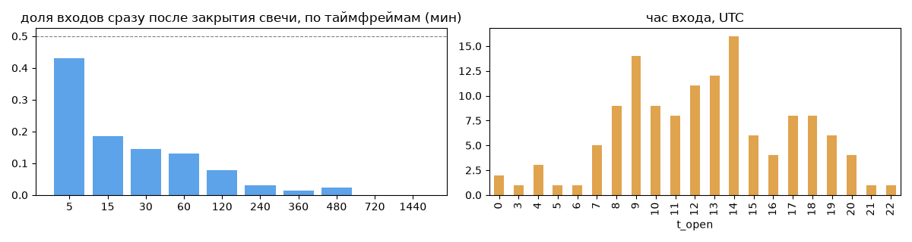
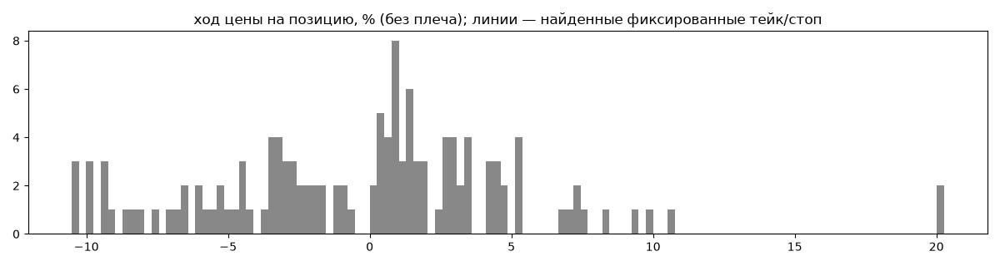
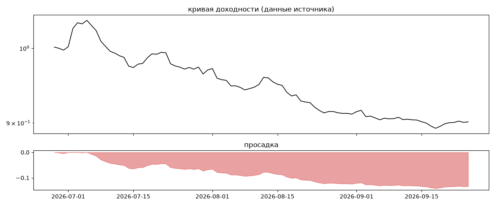

# Just B Free Family — обратный инжиниринг

*Источник: bybit · https://www.bybit.com/copyTrade/trade-center/detail?leaderMark=SulB/0bO3V7XNju3NnFigA== · разбор 26.09.2026*

> check justbcopytrade.com for more info!

## Коротко

- **Тип:** тренд (вход по ходу движения) · нейтрально · **человек**
  - контекст входа: вход ПО ХОДУ движения (тренд/пробой) (66% входов по ходу 4–24 ч движения)
- **Контекст входа:** вход ПО ХОДУ движения (тренд/пробой): за 4ч 67% по ходу (медиана 0.26%), за 24ч 64% по ходу (медиана 0.62%), за 72ч 67% по ходу (медиана 1.13%)
- **Когда входит:** без привязки к свечам
- **Правило входа:** не искали — у входов нет сетки свечей — входы лимитками/вручную или по тикам; укажите таймфрейм вручную (--tf)
- **Как выходит:** выход плавающий: по сигналу или скользящему стопу
- **Результат:** ×0.9, -35% в год, макс. просадка -14%, сейчас -13% (82 дн.). По годам: 2026: -10%
- **Хвосты:** месяцев в плюс 0%, худший месяц = None средних хороших, просадка/волатильность -1.32 → не ясно
- **Оговорки:** только последние 90 дней — выводы о правилах ограничены; p_open = средняя позиции, order_price = цена ордера; кривая = cumResetRoi за 90 дней (ROI витрины, с плечом)

## Почерк

| | |
|---|---|
| период | 2026-06-27 → 2026-09-24 (89 дн.) |
| позиций | 130 (10.21 в неделю), открыто сейчас 0 |
| монет | 51: BTC 19, ETH 11, XAUT 8, SOL 7, ONDO 5, HYPE 4 |
| доля BTC/ETH/SOL/XRP/BNB/золото | 38% |
| шорты | 50% |
| в плюс | 55% |
| средний плюс / минус | 3.66% / -4.96% (отношение 0.74) |
| худшая / лучшая | -10.64% / 27.63% |
| удержание 10/50/90% | {'p10': 5.5, 'p50': 45.5, 'p90': 170.2} ч |
| одновременно открыто макс. | 9 |
| доливки | {'multi_order_share': 0.0, 'size_ratio': None, 'add_dir': None, 'max_orders': 1, 'cost_mult_max': 11.5, 'cost_cv': 0.87} |
| уровни цен | {'round_price_share': 0.45, 'repeat_price_share': 0.0, 'grid': None} |








## Выходы

```
{
 "fixed_tp": null,
 "fixed_sl": null,
 "reentry": 0.0,
 "exit_on_candle_close": {
  "15": 0.14,
  "60": 0.03,
  "240": 0.0,
  "1440": 0.0
 },
 "hold_mode_h": 0.19,
 "hold_mode_share": 0.01,
 "atr": {
  "interval": "60",
  "win_pct_cv": 0.88,
  "win_atr_cv": 0.67,
  "loss_pct_cv": 0.7,
  "loss_atr_cv": 0.6,
  "win_k_median": 2.93,
  "loss_k_median": -4.29
 },
 "verdict": [
  "выход плавающий: по сигналу или скользящему стопу"
 ]
}
```