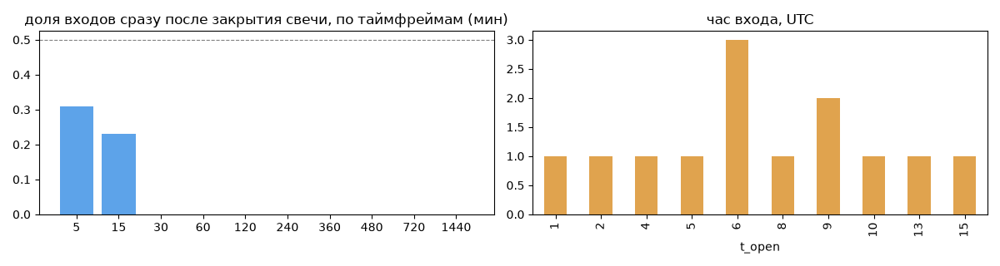
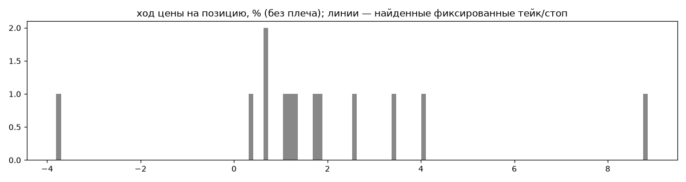
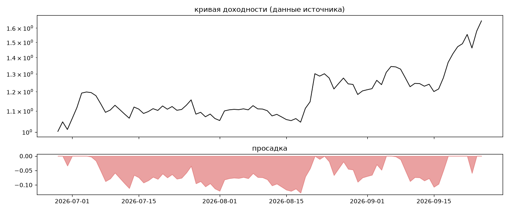

# wizard31337 — обратный инжиниринг

*Источник: bybit · https://www.bybit.com/copyTrade/trade-center/detail?leaderMark=pWOCK0qxEm7vvnv0bg8b9g== · разбор 26.09.2026*

## Коротко

- **Тип:** докупка/мартингейл · продаёт страховку · **не ясно, бот или человек**
  - доливки с множителем ×0.97
  - объём позиции растёт до ×4.0 от базового
  - 92% сделок в плюс, стопа нет
- **Когда входит:** без привязки к свечам
- **Правило входа:** не искали — у входов нет сетки свечей — входы лимитками/вручную или по тикам; укажите таймфрейм вручную (--tf)
- **Как выходит:** выход плавающий: по сигналу или скользящему стопу
- **Результат:** ×1.65, +677% в год, макс. просадка -13%, сейчас +0% (0 дн.). По годам: 2026: +65%
- **Хвосты:** месяцев в плюс 100%, худший месяц = None средних хороших, просадка/волатильность -0.2 → не ясно
- **Оговорки:** только последние 90 дней — выводы о правилах ограничены; p_open = средняя позиции, order_price = цена ордера; кривая = cumResetRoi за 90 дней (ROI витрины, с плечом)

## Почерк

| | |
|---|---|
| период | 2026-03-30 → 2026-09-26 (180 дн.) |
| позиций | 13 (0.51 в неделю), открыто сейчас 0 |
| монет | 6: ETH 4, BTC 4, ONDO 2, ZK 1, SOL 1, HYPE 1 |
| доля BTC/ETH/SOL/XRP/BNB/золото | 69% |
| шорты | 77% |
| в плюс | 92% |
| средний плюс / минус | 2.38% / -4.38% (отношение 0.54) |
| худшая / лучшая | -4.38% / 9.51% |
| удержание 10/50/90% | {'p10': 1.8, 'p50': 72.4, 'p90': 2245.3} ч |
| одновременно открыто макс. | 4 |
| доливки | {'multi_order_share': 0.08, 'size_ratio': 0.97, 'add_dir': 'пирамида по ходу', 'max_orders': 2, 'cost_mult_max': 4.0, 'cost_cv': 0.67} |
| уровни цен | {'round_price_share': 0.0, 'repeat_price_share': 0.29, 'grid': None} |








## Выходы

```
{
 "fixed_tp": null,
 "fixed_sl": null,
 "reentry": 0.0,
 "exit_on_candle_close": {
  "15": 0.23,
  "60": 0.0,
  "240": 0.0,
  "1440": 0.0
 },
 "hold_mode_h": 1.19,
 "hold_mode_share": 0.08,
 "verdict": [
  "выход плавающий: по сигналу или скользящему стопу"
 ]
}
```