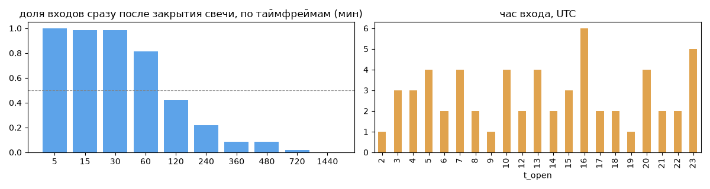
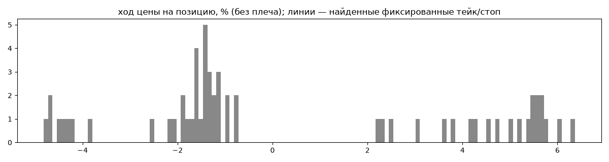
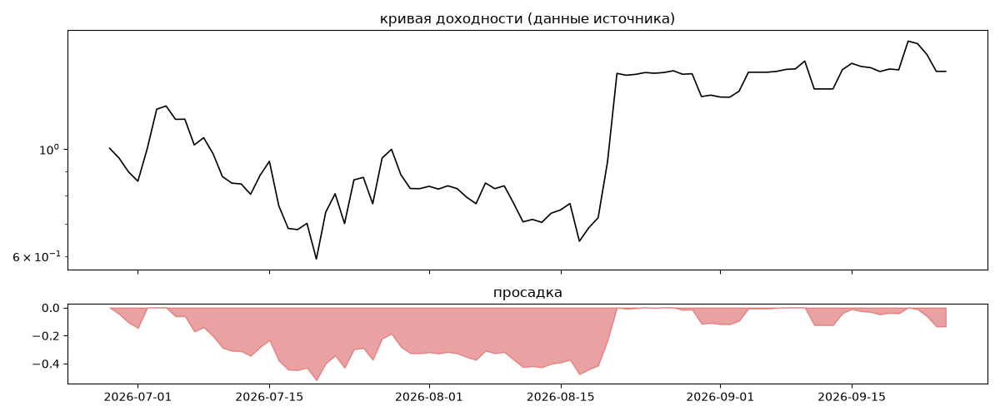
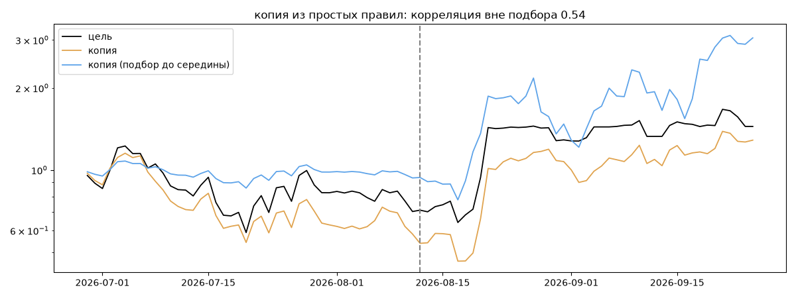

# Wasolldas 🏄🏻‍♀️ — обратный инжиниринг

*Источник: bybit · https://www.bybit.com/copyTrade/trade-center/detail?leaderMark=rp9DqDnaeagerRcZXQr8kA== · разбор 26.09.2026*

> I run a fully automated Long & Short trend-following system powered by TradingView bots. The past months were challenging and tested both the strategy and my confidence, as profits and drawdowns were often separated by only a few trades. Following extensive optimization and adaptation to recent market changes, the bots have been recalibrated and are now running under updated conditions. No emotions, no manual intervention—just systematic execution based on predefined rules and market trends.

## Коротко

- **Тип:** тренд · покупает страховку · **бот**
  - в плюс 37% сделок, средний плюс в 2.22 раза больше минуса
  - контекст входа: вход ПО ХОДУ движения (тренд/пробой) (97% входов по ходу 4–24 ч движения)
  - сверка с самоописанием: заявлено «тренд» → ✅ совпало
- **Контекст входа:** вход ПО ХОДУ движения (тренд/пробой): за 4ч 95% по ходу (медиана 1.38%), за 24ч 100% по ходу (медиана 2.45%), за 72ч 75% по ходу (медиана 1.69%)
- **Когда входит:** на закрытии свечи 60 мин (≈0.3 мин после закрытия, 81% входов)
- **Правило входа:** не искали — мало позиций (59 < 60)
- **Как выходит:** стоп похож на ≈-2.49×ATR
- **Результат:** ×1.44, +352% в год, макс. просадка -52%, сейчас -13% (4 дн.). По годам: 2026: +44%
- **Хвосты:** месяцев в плюс 67%, худший месяц = None средних хороших, просадка/волатильность -0.26 → не ясно
- **Природа по кривой:** тренд 60%, возврат к среднему 33%, докупка (продажа страховки) 7% · совпадение копии вне подбора 0.54 (на подборе 1.0) — ⚠️ кривая короткая, вывод слабый
- **Форма доходности:** участие в росте рынка 2.07, в падении -0.63 → в обычные дни в росте участвует сильнее, чем в падениях (редкие обвалы тут не видны — см. «хвосты»)
- **Оговорки:** только последние 90 дней — выводы о правилах ограничены; p_open = средняя позиции, order_price = цена ордера; кривая = cumResetRoi за 90 дней (ROI витрины, с плечом)

## Почерк

| | |
|---|---|
| период | 2026-06-25 → 2026-09-24 (91 дн.) |
| позиций | 59 (4.55 в неделю), открыто сейчас 0 |
| монет | 2: BTC 39, NEAR 20 |
| доля BTC/ETH/SOL/XRP/BNB/золото | 66% |
| шорты | 41% |
| в плюс | 37% |
| средний плюс / минус | 4.67% / -2.11% (отношение 2.22) |
| худшая / лучшая | -4.99% / 6.8% |
| удержание 10/50/90% | {'p10': 3.9, 'p50': 26.9, 'p90': 107.8} ч |
| одновременно открыто макс. | 2 |
| доливки | {'multi_order_share': 0.02, 'size_ratio': 0.73, 'add_dir': 'пирамида по ходу', 'max_orders': 2, 'cost_mult_max': 2.8, 'cost_cv': 0.42} |
| уровни цен | {'round_price_share': 0.02, 'repeat_price_share': 0.0, 'grid': None} |







## Копия по кривой

Подбор на 89 днях, разрез 2026-08-12. Корреляция дневной доходности: подбор 1.0, **проверка 0.54**, вся история 0.93 (R² 0.87).

| компонента копии | вес |
|---|---|
| BTC [день] ход 3 | 0.069 |
| SOL [4ч] докупка шаг 1% тейк 1% | 0.062 |
| BTC [4ч] ход 2 | 0.057 |
| SOL [4ч] ход 3 | 0.057 |
| SOL [4ч] возврат 2 | 0.049 |
| BTC [день] возврат 2 | 0.044 |
| BTC [4ч] ход 3 | 0.041 |
| ETH [4ч] ход 1 | 0.041 |
| SOL [день] возврат 1 | 0.04 |
| ETH [4ч] ход 20 | 0.037 |

Сильнее всего совпадает по одиночке: NEAR [4ч] ход 20 (0.48), NEAR [день] ход 5 (0.47), BTC [день] ход 3 (0.47), BTC [день] ход 5 (0.46), BTC [4ч] докупка шаг 1% тейк 1% (0.44), NEAR [4ч] EMA5/20 (0.42)

Сильнее всего противоположна: NEAR [день] возврат 5 (-0.47), BTC [день] возврат 3 (-0.47), BTC [день] возврат 5 (-0.46), NEAR [день] возврат 3 (-0.37)




## Выходы

```
{
 "fixed_tp": null,
 "fixed_sl": null,
 "reentry": 0.0,
 "exit_on_candle_close": {
  "15": 0.12,
  "60": 0.03,
  "240": 0.02,
  "1440": 0.0
 },
 "hold_mode_h": 1.47,
 "hold_mode_share": 0.02,
 "atr": {
  "interval": "60",
  "win_pct_cv": 0.27,
  "win_atr_cv": 0.23,
  "loss_pct_cv": 0.62,
  "loss_atr_cv": 0.2,
  "win_k_median": 4.14,
  "loss_k_median": -2.49
 },
 "verdict": [
  "стоп похож на ≈-2.49×ATR"
 ]
}
```