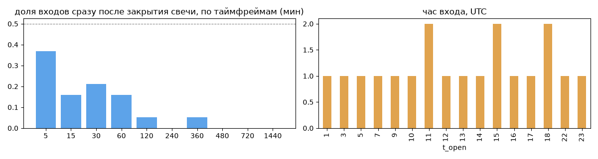
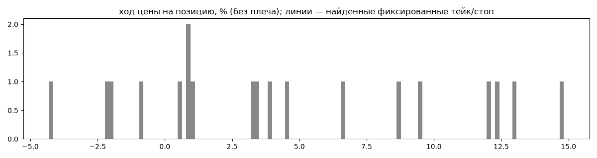
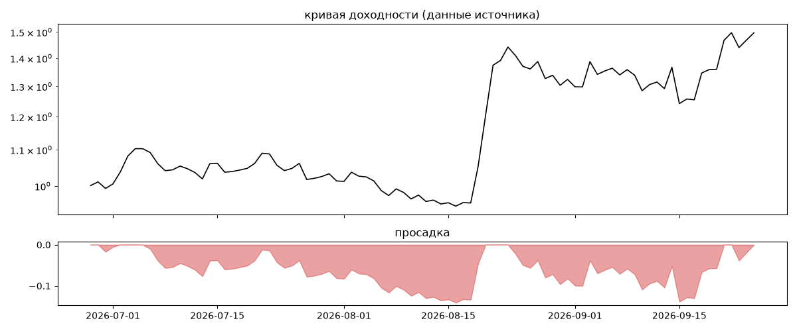
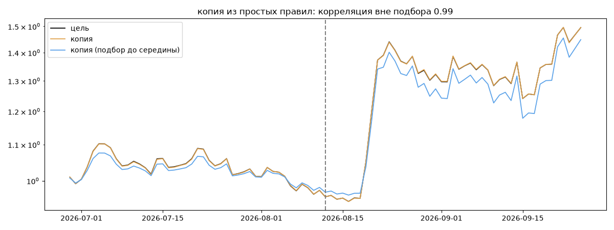

# XRPUSDT — обратный инжиниринг

*Источник: bybit · https://www.bybit.com/copyTrade/trade-center/detail?leaderMark=xENuuOsi1hDR9RN76qH1zw== · разбор 26.09.2026*

## Коротко

- **Тип:** сетка · продаёт страховку · **бот**
  - заявки на повторяющихся уровнях XRP с шагом 0.04 (~2.92%)
  - контекст входа: вход ПРОТИВ движения (контртренд/докупка на проливе) (10% входов по ходу 4–24 ч движения)
- **Контекст входа:** вход ПРОТИВ движения (контртренд/докупка на проливе): за 4ч 0% по ходу (медиана -1.21%), за 24ч 21% по ходу (медиана -1.62%), за 72ч 37% по ходу (медиана -2.06%)
- **Когда входит:** без привязки к свечам
- **Правило входа:** не искали — у входов нет сетки свечей — входы лимитками/вручную или по тикам; укажите таймфрейм вручную (--tf)
- **Как выходит:** выход плавающий: по сигналу или скользящему стопу
- **Результат:** ×1.5, +421% в год, макс. просадка -14%, сейчас -0% (3 дн.). По годам: 2026: +50%
- **Хвосты:** месяцев в плюс 100%, худший месяц = None средних хороших, просадка/волатильность -0.21 → не ясно
- **Природа по кривой:** держание (бета рынка) 62%, тренд 15%, докупка (продажа страховки) 14%, возврат к среднему 10% · совпадение копии вне подбора 0.99 (на подборе 1.0) — ⚠️ кривая короткая, вывод слабый
- **Форма доходности:** участие в росте рынка 1.16, в падении 1.28 → в обычные дни в падениях участвует сильнее, чем в росте
- **Оговорки:** только последние 90 дней — выводы о правилах ограничены; p_open = средняя позиции, order_price = цена ордера; кривая = cumResetRoi за 90 дней (ROI витрины, с плечом)

## Почерк

| | |
|---|---|
| период | 2026-03-06 → 2026-05-20 (75 дн.) |
| позиций | 19 (1.78 в неделю), открыто сейчас 0 |
| монет | 1: XRP 19 |
| доля BTC/ETH/SOL/XRP/BNB/золото | 100% |
| шорты | 0% |
| в плюс | 78% |
| средний плюс / минус | 6.4% / -2.45% (отношение 2.62) |
| худшая / лучшая | -4.78% / 15.23% |
| удержание 10/50/90% | {'p10': 3140.5, 'p50': 3725.1, 'p90': 4328.6} ч |
| одновременно открыто макс. | 19 |
| доливки | {'multi_order_share': 0.05, 'size_ratio': 0.5, 'add_dir': 'усреднение вниз', 'max_orders': 2, 'cost_mult_max': 49.9, 'cost_cv': 3.11} |
| уровни цен | {'round_price_share': 0.55, 'repeat_price_share': 0.55, 'grid': {'sym': 'XRP', 'step': 0.04, 'step_pct': np.float64(2.92), 'levels': 4, 'on_grid': 1.0}} |







## Копия по кривой

Подбор на 89 днях, разрез 2026-08-12. Корреляция дневной доходности: подбор 1.0, **проверка 0.99**, вся история 1.0 (R² 1.0).

| компонента копии | вес |
|---|---|
| XRP [4ч] держать | 0.483 |
| XRP [день] держать | 0.135 |
| XRP [4ч] докупка шаг 3% тейк 3% | 0.091 |
| BTC [4ч] докупка шаг 2% тейк 2% | 0.035 |
| BTC [день] возврат 2 | 0.026 |
| ETH [4ч] возврат 3 | 0.015 |
| XRP [4ч] возврат 5 | 0.014 |
| BTC [4ч] ход 3 | 0.012 |
| BTC [день] ход 3 | 0.011 |
| BTC [4ч] возврат 1 | 0.011 |

Сильнее всего совпадает по одиночке: XRP [день] держать (1.0), XRP [4ч] держать (1.0), XRP [4ч] докупка шаг 3% тейк 3% (0.88), BTC [день] держать (0.87), BTC [4ч] держать (0.87), XRP [4ч] докупка шаг 2% тейк 2% (0.84)

Сильнее всего противоположна: XRP [день] EMA50/200 (-0.9), XRP [день] ход 200 (-0.7), XRP [день] возврат 2 (-0.58), BTC [день] возврат 2 (-0.54)




## Выходы

```
{
 "fixed_tp": null,
 "fixed_sl": null,
 "reentry": 0.0,
 "exit_on_candle_close": {
  "15": 0.16,
  "60": 0.05,
  "240": 0.05,
  "1440": 0.0
 },
 "hold_mode_h": 3082.54,
 "hold_mode_share": 0.05,
 "verdict": [
  "выход плавающий: по сигналу или скользящему стопу"
 ]
}
```